# Unified Commerce System — End-to-End Business Workflows

**Status:** Proposed operating workflow  
**Locations:** Anna Nagar and Ayyanambakkam, Chennai  
**Source:** `plan.md`  
**Scope:** Product creation, purchasing, inventory, POS, kiosk, ecommerce, payment, packing, pickup, delivery, returns, and reporting  
**Constraint:** This is a business and system workflow specification. It contains no application code.

## 1. Purpose and operating model

This document translates the architecture plan into the complete operating flow for both shops. Anna Nagar and Ayyanambakkam use the same Product Master, pricing rules, inventory ledger, customer records, orders, payments, fulfillment process, and reports.

Neither shop is permanently designated as retail or wholesale. Each location has configurable capabilities for POS, kiosk, pickup, retail ecommerce, wholesale fulfillment, and delivery. A physical POS or kiosk order remains at the device's registered shop. A digital order is assigned to one eligible shop that can fulfill the complete basket; the system does not split an order automatically.

The central system of record is authoritative whenever connectivity is available. The only controlled exception is offline POS, which records a bounded local transaction and synchronizes it later with an idempotency key.

### End-to-end value stream

```mermaid
flowchart LR
    A["Authorized manager creates and publishes product"] --> B["Buyer raises and approves purchase order"]
    B --> C["Receiving shop accepts stock"]
    C --> D["Inventory ledger increases on-hand stock"]
    D --> E{"Sales channel"}
    E -->|"POS"| F["Registered shop serves counter customer"]
    E -->|"Kiosk"| G["Registered shop reserves local stock"]
    E -->|"Ecommerce or wholesale"| H["System checks serviceability and routes whole order"]
    F --> I["Price, tax, stock and payment validation"]
    G --> I
    H --> I
    I --> J{"Order can proceed?"}
    J -->|"No"| X["Reject, hold or manual review with reason"]
    J -->|"Yes"| K["Confirm payment terms and order"]
    K --> L["Pick, weigh and pack"]
    L --> M{"Handover method"}
    M -->|"Counter or pickup"| N["Token or staff verification and handover"]
    M -->|"Own delivery"| O["Assign driver, track, OTP and proof"]
    N --> P["Complete order and reconcile money"]
    O --> P
    P --> Q{"Return requested?"}
    Q -->|"No"| R["Daily close and management reporting"]
    Q -->|"Yes"| S["Inspect, restock or write off, refund or replace"]
    S --> R
```

## 2. Actors and responsibility boundaries

| Actor | Primary responsibilities | Location boundary |
|---|---|---|
| Owner/Admin | Configure capabilities, roles, policies, routing, price approvals, exceptions, and consolidated reports | Both shops |
| Accountant/Compliance adviser | Approve GST, invoice numbering, tax, credit-note, retention, offline invoice blocks, and financial controls | Both shops |
| Location manager | Approve local purchases, discounts, adjustments, transfers, returns, variances, and manual order routing | Assigned shop unless granted wider scope |
| Catalogue manager | Maintain products, variants, units, tax profiles, price books, images, and channel visibility | Configured scope; products remain shared |
| Buyer/Purchase staff | Raise purchase orders, coordinate suppliers, and record supplier returns | One or both shops as authorized |
| Inventory staff | Receive goods, count stock, transfer stock, record damage/expiry, and resolve discrepancies | Assigned shop |
| Cashier | Open/close register, sell, collect payment, print/reprint, and process permitted returns | Registered POS shop |
| Kiosk customer | Build local cart, pay by UPI or choose pay at counter, and collect by token | Registered kiosk shop |
| Ecommerce retail customer | Check serviceability, order, pay/COD, track, collect or receive delivery, and request return | Routed shop is not chosen directly unless policy permits |
| Approved wholesale customer | Use wholesale price book, quantity tiers, GST profile, and approved credit terms | Routed to an eligible wholesale-capable shop |
| Packer/Pickup staff | Pick, weigh, handle tolerance decisions, pack, label, call tokens, and hand over | Assigned fulfillment shop |
| Dispatcher | Review delivery-ready orders, assign/reassign drivers, and manage failed deliveries | One or both shops as configured |
| Driver | Accept assigned jobs, pick up, update delivery state, collect COD, capture OTP/proof, and return failed orders | Assigned jobs only |
| Razorpay/Bank processor | Process online payment/refund and send signed events | External processor; never system of record |
| Background worker | Expire reservations, process webhooks/outbox events, create documents, notify, reconcile, and alert | Both shops |
| Unified system | Enforce authorization, pricing, stock locks, idempotency, state transitions, audit, and reporting updates | Shared source of truth |

## 3. Status model and transition ownership

The four order-related lifecycles are independent. For example, an order can be `Confirmed`, payment can be `COD due`, fulfillment can be `Packed`, and delivery can be `Assigned` at the same time. Every transition records actor or processor, timestamp, location/device, reason, and correlation to the source document.

### 3.1 Core order lifecycles

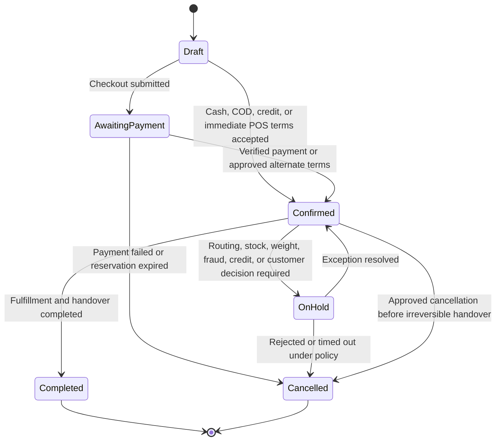

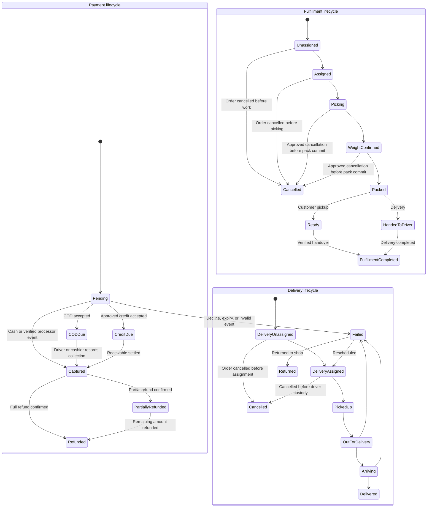

`Fulfillment cancelled` is permitted only before packing commits stock/invoice. `Delivery cancelled` is permitted only before driver custody. After those gates, corrections use compensating return/refund or `Failed → Returned`; no lifecycle is moved backward to conceal committed stock, invoice, proof, or custody.

### 3.2 Supporting workflow statuses

| Workflow | Proposed statuses | Terminal outcomes |
|---|---|---|
| Product | Draft → Pending approval → Active/Published → Unpublished → Archived | Active or Archived |
| Purchase order | Draft → Submitted → Approved → Ordered → Partially received → Received → Closed | Closed or Cancelled |
| Transfer | Draft → Approved → Dispatched/In transit → Partially received → Received | Received, Disputed, or Cancelled before dispatch |
| Stock count | Draft → Counting → Submitted → Variance review → Posted | Posted or Cancelled |
| Return | Requested → Eligibility review → Approved → Received → Inspected → Resolution pending | Refunded, Replaced, Store credit issued, Rejected, or Closed |
| Register session | Open → Closing → Variance review | Closed |

These supporting statuses refine the operating workflow without replacing the four core order lifecycles from `plan.md`.

## 4. System-update rules used by every workflow

1. **Atomic business update:** Stock-critical actions update the source document, `inventory_ledger`, `inventory_balances`, state history, audit event, and outbox event in one central database transaction.
2. **Append-only stock:** No actor directly edits on-hand or reserved totals. Receipts, reservations, releases, sales, returns, transfers, counts, damage, and corrections create ledger entries.
3. **Immutable commercial history:** Confirmed order lines snapshot product name, SKU, unit, requested quantity, actual quantity, price, discount, GST, and totals. An issued invoice is corrected through a credit note, refund, or compensating record—not overwritten.
4. **Idempotency:** Checkout submissions, POS synchronization, provider webhooks, refunds, delivery completion, and stock postings use unique identifiers so retries cannot duplicate money or stock.
5. **Outbox and notifications:** A committed business event creates an outbox record. Notifications, document creation, cache refresh, and external calls run asynchronously and can retry without repeating the business transaction.
6. **Location scope:** Every physical order records its registered device and shop. Every digital order records routing inputs, selected shop, and any manager override reason.
7. **Quantities and money:** Counted goods use whole units; loose goods use base units such as grams. Money is recorded in paise. Display conversion never changes stored base quantity.
8. **Available stock:** `on hand − active reservations − offline safety buffer`. A reservation changes reserved stock, not physical on-hand stock.
9. **Reservation expiry guard:** A background expiry may release only an unclaimed, unconsumed reservation after atomically checking order, payment, and fulfillment state. Once picking starts, stock can be released only by an authorized cancellation/fulfillment transaction; after packing posts stock, cancellation uses compensating return/restock entries.
10. **Status discipline:** `On hold` belongs only to the order lifecycle. Payment terms/outcomes such as pay-at-counter or expired, refund processing, fulfillment blockers, and cash/credit settlement are stored in their own records and must not be invented as extra order/payment/fulfillment states.

## 5. Product creation and publication

### Business flow

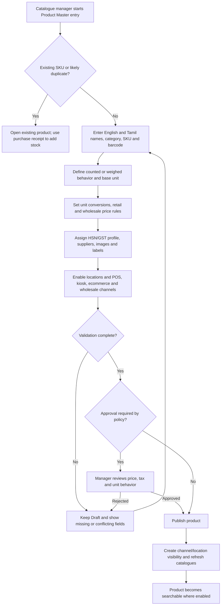

### Actors, decisions, exceptions, and updates

| Step | Owner | Decision or exception | System update |
|---|---|---|---|
| Identify product | Catalogue manager | Exact SKU/barcode match blocks duplicate creation; fuzzy name/unit matches require confirmation | Draft product search context and audit of attempted duplicate |
| Define stock behavior | Catalogue manager | Loose sack converted to grams; sealed retail pack normally remains a separate counted SKU | Product variant, unit, base quantity precision, conversions |
| Price and tax | Catalogue manager/Manager | Missing GST/HSN, invalid tier, negative margin warning, or unapproved discount policy prevents publication | Price books/rules and tax profile; approval history |
| Location/channel scope | Manager | Capability-disabled channel cannot be enabled at that shop | Channel visibility and location availability records |
| Publish | Authorized manager | Product may publish with zero stock but must display unavailable until received | Product status `Active/Published`, catalogue cache event, audit/outbox event |
| Edit later | Authorized manager | Changes affect future sales only; historical lines/invoices remain unchanged | New master values, version/audit event, channel refresh |
| Retire | Authorized manager | Product with history is archived, not hard-deleted | `Unpublished` or `Archived`; searchable history retained |

## 6. Purchasing, receiving, and supplier return

### Purchase-to-stock workflow

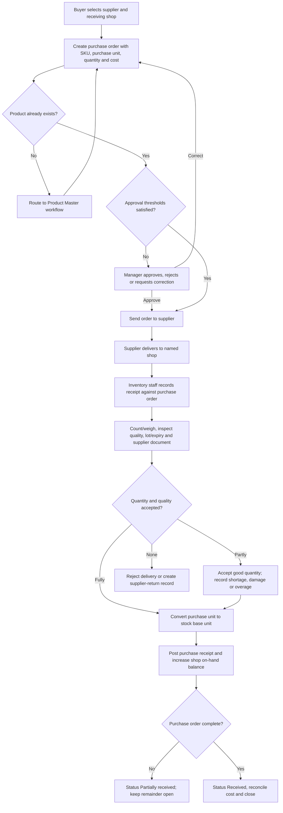

### System updates and exceptions

| Event | Inventory effect | Financial/document effect | Exception handling |
|---|---|---|---|
| Purchase order approved | None | Approved commitment and expected cost | Unauthorized or over-threshold order stays pending approval |
| Goods fully received | `on-hand + accepted base quantity` at receiving shop | Purchase receipt, actual cost, lot/expiry where used | Duplicate receipt ID is ignored/reported through idempotency |
| Partial receipt | Increase only accepted quantity | PO becomes `Partially received`; balance remains open | Shortage/overage and supplier reason recorded |
| Damaged/expired on arrival | No sellable stock increase, or quarantine location if configured | Rejection/supplier-return evidence | Manager decides reject, quarantine, discount acceptance, or return |
| Unit conversion mismatch | No posting | Receipt remains Draft/exception | Correct product conversion or receipt quantity before approval |
| Receipt reversal | Compensating negative ledger entry after approval | Reversal linked to original receipt | Manager approval and reason required; original is retained |
| Supplier return | `on-hand − returned quantity` from approved shop | Supplier-return document and expected supplier credit | Block if available stock is insufficient or quantity is reserved |

## 7. Inventory control across both shops

### 7.1 Ledger, reservation, and availability

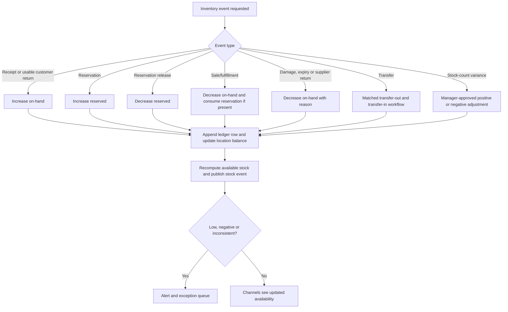

Stock postings include SKU/variant, shop, on-hand delta, reserved delta, reason, source document, actor/device, timestamp, and idempotency key. The balance row is locked while a stock-critical transaction is posted.

### 7.2 Transfer between Anna Nagar and Ayyanambakkam

```mermaid
sequenceDiagram
    actor Requester as Requesting inventory staff
    participant S as Source shop
    participant SYS as Unified system
    actor Manager as Authorized manager
    participant D as Destination shop
    Requester->>SYS: Create transfer with SKU and quantity
    SYS->>SYS: Check source available stock and active reservations
    alt Insufficient available stock
        SYS-->>Requester: Reject or reduce request; record reason
    else Stock available
        SYS->>Manager: Request approval if required
        Manager->>SYS: Approve transfer
        S->>SYS: Pick and dispatch
        SYS->>SYS: Post transfer-out; status In transit
        D->>SYS: Count/weigh and receive
        alt Quantity matches
            SYS->>SYS: Post matched transfer-in; status Received
        else Short, excess, or damaged
            SYS->>SYS: Post accepted quantity; status Disputed
            SYS-->>Manager: Create discrepancy review
        end
    end
```

Rules:

- A transfer cannot consume reserved stock unless the related reservations are explicitly moved or released by an authorized workflow.
- Stock in transit is not sellable at either shop.
- Dispatch cannot be cancelled by deleting the transfer. It must be received, returned, or resolved with matched compensating entries.
- The source and destination ledger references remain linked so stock cannot disappear between shops.

### 7.3 Stock count, damage, expiry, and correction

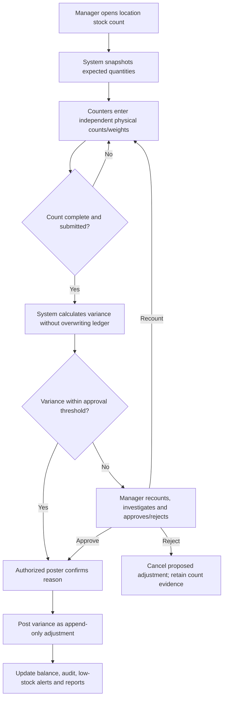

Count controls:

- Each count uses a cutoff/snapshot. The shop either freezes stock movements for the counted scope or the system reconciles every purchase, sale, reservation, transfer and return posted after the snapshot before calculating variance.
- Counters do not see or overwrite expected quantity while blind counting where policy requires independence. Recount/approval preserves each submitted count and actor.
- Reserved stock, stock in transit, quarantine/damage and sellable on-hand are counted/reconciled separately; a physical count cannot erase reservations or in-transit custody.

Damage, expiry, shrinkage, and corrections use distinct reason codes and approval thresholds. A correction reverses or compensates for a named prior event; it never erases that event.

#### Opening stock at go-live

Existing inventory at Anna Nagar and Ayyanambakkam is loaded only after Product Master/unit setup and an approved physical opening count. Each opening row records shop, SKU/variant, integer base quantity, approved cost source, lot/expiry where used, count evidence, cutoff time, uploader/counter, manager approval and migration batch. The system posts an append-only `Opening balance` ledger event and updates the balance in the same transaction; it never writes balance totals without ledger rows. Duplicate batch/idempotency controls prevent a second load. Both shops' opening stock, value, quarantined goods and variances must reconcile and be signed off before POS, kiosk or ecommerce is enabled.

## 8. Windows counter POS billing workflow

The Windows POS is a browser-based PWA paired with a trusted local print agent. The same workflow runs at Anna Nagar and Ayyanambakkam, but each device is registered to one shop and register. A counter sale always uses that shop's stock, invoice series, cashier session, and location-scoped permissions.

### 8.1 Actors, preconditions, and completion outcome

| Item | Definition |
|---|---|
| Primary actor | Cashier; location manager approves controlled exceptions |
| Supporting actors | Retail customer, approved wholesale customer, payment processor/terminal, unified system, Windows print agent |
| Preconditions | Active cashier account; registered device; assigned shop; open register session; current or permitted offline catalogue/price/tax cache; usable invoice-number source |
| Default mode | Anonymous retail sale using the current retail price book |
| Successful paid sale | Order `Completed`; payment `Captured`; fulfillment `Completed`; invoice issued; on-hand stock reduced; cash/tender movement recorded |
| Successful credit sale | Order `Completed`; payment `Credit due`; fulfillment `Completed`; invoice issued; on-hand stock reduced; customer receivable increased |
| Failed/cancelled draft | No invoice or stock posting; any started payment attempt retained and reconciled; temporary state released |
| Printing outcome | Receipt printed or print exception queued; printing never determines whether the committed sale succeeded |

### 8.2 POS screen flow

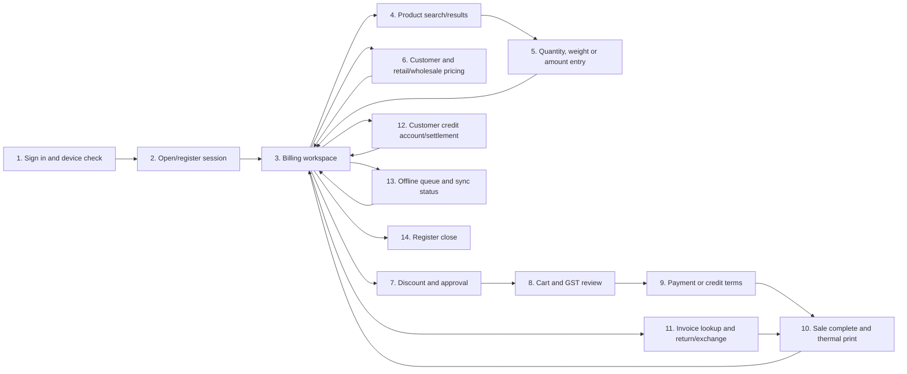

| Screen | Cashier action | Required display/validation | System outcome |
|---|---|---|---|
| 1. Sign in/device check | Authenticate | Cashier name/role, registered device, assigned shop, online state | Session bound to device and shop; unauthorized access blocked |
| 2. Register session | Enter opening cash and confirm printer/register | Prior unclosed session, invoice availability, printer health warning, unsynced queue | `cash_register_session` becomes `Open`; opening cash movement recorded |
| 3. Billing workspace | Start/resume/void a cart | Shop, cashier, connectivity, retail/wholesale mode, cart, totals, stock warnings, pending sync count | Draft order/cart tied to register and location |
| 4. Product search | Scan barcode or search English/Tamil name/SKU | Match quality, unit behavior, current price, local available stock, POS visibility | Product selected or disabled with reason |
| 5. Line entry | Enter count, weight, or customer amount | Base/selling unit, price tier, min/max/increment, calculated quantity/amount, GST basis | Validated draft line; totals recalculated |
| 6. Customer/pricing | Select customer or approved wholesale account | Approval, GSTIN, assigned price book, credit balance/limit, overdue status | Cart repriced; customer and price-book snapshot selected |
| 7. Discount | Enter line/order discount or request approval | Allowed type, cap, margin warning, approver, reason, effect on GST/totals | Approved discount snapshot and audit event; otherwise no change |
| 8. Cart/GST review | Confirm quantities, prices, tax, customer and total | Line and order totals, CGST/SGST or other approved tax treatment, rounding, payment due | Cart locked for payment attempt; final stock recheck requested |
| 9. Payment/credit | Choose one or mixed tenders, or credit | Amount due, collected/remaining, change, provider state, credit authorization | Tender attempts recorded; proceed only when fully paid or approved credit covers balance |
| 10. Completion/print | Confirm handover; print/send receipt | Invoice number, final statuses, print state | Atomic sale posted; signed print job queued after commit |
| 11. Return/exchange | Find invoice, select line/quantity/reason | Eligibility, prior returns, refundable amount, disposition, approval | Linked return/refund/credit note or replacement sale |
| 12. Credit account | Review balance or record authorized settlement | Open invoices, due dates, limit, payment allocation | Receivable/payment allocation updated and audited |
| 13. Offline queue | Review connectivity and queued sales | Cache age, invoice block remaining, oldest unsynced sale, conflicts | Retry sync or escalate; cashier cannot delete queued sales |
| 14. Register close | Count cash and enter terminal/UPI totals | Expected vs declared totals, refunds, movements, unsynced items | Close or `Variance review` |

Navigation rules:

- Product search and cart entry are optimized for keyboard, barcode scanner, and touch/mouse use. A barcode scanner may behave as keyboard input; no special hardware integration is assumed.
- The cashier may identify or change the customer before payment starts. If the customer change alters price, tax data, or discount eligibility, the POS reprices every line and requires review.
- Once payment has started, changing customer, lines, price mode, or discount cancels/releases the current unpaid attempt or returns it to reconciliation before unlocking the cart.
- A new sale cannot start on a register that is closing, closed, or blocked by a material unresolved control according to policy.

### 8.3 Standard online billing workflow

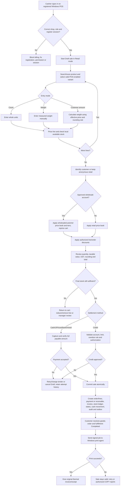

### 8.4 Product search and selection rules

1. Search accepts exact barcode, exact or partial SKU, and English or Tamil product name. Exact barcode/SKU matches rank before name matches.
2. Only an active variant enabled for POS at the device's shop can be added. An inactive, archived, wrong-channel, or wrong-location result may be shown for explanation but remains disabled.
3. Results show the selling unit, counted/weighed behavior, current effective retail price, local available stock, and low/out-of-stock state. Wholesale pricing appears only after an approved account is selected.
4. Selecting a parent product with multiple variants requires the cashier to choose the exact SKU; stock and price never post against an ambiguous parent.
5. Search is expected under 300 ms p95 online and immediate from the approved local cache offline.
6. Product creation and master-data correction are not POS billing actions. The cashier reports missing/incorrect products to an authorized catalogue manager.

### 8.5 Count, weight, and amount-to-weight entry

| Product behavior | Allowed entry | Stored quantity | Validation |
|---|---|---|---|
| Counted SKU | Whole item count | Integer units | Count must be positive and within available stock; fractions blocked |
| Loose/weighed SKU | Direct weight in configured display unit | Smallest base unit, normally integer grams | Positive; within min/max, increment and available-stock rules |
| Loose/weighed SKU | Customer target amount | Calculated and rounded base quantity | Product must allow amount entry; effective price/tier and tax basis must be known |
| Sealed pack SKU | Whole pack count | Integer units of the pack SKU | Do not convert a sealed pack into loose grams unless Product Master explicitly models that conversion |

Manual weight entry is the MVP default; direct weighing-scale integration is deferred. The POS must always display both the cashier-facing unit (for example kilograms) and the stored base quantity (grams) before confirmation.

#### Amount-to-weight calculation

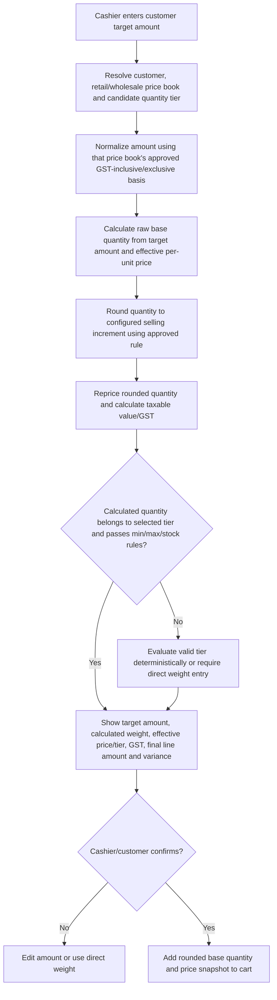

The conceptual calculation is:

**raw quantity = target line amount ÷ effective price per selling unit**

The system then converts the result to the smallest base unit, applies the configured weight increment/rounding rule, and recalculates the actual line amount and GST from the rounded quantity. Calculations use integer base quantities and paise—not binary floating point.

Business constraints:

- The target amount applies to one line, not the whole cart. Invoice-level discounts, other lines, and cash rounding may make the final invoice total different.
- The target amount's GST-inclusive or GST-exclusive meaning follows the approved price-book/tax configuration and must be visible to the cashier.
- If quantity-based wholesale tiers create more than one possible answer, the system selects only a tier whose calculated quantity falls inside that tier. If no single deterministic tier is valid, amount entry is rejected and the cashier enters weight directly.
- An amount-entered line retains its original entry intent. If customer, price tier, or discount changes later, the POS must not silently change both weight and payable amount: it shows the new calculation and requires the cashier to confirm whether policy preserves the customer's target amount or the already-measured weight. The selected basis is stored on the line.
- The final line stores target amount (when used), raw/calculated quantity, rounded base quantity, effective unit price, tier, discount, taxable value, tax, and final amount for audit.
- A cashier cannot type over the calculated price or weight without using a separately authorized override/correction action and reason.

### 8.6 Retail, wholesale, customer pricing, and discounts

#### Pricing selection

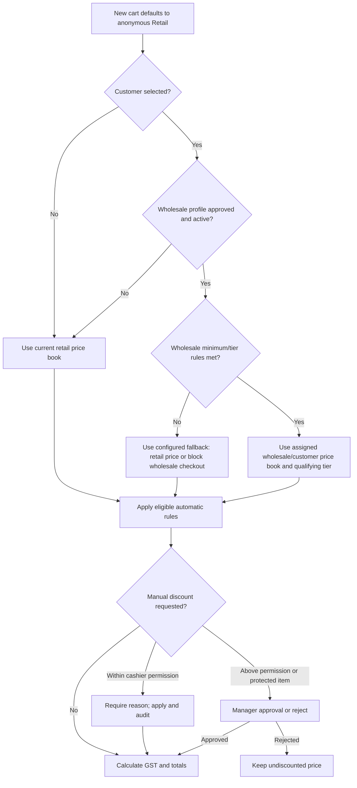

Pricing rules:

1. The customer-specific approved price book, approved wholesale price book/tier, or retail price book is selected by an explicit precedence policy. Price books are not stacked.
2. A wholesale customer must be active, approved, and within any minimum quantity/value rules. A GSTIN alone does not grant wholesale pricing or credit.
3. Changing customer, quantity, or weight can change the applicable tier. The system reprices the line/cart and shows the difference before payment.
4. Automatic price-book/tier rules apply before a manual discount. The configured precedence among line discount, order discount, and tax/rounding must be accountant-approved.
5. Discounts may be a permitted percentage or fixed paise amount at line/order level. Maximum discount, protected categories, below-cost warning/block, and manager threshold are configurable.
6. A manual discount records original price, applied rule, discount type/value, cashier, approver when required, reason, and resulting taxable value.
7. A manager approval cannot silently change the Product Master price; it applies only to the named transaction unless a separate authorized master-data change is made.
8. Historical order lines and invoices retain their price/tax snapshots when a price book later changes.

### 8.7 Stock validation and sale posting

The POS checks displayed stock while building the cart and rechecks it under a database lock immediately before committing an online sale. Available stock is `on hand − active reservations − offline safety buffer`. A cashier cannot bypass insufficient stock by directly changing the balance.

For a successful online sale, one atomic central transaction creates or updates:

- POS order and immutable line snapshots with source channel, registered device, cashier, register, and shop;
- payment transaction(s) or customer-credit receivable and allocations;
- GST invoice and approved invoice number;
- append-only inventory-ledger sale entries and current balance rows;
- order, payment, and fulfillment state-history entries;
- cash-register movement(s), discount/override audit, idempotency record, and outbox events.

| POS outcome | Order lifecycle | Payment lifecycle | Fulfillment lifecycle | Delivery lifecycle |
|---|---|---|---|---|
| Paid counter sale | `Draft → Awaiting payment → Confirmed → Completed` | `Pending → Captured` | `Unassigned/Assigned → Picking → Weight confirmed → Packed → Completed` as applicable | Not created |
| Approved credit sale | `Draft → Confirmed → Completed` | `Credit due` until an allocated receipt changes payment to `Captured`; the receivable separately becomes `Settled` | `Unassigned/Assigned → Picking → Weight confirmed → Packed → Completed` as applicable | Not created |
| Failed tender/cancelled cart | `Draft/Awaiting payment → Cancelled` when explicitly cancelled or expired | `Pending → Failed`, or retained `Pending` for reconciliation | Not completed; any temporary hold released | Not created |
| Completed offline sale before sync | Same business outcome stored locally, plus device sync state `Pending sync` | Captured/credit state under offline eligibility rules | Completed locally | Not created |

If any required stock, payment/credit, invoice-number, or database validation fails, the business transaction does not partially post. A provider payment that captured externally while local completion failed enters payment reconciliation; the cashier resumes the original idempotent sale instead of charging again.

### 8.8 Payments and mixed tender

| Method | Confirmation required before completion | Register/financial update | Main exception |
|---|---|---|---|
| Cash | Cashier enters tendered amount; POS calculates change | Payment `Captured`; cash-in and change details in register session | Insufficient tender or implausible amount requires correction |
| Dynamic UPI/online payment | Valid unique server-side signed provider event | Payment attempt/transaction linked to sale; no card/UPI credentials stored | Screenshot/client success is not proof; delayed webhook remains `Pending` |
| Card terminal | Approved terminal success/reference or integrated confirmation under policy | Captured card tender and terminal/reference metadata | Decline, timeout, duplicate charge, or terminal/POS mismatch enters reconciliation |
| Bank transfer | Authorized verification/reference under business policy | Captured bank tender and reference | Unverified transfer cannot be marked captured |
| Mixed payment | Every leg confirmed and total paid equals amount due | Separate linked tender rows; register totals by method | Failed leg must be retried/replaced/reversed before sale commits |
| Customer credit | Approved active account, sufficient available limit, permitted due terms, no blocking overdue rule | Payment `Credit due`; receivable increased and linked to invoice | Over-limit/overdue/inactive account requires payment or manager-authorized exception |

Payment rules:

- The POS shows total due, confirmed tender by method, remaining amount, and cash change. Non-cash tender cannot be treated as cash change.
- The sale completes only when confirmed tender plus approved credit allocation covers the payable total according to policy.
- Each attempt has a unique idempotency/correlation key. Retrying the screen must recover the existing result before creating another provider charge.
- Cancelling an unpaid attempt does not erase it. Captured or uncertain external payments must be reconciled/refunded, not abandoned.
- Card/UPI/bank references and provider event IDs are unique where available. Cash corrections use auditable register movements.
- Refunds link to the original tender and cannot exceed the unrefunded eligible amount.

### 8.9 Credit-sale workflow

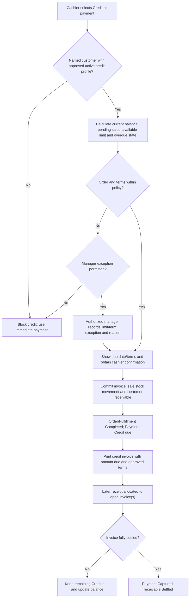

Credit control rules:

- Anonymous credit is prohibited. Customer identity, approval, credit limit, balance, due terms, and GST data are retrieved centrally.
- Available credit accounts for open invoices and other committed/pending exposure as defined by policy.
- A credit-limit override is a manager action with value, duration/scope, and reason; the cashier cannot edit the customer's master limit.
- An offline credit sale is allowed only when a fresh cached approval and separate offline exposure limit permit it. The POS cannot change limits or accept an unverified new wholesale account offline.
- Returns against a credit invoice reduce the open receivable or create a customer credit balance according to approved accounting policy; they do not create an unrelated cash refund automatically.

### 8.10 GST invoice and numbering workflow

```mermaid
sequenceDiagram
    actor Cashier
    participant POS as Windows POS
    participant SYS as Unified system
    participant PA as Print agent
    actor Customer
    Cashier->>POS: Confirm reviewed cart and settlement
    POS->>SYS: Submit idempotent final sale
    SYS->>SYS: Lock stock, validate tax/price/payment/credit and allocate invoice number
    alt Any validation fails
        SYS-->>POS: Reject without partial business posting
    else Commit succeeds
        SYS->>SYS: Store invoice/lines, ledger, states, financial and audit records
        SYS-->>POS: Return committed invoice and print payload
        POS->>PA: Send signed local print job
        alt Printer succeeds
            PA-->>Cashier: Print original 58/80 mm invoice
            Cashier->>Customer: Hand over goods and invoice
        else Printer fails
            PA-->>POS: Return failure
            POS-->>Cashier: Sale valid; retry or request COPY reprint
        end
    end
```

The accountant/compliance adviser must approve the actual GST layout, numbering, tax basis, rounding, retention, credit-note treatment, and any e-invoicing applicability before production. Subject to that approval, the invoice record and print layout must support:

- seller legal name, address, GSTIN/FSSAI details and the fulfilling shop;
- unique approved invoice series/number and issue date/time in India Standard Time;
- customer name/address/GSTIN when required, including approved wholesale details;
- product/variant description, HSN, quantity, selling unit, unit price, discount, taxable value and tax rate;
- CGST/SGST or other applicable tax components and place-of-supply treatment;
- line totals, invoice discount/rounding, total payable, tender summary or credit amount/due terms;
- original/copy designation, return/credit-note references, cashier/register, and invoice lookup identifier as policy allows.

Invoice rules:

1. An online number is allocated only as part of the successful sale transaction. A failed draft never fabricates an issued invoice.
2. Offline final invoices may use only accountant-approved, preallocated number blocks tied to a registered device/shop. Used, voided, expired, and unused numbers are reconciled after sync.
3. Issued invoices and lines are immutable. A return, tax correction, or refund uses linked credit-note/reversal/compensating records under the approved accounting workflow.
4. Tax is calculated from stored paise/base quantities using the approved line/invoice rounding policy. Printed totals must equal the stored invoice totals.
5. Reprinting does not allocate a new invoice number and must be visibly marked `COPY` with an audit event.

### 8.11 Thermal printing workflow and rules

The POS browser never writes directly to an arbitrary printer. After the sale commits, it sends a signed print job to the Windows service on `localhost`.

| Control | Required behavior |
|---|---|
| Trust boundary | Print agent accepts only approved origins, registered devices, valid job signatures, and allow-listed printer/template IDs |
| Formats | Shop-approved 58 mm and 80 mm layouts; Tamil-capable fonts only where tested/supported |
| Timing | Print after the committed invoice is returned; a print retry cannot repeat the sale |
| Original/reprint | Initial successful output is the original; authorized repeats show `COPY`, original invoice number, reprint actor/time/reason |
| Failure | Queue/retry or choose another allow-listed printer if permitted; display actionable health/error status |
| Audit | Record job ID, invoice, device, printer, template width, attempt result, actor, and reprint reason |
| Privacy | Do not print unnecessary customer or payment credentials; never print/store card or UPI secrets |

### 8.12 POS return, refund, and exchange workflow

This is the counter-screen specialization of the system-wide return workflow in Section 15.

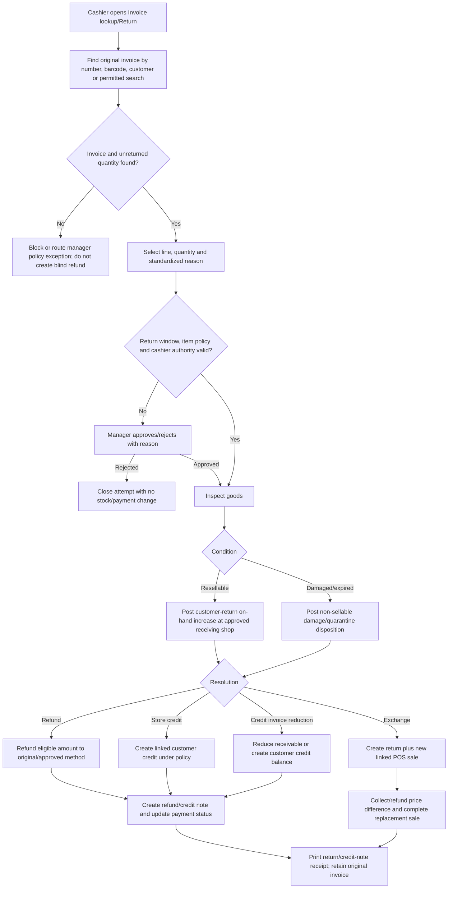

POS return rules:

- The return cannot exceed the original sold quantity minus prior accepted returns, or the remaining refundable amount.
- The cashier records reason and physical disposition before sellable stock is increased. Damaged/expired goods never become available stock.
- A cross-shop return is allowed only at an approved receiving shop and records both original and receiving locations.
- Refunds follow original-tender and approval policy. Provider refunds can remain pending until confirmed; repeated clicks use the same refund idempotency key.
- An exchange is not an overwrite of the original invoice. It is a linked return plus a new sale with a separately traceable payment/refund difference and stock movement.
- Returns without reliable original data, sensitive refunds, and credit-limit/customer changes are blocked offline by default.

### 8.13 Offline sale and synchronization workflow

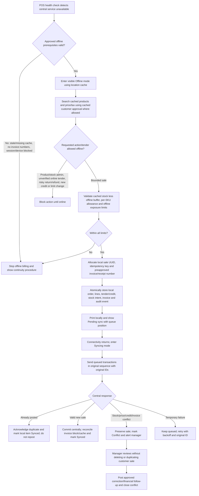

#### Offline eligibility matrix

| Action | Offline default | Conditions/notes |
|---|---|---|
| Product search and normal cart | Allowed | Current approved location cache only |
| Count/weight/amount entry | Allowed | Cached unit, price, tax, rounding and per-SKU limits must exist |
| Cash sale | Allowed | Within stock/sale/invoice limits; cash movement queued |
| Credit sale | Restricted | Named cached approved account; offline limit and overdue snapshot valid |
| Card/UPI/bank transfer | Blocked unless separately approved | Dynamic/server verification is unavailable; an independent terminal process requires explicit accountant/owner policy and reconciliation |
| Mixed tender | Restricted | Every component must be independently allowed offline |
| Manual discount | Restricted | Cached permission/limit; manager approval must be locally verifiable and auditable |
| Product creation/edit | Blocked | Central-only master-data action |
| Purchase receipt/transfer/stock adjustment | Blocked | Central-only stock-control action |
| Return/refund/exchange | Blocked by default | Original/remaining eligibility and refund state may be stale |
| Customer/wholesale approval or credit-limit change | Blocked | Central-only credit-control action |
| Original invoice print | Allowed | Valid preallocated number and local committed sale required |
| COPY reprint | Allowed under permission | Must reference locally known invoice and record reason for later sync |

#### Synchronization rules

1. Each offline sale and child record keeps the same UUID/idempotency key through every retry; local IDs are never regenerated to make a conflict disappear.
2. The device writes its local queue before showing success or printing. A power restart resumes the durable queue.
3. Sales synchronize in original commit order so invoice sequence, running offline stock allowance, credit exposure, and register movements can be reconciled.
4. The central system accepts a duplicate ID as the already-recorded sale and returns the canonical result. It never posts stock or payment twice.
5. A central stock conflict does not erase a completed customer sale. It opens a manager case to reconcile oversell, transfer, adjustment, or replenishment with an auditable compensating action.
6. A price/tax/master-data difference retains the legally issued offline snapshot unless the accountant-approved correction workflow requires a linked correction; sync does not silently rewrite the customer's invoice.
7. Used, voided, unused, and expired offline invoice numbers are reconciled per registered device and shop.
8. The POS prominently shows connectivity mode, last successful sync, queued count, oldest queued age, invoice numbers remaining, and conflict count.
9. Management is alerted when queue age, conflict count, cache age, or offline exposure exceeds policy.
10. A cashier cannot clear the queue, edit committed offline records, or sign out/close in a way that conceals unsynchronized transactions.

### 8.14 POS business-rule catalogue

| Rule area | Required rule |
|---|---|
| Location | Every sale, return, invoice, stock movement and register event is bound to the POS device's registered shop |
| Register | Billing requires an open session; only authorized users can reopen, force close, or resolve a variance |
| Customer mode | New sale defaults to retail; wholesale/credit requires a named approved account |
| Product | Only active POS-enabled variants at the shop can be sold; master records are not created from POS |
| Quantity | Counted SKUs use whole units; weighed SKUs use integer base units such as grams |
| Weight source | Manual entry is MVP; source is recorded; direct scale integration is deferred |
| Amount conversion | Resolve valid price/tier and tax basis, calculate base quantity, round quantity, then reprice and show final variance |
| Stock | Recheck under lock before online commit; offline sale must fit safety-buffer and device exposure limits |
| Price | Approved precedence chooses one retail, wholesale, or customer price book; future price changes do not change history |
| Discount | Apply only permitted types/limits; manager approval and reason required above cashier authority |
| Tax | Use approved HSN/GST profile and rounding; stored/printed totals must match |
| Payment | Full confirmed settlement or approved credit is required before completion; uncertain external attempts enter reconciliation |
| Mixed tender | Sum of confirmed legs plus approved credit must cover due amount exactly under the cash-change policy |
| Credit | No anonymous credit; enforce approval, available limit, overdue rules and due terms |
| Commit | Order, payment/receivable, invoice, ledger, states, register movement, audit and outbox post atomically online |
| Invoice | Allocate approved number only for a committed sale; offline uses assigned blocks; issued records are immutable |
| Handover | Customer goods are handed over only after paid/credit-approved completion; failed payment remains Draft/Awaiting payment |
| Print | Printing occurs after commit; failure cannot roll back or duplicate the sale; reprints show `COPY` |
| Return | Original invoice/eligibility required; disposition precedes restock; refund cannot exceed eligible balance |
| Audit | Customer/pricing change, discount, override, void, refund, reprint, offline sync and conflict resolution record actor/reason |

### 8.15 POS exception matrix

| Trigger | Cashier-visible outcome | Status/financial/stock behavior | Recovery/owner |
|---|---|---|---|
| Unregistered device or wrong shop | Billing blocked | No Draft/stock/payment update | Admin registers/reassigns device with audit |
| No open register/prior session unresolved | Billing blocked or manager prompt | No new sale; prior session remains open/review | Cashier/manager opens or resolves session |
| Product absent from search | No sellable result | No line added | Verify spelling/SKU; catalogue manager creates/enables product centrally |
| Product inactive/wrong channel/location | Result disabled with reason | No line added | Authorized manager changes master visibility if valid |
| Ambiguous barcode/SKU | Selection blocked | No line added | Catalogue manager fixes uniqueness/mapping |
| Invalid count/weight/increment | Inline validation | Draft unchanged or prior valid value retained | Cashier corrects entry |
| Amount-to-weight tier has no deterministic answer | Amount mode rejected | No line added/changed | Enter direct weight or manager reviews price-tier design |
| Insufficient available stock | Line blocked/reduced | No negative stock posting | Reduce quantity, replenish/transfer centrally, or cancel line |
| Price changes after customer/quantity change | Reprice warning and new total | Draft snapshots updated only after confirmation | Cashier/customer reviews before payment |
| Discount exceeds permission/protected item | Approval required or rejected | No unauthorized discount | Manager approves with reason or use allowed price |
| Wholesale account unapproved/inactive | Retail fallback or block by policy | No wholesale price/credit | Use retail payment or customer manager resolves account |
| Credit limit/overdue breach | Credit blocked | No receivable/sale commit | Immediate payment or authorized manager exception |
| Cash tender short | Remaining due shown | Sale remains unpaid Draft | Add tender/change method |
| UPI/card/bank decline | Payment failed message | Attempt retained; no sale commit/stock decrement | Retry or alternate tender |
| Provider success screen but no verified event | Payment remains Pending | No paid completion; reservation/draft held by policy | Reconciliation checks provider; never trust screenshot |
| Payment captured but local commit response lost | Do not charge again | Payment/sale outcome uncertain; stock protected as possible | Recover original idempotency result/reconcile |
| Mixed-tender leg fails | Remaining/failed leg shown | Confirmed legs retained/reversed under policy; no final sale commit | Replace/retry leg or cancel with reconciliation |
| Final stock race | Commit rejected | External payment, if any, enters recovery; no duplicate stock posting | Reprice/reduce/refund or manager review |
| Invoice-number unavailable | Completion blocked before local commit | No issued invoice/partial business posting | Restore number allocation; reconcile captured tender if needed |
| Printer offline/paper out/agent unavailable | Sale complete; print error | Invoice/payment/stock remain committed | Fix printer, retry same job, or authorized COPY reprint |
| Duplicate print request | Reprint confirmation | No new sale/invoice; `COPY` audit | Authorized reprint only |
| Return invoice not found/eligibility stale | Return blocked/manager review | No refund or stock increase | Go online/find original or approved exception workflow |
| Return item damaged | Non-sellable disposition | No available-stock increase | Damage/quarantine posting and approved refund decision |
| Duplicate/excess refund | Refund blocked | Original eligible balance unchanged | Finance investigates original refund IDs |
| Connectivity lost before commit | Switch/check Offline eligibility | No online partial sale | Continue as new bounded offline transaction only if prerequisites pass |
| Connectivity lost after provider capture | Payment recovery screen | Do not repeat charge; outcome Pending | Reconcile original attempt when connectivity returns |
| Offline cache/invoice block expired | Offline billing stopped | Queued sales preserved; no new sale | Restore central connection/admin allocation |
| Offline stock/credit exposure exceeded | Item/credit blocked offline | No additional local sale | Wait for sync or use permitted immediate-payment/manual continuity policy |
| Duplicate offline sync | Queue item marked Synced | No duplicate order/payment/invoice/ledger | Accept canonical central result |
| Offline central conflict | Conflict badge and manager case | Customer sale preserved; no silent rewrite/delete | Manager posts approved correction and closes case |
| Register/payment/credit variance at close | Session `Variance review` | Financial close held; sales retained | Manager explains/approves adjustment and signs off |

### 8.16 Register closing

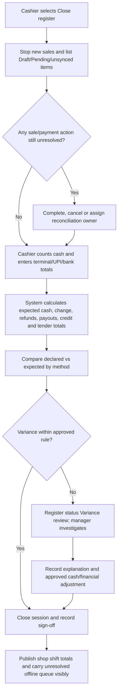

Closing never deletes or hides unsynchronized offline sales. The close record includes opening cash, cash sales, cash refunds, paid-in/paid-out movements, expected closing cash, declared cash, variance, non-cash totals, credit sales/collections, unsynced transaction count/value, cashier, approver, and timestamps.

## 9. Self-service kiosk workflow

Each kiosk is online-only, registered to either Anna Nagar or Ayyanambakkam, and restricted to that shop's kiosk-enabled catalogue and stock. The customer cannot route the order to the other shop from the kiosk. The default kiosk sale uses the retail price book; wholesale account and credit-sale workflows remain staff-assisted unless explicitly added to kiosk scope later.

### 9.1 Actors, boundaries, and successful outcome

| Actor/component | Responsibility |
|---|---|
| Customer | Select Tamil or English, browse, choose count/weight, review cart, choose UPI or pay at counter, retain token, watch status, and collect |
| Kiosk device | Maintain one private session, display local catalogue/prices, request live validation, present payment/token outcome, and clear data after completion/timeout |
| Unified system | Enforce kiosk/device/location scope, price/tax/stock rules, reservations, idempotency, status transitions, token uniqueness, audit, and public-display privacy |
| Razorpay/payment processor | Create/process dynamic UPI payment and send signed outcome events; it does not own the order |
| Background worker | Expire carts/reservations/QRs, process payment events, update display/notifications, reconcile delayed outcomes, and raise alerts |
| Packer | Accept the local packing job, pick, weigh, resolve variance, pack, label, and mark `Ready` |
| Counter/pickup staff | Validate token and order, collect pay-at-counter amount, hand over once eligible, print invoice, and complete the order |
| Location manager | Resolve stock, payment, weight, token, no-show, refund, and manual cancellation exceptions |
| Public status display | Show minimal bilingual token/status information; never payment, item, value, phone, or customer details |

A successful kiosk collection ends with order `Completed`, payment `Captured`, fulfillment `Completed`, token `Consumed`, final inventory movement and invoice recorded, handover audited, and the token removed from the active public display.

### 9.2 Customer screen journey

```mermaid
flowchart LR
    K1["1. Welcome / தொடக்கம்"] --> K2["2. Tamil or English"]
    K2 --> K3["3. Browse categories/search products"]
    K3 --> K4["4. Product details and count/weight selection"]
    K4 --> K5["5. Cart"]
    K5 --> K3
    K5 --> K6["6. Review price, GST and local availability"]
    K6 --> K7["7. UPI or Pay at counter"]
    K7 -->|"UPI"| K8["8A. Dynamic QR and payment status"]
    K7 -->|"Pay at counter"| K9["8B. Confirm payment-due order"]
    K8 --> K10["9. Token confirmation"]
    K9 --> K10
    K10 --> K11["10. Watch bilingual status display"]
    K11 --> K12["11. Present token at pickup counter"]
    K12 --> K13["12. Pay if due, collect goods and invoice"]
```

| Screen | Customer action | Required content and controls | System effect |
|---|---|---|---|
| 1. Welcome | Touch to start | Shop name, service availability, accessibility/help, no retained prior session | Create anonymous kiosk session bound to device/shop |
| 2. Language | Choose `தமிழ்` or `English` | Equally prominent choices; clear language switch remains available before payment | Save session language only; no customer profile needed |
| 3. Browse/search | Browse categories or search | Chosen-language name, fallback translation rule, image, retail price/unit, stock state, category filters | Query only active kiosk-enabled products at this shop |
| 4. Product details | Choose whole count or preset/custom weight | Unit behavior, price per unit/kg, preset buttons, custom limits/increment, calculated line price/GST | Validate draft line against Product Master and live available stock |
| 5. Cart | Add, remove, or edit lines | Product, requested quantity/weight, unit price, line tax/total, availability warnings, cart total | Reprice cart and preserve requested quantities; no stock is committed yet |
| 6. Review | Confirm order | Shop, items, requested quantities, retail pricing, discount if automatically applicable, GST/rounding, total, packing/weight notice | Revalidate all lines and create short-lived local reservation |
| 7. Payment choice | Select UPI or pay at counter | Current payable estimate, expiry/no-show terms, explanation that final loose weight may change total | Set selected payment route; keep order idempotency key |
| 8A. UPI | Scan dynamic QR and wait | QR, amount, countdown, cancel/help, server-confirmed progress | Payment `Pending`; only verified signed event can set `Captured` |
| 8B. Pay at counter | Accept payment-due terms | Amount currently due and prominent `PAYMENT REQUIRED BEFORE COLLECTION` | Payment remains `Pending` with term `pay-at-counter`; order accepted under configured timeout |
| 9. Token | Save/print token | Large token, shop, chosen language, payment label, collection instructions; optional QR/receipt | Generate/reuse one location-scoped token and add fulfillment to packing queue |
| 10. Status | Watch public display | Bilingual `Received`, `Preparing`, `Assistance`, and `Ready` labels using token only | Display follows committed fulfillment/display events |
| 11. Pickup | Present token/slip/QR | Counter direction and help path | Staff retrieves exact local order and checks state |
| 12. Collection | Pay if required and receive pack/invoice | Final amount, verified payment, final invoice/receipt | Atomic handover completes order/fulfillment and consumes token |

Navigation and session rules:

- The chosen language applies to navigation, product names/descriptions where translated, weight/unit labels, cart, payment instructions, token screen, errors, and help. A missing Tamil field uses an explicitly marked English fallback rather than a blank or mistranslated value.
- Language can change without losing the cart before payment begins. During an active payment attempt, the text may change but the cart, amount, provider attempt, and QR identity must not be regenerated accidentally.
- Back navigation is allowed until payment begins. After a payment is pending/captured, cart changes use cancel/reconciliation policy rather than silently abandoning the attempt.
- Inactivity before checkout clears the anonymous cart/session. Inactivity during a payment attempt clears the public screen only after safely preserving the server-side order/payment attempt for webhook completion or recovery.
- On completion, cancellation, or timeout, the kiosk removes cart, token, QR, and any customer-entered data from the next user's screen and starts a fresh Welcome session.

### 9.3 Product browsing, weight selection, and cart rules

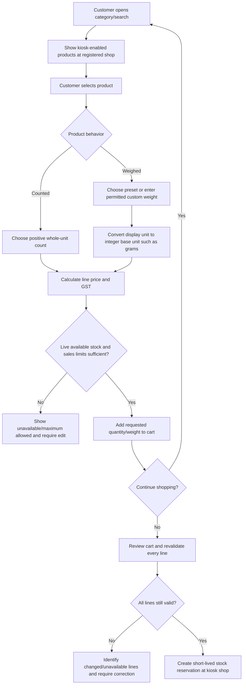

Product and cart business rules:

1. Only active products explicitly enabled for `kiosk` at the registered shop appear. A POS-only/ecommerce-only, archived, or other-shop product cannot be ordered.
2. Search/browse honors Tamil and English names, categories, SKU keywords where customer-friendly, product images, and a controlled fallback when a translation is missing.
3. Counted products accept only positive whole units. Loose products store requested quantity in the smallest base unit, normally integer grams, even when the customer sees kilograms.
4. Preset weights and custom min/max/increments come from Product Master. The customer cannot enter a weight outside those rules or more than live available stock.
5. Direct weighing-scale input is not assumed. Kiosk weight is a requested amount; the packer records actual weight later.
6. Retail price, GST treatment, unit price, requested quantity, and estimated line total are visible before adding. The cart uses paise/base quantities and approved rounding.
7. The cart does not reserve stock while the customer is merely browsing. The system rechecks and reserves at final review/checkout to avoid indefinite stock holds.
8. If live stock changes before reservation, the affected line is reduced only with explicit customer confirmation; otherwise the customer edits or removes it.
9. Automatic retail rules may apply if configured. Manual cashier discounts, wholesale price selection, credit, and price override are not anonymous kiosk actions.
10. The cart clearly states that loose-item weight is requested and that the final actual weight/amount follows the approved tolerance and adjustment workflow.

### 9.4 Checkout, UPI/pay-at-counter, and token generation

```mermaid
sequenceDiagram
    actor Customer
    participant K as Registered shop kiosk
    participant SYS as Unified system
    participant PAY as Razorpay
    participant Q as Packing queue
    Customer->>K: Confirm cart and payment choice
    K->>SYS: Submit idempotent checkout for this kiosk/shop
    SYS->>SYS: Lock balance rows, reprice, validate and create reservation
    alt Reservation or validation fails
        SYS-->>K: Return affected lines/reason; no token
    else UPI selected
        SYS->>PAY: Create dynamic payment request
        SYS-->>K: Show QR and countdown; Order Awaiting payment
        PAY-->>SYS: Signed unique payment event
        alt Verified Captured
            SYS->>SYS: Payment Captured; Order Confirmed
            SYS->>SYS: Generate/reuse token
            SYS->>Q: Add paid order to local packing queue
            SYS-->>K: Show paid token confirmation
        else Failed or expired
            SYS->>SYS: Payment Failed; cancel/expire order and release reservation
            SYS-->>K: Offer safe retry/new attempt
        else Delayed/unknown
            SYS->>SYS: Keep Pending; reconciliation owns outcome
            SYS-->>K: Show processing/recovery instructions; do not claim paid
        end
    else Pay at counter selected
        SYS->>SYS: Accept payment-due terms; Order Confirmed; Payment Pending with pay-at-counter term
        SYS->>SYS: Generate/reuse token and extend reservation under kiosk policy
        SYS->>Q: Add PAYMENT DUE order to local packing queue
        SYS-->>K: Show token and payment-required instructions
    end
```

#### Token rules

1. A token is generated only after the UPI payment is verified as captured or pay-at-counter terms are successfully accepted with stock reserved.
2. Checkout retries return the same token for the same accepted order. They never create duplicate orders, reservations, packing jobs, or tokens.
3. The token is unique within its configured shop/time scope, tied to one order and device/shop, and cannot retrieve an order at the other location.
4. The customer-facing token may be a short display number plus an optional QR/long lookup identifier. Public display uses only the non-sensitive token.
5. The token is a queue/collection reference—not proof of payment. Staff must check payment and fulfillment state in the system.
6. Optional token-slip printing occurs only after the order/token commit. Printer failure does not cancel the order; the kiosk keeps the token on screen and provides a staff-help/recovery route.
7. A token moves through `Issued → Preparing → Ready/Assistance → Consumed`, or `Cancelled/Expired` under approved policy. Every state change is driven by a committed order/fulfillment event.

#### Kiosk status combinations

| Scenario | Order | Payment | Fulfillment | Reservation/stock | Token |
|---|---|---|---|---|---|
| Cart before checkout | `Draft` or cart only | Not created | Not created | None | None |
| UPI QR active | `Awaiting payment` | `Pending` | `Unassigned` | Active short reservation | None until verified capture |
| UPI paid/token issued | `Confirmed` | `Captured` | `Assigned` | Reserved at kiosk shop | `Issued/Preparing` |
| Pay at counter/token issued | `Confirmed` | `Pending` with term `pay-at-counter` | `Assigned` | Reserved at kiosk shop | `Issued/Preparing`, marked payment due |
| Packed and ready | `Confirmed` | `Captured` or `Pending` with term `pay-at-counter` | `Ready` | Reservation consumed into final stock posting | `Ready` |
| Collected | `Completed` | `Captured` | `Completed` | Final sale movement posted | `Consumed` |
| UPI failure/checkout expiry | `Cancelled` with reason | `Failed`; payment-attempt outcome records decline/expiry | Not completed | Reservation `Released/Expired` | None or `Cancelled` |

### 9.5 Staff packing-queue workflow

```mermaid
flowchart TD
    A["Accepted kiosk order appears in registered shop queue"] --> B["Queue shows token, age, requested items/weights and PAID/PAYMENT DUE flag"]
    B --> C["Packer claims order"]
    C --> D["Pick counted items and weigh each loose line"]
    D --> E["Record actual quantity separately from requested quantity"]
    E --> F{"Every item available and acceptable?"}
    F -->|"No"| G["Mark shortage/damage and set token Assistance/Order On hold"]
    G --> H{"Resolution with customer/manager"}
    H -->|"Repack/substitute if explicitly approved"| D
    H -->|"Cancel/partial under policy"| I["Adjust/release stock and payment; close or revise order"]
    H -->|"Wait for stock/customer"| J["Remain On hold with owner and timeout"]
    F -->|"Yes"| K{"Actual loose weight within approved tolerance?"}
    K -->|"Yes"| L["Finalize quantities and totals under configured rule"]
    K -->|"No"| M["Set Assistance and obtain customer/staff approval"]
    M --> N{"Financial impact"}
    N -->|"Extra due"| O["Collect extra UPI/counter amount or repack to accepted weight"]
    N -->|"Refund/reduction due"| P["Initiate partial refund or reduce pay-at-counter amount"]
    N -->|"Customer rejects"| I
    O --> Q{"Adjustment confirmed?"}
    Q -->|"No"| J
    Q -->|"Yes"| L
    P --> L
    L --> R["Consume reservation and post final on-hand sale quantity"]
    R --> S["Create packing record, final invoice/financial adjustment and label"]
    S --> T["Seal pack and mark fulfillment Ready"]
    T --> U["Publish bilingual Ready event for token"]
```

#### Staff packing screen and controls

| Stage | Staff view/action | Controls and system updates |
|---|---|---|
| Queue | Filter new, preparing, assistance, ready, aging; see paid/payment-due badge | Location scope enforced; sort/prioritize by accepted time/policy; claim lock prevents duplicate packing |
| Pick list | View product, SKU, requested count/weight, special unit handling | Staff records picked state; no product substitution without explicit approved resolution |
| Actual weight | Enter measured grams/kg for loose items | Store requested and actual base quantities, source, tolerance result, packer, timestamp |
| Exception | Record unavailable/damaged item or out-of-tolerance result | Order `On hold`; token `Assistance`; customer/staff decision and approver audited |
| Financial adjustment | Show new total, paid/due/refund difference | Verified extra payment, reduced pay-at-counter due, or linked partial refund before finalization as policy requires |
| Pack/label | Confirm final contents and sealing | Consume reservation, post stock, create packing record/invoice/label and outbox events atomically |
| Ready | Place in controlled pickup area and mark ready | Fulfillment `Ready`; status-display event and optional bilingual announcement |

Staff rules:

- The packer sees only orders assigned to the current shop and cannot redirect a kiosk order to the other shop from the queue.
- `PAYMENT DUE` is always visible but does not by itself authorize handover. The business may choose whether staff begin packing before counter payment; that setting changes priority, not the final handover control.
- Requested and actual weight are never overwritten into one field. The line retains tolerance, recalculation, approval, payment/refund, and stock effects.
- A substitute, quantity reduction, extra charge, or cancellation needs the configured customer/manager decision. Staff cannot silently change the basket.
- Marking `Ready` publishes a status event only after the packing/stock/invoice transaction succeeds. A display outage does not change fulfillment state.

### 9.6 Status display and collection workflow

```mermaid
sequenceDiagram
    participant SYS as Unified system
    participant DISP as Public status display
    actor Customer
    actor Counter as Pickup/counter staff
    participant POS as Counter/POS payment screen
    SYS-->>DISP: Token Issued/Preparing event
    DISP-->>Customer: Show token under Received/Preparing
    SYS-->>DISP: Token Ready event
    DISP-->>Customer: Show bilingual Ready status
    Customer->>Counter: Present token/slip/QR
    Counter->>SYS: Retrieve order at this shop
    alt Token invalid, consumed, cancelled, wrong shop, or not Ready
        SYS-->>Counter: Block handover and show safe reason/escalation
    else Ready and payment due
        Counter->>POS: Open exact kiosk order and collect tender
        POS->>SYS: Submit confirmed payment against same order
        alt Payment not captured
            SYS-->>Counter: Keep Ready/On hold; no handover
        else Payment captured
            Counter->>SYS: Confirm recipient and handover
            SYS->>SYS: Fulfillment/Order Completed; token Consumed
        end
    else Ready and already paid
        Counter->>SYS: Confirm recipient and handover
        SYS->>SYS: Fulfillment/Order Completed; token Consumed
    end
    SYS-->>DISP: Remove/mark collected token
    SYS-->>Counter: Provide final invoice print/send action
```

Status-display rules:

1. The display shows only token and a minimal stage such as `பெறப்பட்டது / Received`, `தயாராகிறது / Preparing`, `உதவி தேவை / Assistance`, or `தயார் / Ready`.
2. It never shows customer name, phone, address, products, quantity, price, payment status, or reason for assistance.
3. The display subscribes only to its configured shop. Anna Nagar tokens cannot appear on the Ayyanambakkam display or vice versa.
4. Realtime reconnection reloads current active states from the system; it does not replay a stale `Ready` token after collection.
5. If the display or announcement fails, the system order remains valid. Staff use the authoritative packing queue and may call the token manually.
6. Collection is an atomic, idempotent transition. Repeating the scan/click returns `Already collected` and cannot decrement stock or capture payment again.
7. A ready-order no-show moves to `On hold` after policy timeout. Because final stock may already be committed and an invoice may exist, staff use the approved cancellation/return-to-stock and refund workflow—not a simple reservation release.

### 9.7 Kiosk system updates and business rules

| Rule area | Required behavior |
|---|---|
| Device/location | Kiosk, reservation, order, token, packing job, stock posting, invoice and status display remain bound to the registered shop |
| Connectivity | Kiosk checkout is online-only; no offline order/payment/token creation |
| Language | Tamil/English choice is session-scoped, reversible before payment, and applied consistently with explicit fallback |
| Privacy | Anonymous by default; clear session/QR/token after completion/timeout; public display uses token only |
| Catalogue | Only active kiosk-enabled variants at this shop; retail price book by default |
| Quantity | Counted units are integers; requested/actual loose quantities are separate integer base units such as grams |
| Weight | Preset/custom constraints come from Product Master; packer confirms actual weight and tolerance later |
| Cart | Live reprice/revalidation before reservation; stock change requires explicit customer correction |
| Reservation | Create atomically at checkout; expire/release on failed/abandoned unpaid flow; consume into final stock posting when packed |
| UPI | Dynamic QR tied to one idempotent attempt; only valid unique signed server event changes payment to `Captured` |
| Pay at counter | Accepted order is visibly `PAYMENT DUE`; counter must capture payment against that exact order before handover |
| Token | One idempotent shop-scoped token per accepted order; queue reference, not proof of payment |
| Packing | Queue claim, actual weight, exceptions, final stock, invoice and ready event are actor/time audited |
| Display | Public minimal bilingual state; authoritative fulfillment state always remains in the core system |
| Collection | Requires correct shop/token, fulfillment `Ready`, and payment `Captured`; completes order/fulfillment and consumes token once |
| Invoice | Final quantity/price/tax snapshot and GST invoice follow approved accounting rules; reprint shows `COPY` |
| Audit/idempotency | Checkout, webhook, token, payment collection, packing finalization, display event and handover tolerate safe retries |

### 9.8 Kiosk exception matrix

| Trigger | Customer/staff outcome | State and stock/payment behavior | Resolution owner |
|---|---|---|---|
| Kiosk not registered/wrong capability | Unavailable screen | No session/order/reservation | Admin fixes device/shop capability |
| Kiosk loses connectivity | Checkout/payment start blocked; current screen shows service unavailable | No offline order; server-side pending attempt preserved if already created | Background reconciliation/manager help |
| Tamil translation missing | Marked English fallback | No financial/stock impact | Catalogue manager supplies approved translation |
| Product inactive/not kiosk-enabled | Hidden/disabled | No cart line | Catalogue manager/manager reviews visibility |
| Requested count/weight invalid | Inline error/allowed range | No invalid line/reservation | Customer edits selection |
| Stock changes while browsing | Cart line warning | No reservation yet | Customer reduces/removes line |
| Reservation race at checkout | Checkout identifies affected line | No token/payment request until valid reservation | Customer edits/retries |
| Inactivity before checkout | Session reset | Cart cleared; no reservation | Customer restarts |
| Inactivity with active reservation/QR | Public screen clears safely | Attempt remains server-side until payment becomes `Captured`/`Failed` or the attempt expires; reservation follows the guarded expiry policy | Reconciliation/recovery flow |
| UPI QR creation fails | Payment unavailable/retry message | Order remains Draft/Awaiting payment; reservation expires if not retried | Customer retries or chooses pay at counter |
| UPI declined/expired | Failure shown | Payment `Failed`; unpaid order `Cancelled` with reason; reservation `Released/Expired` | New idempotent payment attempt/order as policy |
| UPI success screenshot only | Staff/kiosk does not mark paid | Payment remains `Pending` | Wait for signed event or provider reconciliation |
| Delayed webhook after screen reset | Recovery/processing path | Server can confirm original attempt and issue/recover one token | Background worker/manager lookup |
| Duplicate webhook/checkout click | Existing outcome/token returned | No duplicate payment, reservation, job or order | Idempotency handles automatically |
| Pay-at-counter order not paid | No handover | Payment remains `Pending` with term `pay-at-counter`; order is `Confirmed`/`On hold` and fulfillment may remain `Ready` | Counter collects approved tender or manager cancels |
| Token printer failure | Show token on screen/help path | Order/token/queue remain valid | Staff lookup or audited reprint |
| Token invalid/wrong shop/already consumed | Handover blocked | No payment/stock/state change | Counter verifies order; manager handles dispute |
| Packer cannot find item | Token `Assistance`; order `On hold` | Reservation retained/revised; no silent stock commit | Packer/manager/customer resolution |
| Actual weight outside tolerance | Token `Assistance` | Finalization waits for approved quantity/payment/refund decision | Packer/counter/manager |
| Extra amount not paid | No ready handover/completion | Canonical payment retains its prior state; the incremental payment attempt remains `Pending/Failed`, and order is `On hold` | Repack, collect, or cancel/refund |
| Refund event delayed | Customer gets pending explanation | Linked refund remains pending; no duplicate refund | Background reconciliation/finance |
| Packing finalization transaction fails | Do not show `Ready` | Reservation/final stock/invoice remain at last committed state | Packer retries same idempotent action |
| Status display disconnected/stale | Staff fallback/manual token call | Authoritative order/fulfillment unchanged | Device support; reload active state on reconnect |
| Duplicate collection action | `Already collected` | No second payment, invoice, stock or completion | Automatic idempotent response/manager dispute path |
| Ready order not collected | Reminder/On hold | No simple reservation release after stock commit | Manager extends, cancels/refunds, and returns stock through compensating flow |
| Customer abandons after verified payment | Order continues/recovery token available | Captured payment and reservation preserved | Staff/manager finds by payment/order and completes or refunds |

### 9.9 Minimum acceptance journeys

The kiosk workflow is ready for pilot only when both shops can demonstrate:

1. English counted-item order paid by UPI, packed, shown as Ready, collected, invoiced, and removed from display.
2. Tamil loose-weight order using a preset weight, paid by UPI, with actual weight within tolerance and a correct bilingual token journey.
3. Tamil/English custom-weight order using pay at counter, visibly flagged payment due, paid against the same order, then handed over once.
4. Stock becoming unavailable during cart review without creating a payment or stranded reservation.
5. UPI failure, expiry, delayed signed event, duplicate event, and screen reset without false payment confirmation or duplicate token.
6. Actual weight outside tolerance leading to assistance, approved adjustment/repack/refund, and correct final stock/invoice/payment.
7. Token printer failure and public-status-display failure with staff fallback and no order loss.
8. Invalid, wrong-shop, and already-consumed token attempts blocked without exposing customer/order details.
9. Pay-at-counter attempted handover while unpaid blocked; successful payment and collection captured once.
10. Ready-order no-show resolved with the approved hold/cancellation/refund/return-to-stock workflow and complete audit history.

## 10. Ecommerce and wholesale workflow

The ecommerce site serves retail guests/accounts and approved wholesale accounts from one shared catalogue and order system. Anna Nagar and Ayyanambakkam are evaluated through configuration; neither is hardcoded as the retail shop, wholesale shop, default warehouse, or permanent fallback.

### 10.1 Actors, channels, and outcomes

| Actor/component | Responsibility |
|---|---|
| Retail guest | Check pincode, browse retail catalogue, build cart, provide contact/address, pay through Razorpay or use eligible COD |
| Retail account customer | Retail journey plus saved addresses, order history, tracking, invoices, returns, and faster checkout |
| Wholesale applicant | Create business profile and submit required GST/business/terms information for review |
| Approved wholesale customer | Use assigned price book/tiers, GST details, approved COD/credit terms, addresses, order history, and invoices |
| Customer/wholesale manager | Review wholesale application, assign price book, minimums, tax profile, credit/COD permissions, limit and due terms |
| Routing service | Evaluate both shops using versioned capability, zone, stock, capacity, priority, ETA and promise configuration |
| Razorpay | Process online payments/refunds and emit signed events; it is not the order or stock system of record |
| Location manager | Accept assigned order, resolve capacity/stock/routing exceptions, and approve any manual override/split within authority |
| Assigned shop staff | Pick, weigh, pack, invoice, prepare pickup/delivery, and handle approved exceptions |
| Unified system | Authorize, price, validate stock, reserve, route, manage states/idempotency/audit, and publish fulfillment/payment events |

| Successful path | Final checkout outcome |
|---|---|
| Razorpay retail/wholesale | One shop assigned; stock reserved; payment `Captured` by verified signed event; order `Confirmed`; fulfillment queued |
| COD retail/wholesale | One shop assigned; stock reserved; COD eligibility accepted; payment `COD due`; order `Confirmed`; fulfillment queued |
| Approved wholesale credit | One shop assigned; stock reserved; limit/terms accepted; payment `Credit due`; order `Confirmed`; receivable created |
| No eligible single shop | Order/cart enters `On hold: Manual routing review` or checkout stops before payment; no automatic split |

### 10.2 Ecommerce customer screen flow

```mermaid
flowchart LR
    E1["1. Pincode/serviceability check"] --> E2["2. Retail browse or account sign-in"]
    E2 --> E3["3. Catalogue/category/search"]
    E3 --> E4["4. Product and quantity/weight"]
    E4 --> E5["5. Cart"]
    E5 --> E3
    E5 --> E6["6. Customer/account and address"]
    E6 --> E7["7. Price, GST, delivery/pickup and stock review"]
    E7 --> E8["8. Route and reserve whole basket"]
    E8 --> E9["9. Razorpay, COD or approved wholesale credit"]
    E9 --> E10["10. Confirmation and assigned-shop promise"]
    E10 --> E11["11. Order history/tracking/invoice"]
    E11 --> E12["12. Cancellation/return/support"]
    E2 --> W1["Wholesale application/sign-in"]
    W1 --> W2["Approval status"]
    W2 -->|"Approved"| E3
    W2 -->|"Pending/rejected/suspended"| W3["Retail terms or application support"]
```

| Screen | Customer action | Required decisions/display | System effect |
|---|---|---|---|
| 1. Pincode check | Enter delivery pincode; optionally choose pickup | Serviceable/not currently serviceable, estimated area, pickup alternative, disclaimer that full address is revalidated | Store anonymous service context; no routing assignment yet |
| 2. Identity | Continue as permitted retail guest, sign in, create retail account, or sign in/apply as wholesale | Account type, wholesale status, session security, saved address availability | Resolve retail/approved wholesale pricing context |
| 3. Catalogue | Browse categories/search | Channel-visible products, selected price context, unit, image, availability indicator, retail/wholesale labels | Query ecommerce-enabled catalogue; do not expose other customers' or exact sensitive stock data |
| 4. Product | Select variant and counted quantity/requested weight | Unit behavior, price/tier, min/max/increment, GST basis, estimated availability | Add validated draft line in base units/paise |
| 5. Cart | Edit/remove lines and continue | Requested quantities, price/tier, discounts, tax estimate, subtotal, threshold/availability warnings | Reprice and revalidate; stock not yet promised by a display estimate |
| 6. Address/account | Choose/enter delivery or pickup details | Contact, full address, pincode, GST/billing data when required, wholesale account status | Validate address/zone and lock checkout identity/context |
| 7. Review | Confirm basket and fulfillment mode | Final product prices, wholesale minimum/tier, discounts, GST, delivery fee, order minimum, promised window estimate | Final validation input created; address/cart changes invalidate prior route quote |
| 8. Route/reserve | Wait for assignment check | One-shop availability or manual-review/unavailable message | Evaluate both shops, assign candidate, and atomically reserve complete basket |
| 9. Payment | Choose eligible Razorpay, COD, or approved wholesale credit | Exact current total, restrictions, due terms, provider status | Payment attempt/COD/credit decision tied to reserved order |
| 10. Confirmation | Review order number and promise | Payment status, delivery/pickup mode, assigned fulfillment promise, contact/support | Order `Confirmed`; assigned shop fulfillment queue receives order |
| 11. Account/order detail | Track and download/view records | Order/payment/fulfillment/delivery states, invoice when issued, tracking link when active | Read own records only; notification preferences applied |
| 12. Support | Request permitted cancellation/return | Cutoff, packed/dispatch state, refund/COD/credit impact | Approved cancellation releases/compensates stock and payment; return uses Section 15 |

### 10.3 Pincode, address, service-zone, and fulfillment-mode checks

```mermaid
flowchart TD
    A["Customer enters pincode"] --> B["Find active configured service zones for both shops"]
    B --> C{"Any delivery zone matches pincode?"}
    C -->|"No"| D{"Pickup enabled?"}
    D -->|"No"| E["Show not serviceable; allow catalogue browsing/interest only if configured"]
    D -->|"Yes"| F["Offer eligible pickup shops subject to whole-basket stock"]
    C -->|"Yes"| G["Show preliminary serviceability and delivery terms"]
    G --> H["Customer browses/builds cart"]
    F --> H
    H --> I["Checkout captures full address or selected pickup shop"]
    I --> J{"Delivery or pickup"}
    J -->|"Delivery"| K["Normalize/geocode and validate exact address against current zones"]
    J -->|"Pickup"| L["Validate selected/ranked pickup shop capability and hours"]
    K --> M{"Exact address serviceable now?"}
    M -->|"No"| N["Request corrected address, offer pickup, or stop checkout"]
    M -->|"Yes"| O["Pass address, zone, fee and SLA candidates to routing"]
    L --> O
```

Serviceability rules:

1. The pincode check is an early customer indication, not the final route commitment. The complete address and current zone configuration are revalidated at checkout.
2. Zones, supported pincodes/service polygons, delivery fees, minimum order, order cutoffs, operating hours, promised SLA, COD availability, and eligible shops are configuration—not application constants.
3. A pincode may be served by one or both shops. The customer does not force a delivery shop merely by entering a pincode; routing evaluates all eligible candidates.
4. Pickup may allow customer shop selection or system ranking according to configuration, but the chosen shop must still pass capability, hours, order type, and whole-basket stock checks.
5. If maps/geocoding is unavailable, the system uses a configured pincode/zone fallback and marks the route decision with that degraded source; it does not invent an exact ETA.
6. Address or fulfillment-mode changes after a route quote invalidate delivery fee, promise, assignment, reservation, and any unpaid payment attempt that depends on the old total.

### 10.4 Retail accounts and wholesale approval

Retail guest checkout is configurable. A retail account supports saved addresses, order history, invoices, tracking, returns, and preferences. Wholesale pricing, COD rules, and credit require an authenticated account with the relevant approvals.

```mermaid
flowchart TD
    A["Customer chooses wholesale account"] --> B{"Existing authenticated profile?"}
    B -->|"No"| C["Create customer login and verified contact"]
    B -->|"Yes"| D["Open wholesale profile/status"]
    C --> D
    D --> E{"Current wholesale status"}
    E -->|"None/Draft"| F["Enter legal/trade name, billing/shipping, GST details and configured evidence"]
    E -->|"Pending"| G["Show pending status; no wholesale prices/credit"]
    E -->|"Rejected/Suspended"| H["Show permitted reason/support; retail terms only if allowed"]
    E -->|"Approved"| I["Load assigned price book, tiers, minimums, tax and payment permissions"]
    F --> J["Submit application"]
    J --> K["Manager validates business/tax data and commercial terms"]
    K --> L{"Decision"}
    L -->|"Need information"| M["Return to applicant with requested fields"]
    L -->|"Reject"| N["Status Rejected with internal/public reason handling"]
    L -->|"Approve pricing only"| O["Status Approved; assign wholesale prices; immediate payment/COD as permitted"]
    L -->|"Approve credit"| P["Status Approved; assign price book plus credit limit and due terms"]
    M --> F
    O --> I
    P --> I
```

| Account state/control | Required behavior |
|---|---|
| Retail guest | Retail price book only; no saved account data beyond checkout/consent requirements; COD subject to guest policy |
| Retail account | Retail price book; saved addresses/history; account-specific rules only if explicitly assigned |
| Wholesale `Draft/Pending` | Application may be edited/under review; wholesale prices, credit, and protected business terms are unavailable |
| Wholesale `Approved` | Assigned wholesale/customer price book and quantity/value tiers become available; tax/GST profile applied |
| Wholesale `Rejected/Suspended` | Wholesale checkout/credit blocked; retail ordering allowed only if policy permits |
| Pricing approval | Separate from credit approval. A wholesale customer can be approved for price tiers but required to pay Razorpay/COD |
| Credit approval | Requires explicit limit, available balance, due terms, overdue policy, and authorizer; it does not follow automatically from GSTIN/wholesale approval |
| COD approval | May differ from retail COD and credit; limits/areas/order types are configurable |
| Profile change | Material changes such as GSTIN/legal identity/credit terms may return profile to review without altering historical invoices |
| Access/privacy | Customer sees only own account/orders; staff access is role/location scoped and audited |

Wholesale approval updates `wholesale_profiles`, customer price-book assignment, tax/GST profile, allowed payment terms, optional `credit_accounts`, approval history, audit event, and notification. Rejected applications do not delete the customer account or application evidence required by policy.

### 10.5 Catalogue, pricing, and cart validation

```mermaid
flowchart TD
    A["Customer/account and preliminary zone context known"] --> B["Load active ecommerce-visible products"]
    B --> C{"Pricing context"}
    C -->|"Retail guest/account"| D["Use retail price book"]
    C -->|"Approved wholesale"| E["Use assigned wholesale/customer price book"]
    C -->|"Unapproved wholesale applicant"| F["Use retail terms or block per policy"]
    D --> G["Apply eligible automatic rules"]
    E --> H["Evaluate quantity/value tiers and minimums"]
    F --> G
    H --> G
    G --> I["Customer selects variant and quantity/requested weight"]
    I --> J["Calculate price, discount, taxable value, GST and line total"]
    J --> K["Check indicative availability across eligible shops"]
    K --> L["Add/edit cart"]
    L --> M{"Account, quantity, address or price rule changed?"}
    M -->|"Yes"| N["Reprice and revalidate all lines; show differences"]
    M -->|"No"| O["Proceed to checkout review"]
    N --> O
    O --> P{"Cart rules valid?"}
    P -->|"No"| Q["Require correction: unavailable line, minimum, tier, weight, limit or tax data"]
    P -->|"Yes"| R["Submit immutable checkout inputs to route/stock validation"]
```

Catalogue/cart rules:

1. A product must be active and enabled for ecommerce; wholesale visibility can be independently configured. Product availability may also vary by location and fulfillment mode.
2. Product names, variant/SKU, images, counted/weighed behavior, selling unit, requested-weight rules, HSN/GST basis, and channel visibility come from Product Master.
3. Counted items use whole units; loose items use requested integer base units such as grams. Packing records actual weight later and follows the Section 12 tolerance/payment-adjustment flow.
4. Price-book precedence selects one retail, wholesale, or customer-specific approved book; books do not stack. Quantity tiers are evaluated deterministically from the selected book.
5. Automatic discounts and tier rules apply in approved order. Manual staff discounts are not a public checkout action unless a controlled promotion/quote workflow is added.
6. Wholesale minimum quantity/value, pack multiples, maximums, and price tiers are validated per line/cart. Failure either blocks wholesale checkout or uses an explicitly configured retail fallback visible to the customer.
7. Cart totals show item subtotal, discount, taxable value, GST, delivery fee, approved rounding, credit/COD terms where applicable, and payable total.
8. Displayed availability is not a reservation. Stock is revalidated across candidate shops at checkout and reserved only after one route is selected.
9. Changing identity/account, quantities, address, fulfillment mode, or promo/price context can change price, tax, fee, candidates, and promise. The customer must review the new total before payment.
10. On confirmation, order lines snapshot name, SKU, requested quantity, price/tier, discount, tax and totals so later catalogue/price changes do not alter history.

### 10.6 Configurable routing between Anna Nagar and Ayyanambakkam

#### Route-and-reserve decision flow

```mermaid
flowchart TD
    A["Receive validated cart, customer type, address/pickup and requested promise"] --> B["Load versioned configuration for Anna Nagar and Ayyanambakkam"]
    B --> C["Create candidate list; do not assume a default retail/wholesale shop"]
    C --> D["Filter channel and retail/wholesale capability"]
    D --> E["Filter delivery zone or pickup capability, hours and operating status"]
    E --> F["Filter order restrictions, SLA/cutoff and current capacity"]
    F --> G["Lock/read each candidate's available stock for every line"]
    G --> H["Keep only candidates that can fulfill the complete basket"]
    H --> I{"Single-shop candidates remaining?"}
    I -->|"None"| J["Set On hold/Manual routing review; do not auto-split"]
    I -->|"One"| K["Select that shop"]
    I -->|"Two"| L["Rank using configured priority, drive time, capacity and promised time"]
    L --> M["Apply deterministic configured tie-breaker"]
    M --> K
    K --> N["Calculate final shop-dependent fee/promise and show if changed"]
    N --> O{"Customer accepts final total/promise?"}
    O -->|"No"| P["Return to cart/mode/address or cancel checkout"]
    O -->|"Yes"| Q["Atomically reserve every line at selected shop"]
    Q --> R{"Reservation succeeds without stock race?"}
    R -->|"No"| S["Re-evaluate candidates once under retry policy or move Manual review"]
    R -->|"Yes"| T["Persist assignment, candidate reasons/scores, config version and reservation expiry"]
    T --> U["Proceed to Razorpay/COD/approved credit"]
```

#### Eligibility and ranking configuration

| Stage | Configurable inputs | Rule |
|---|---|---|
| Candidate shops | Anna Nagar, Ayyanambakkam, enabled/disabled/temporarily paused | Both begin as peers; a paused shop is excluded with reason |
| Channel capability | Retail ecommerce, wholesale ecommerce, pickup, delivery fulfillment | Candidate must support channel, customer/order type, and requested mode |
| Serviceability | Pincodes, service polygons, shop-zone mapping, cutoff/hours | Delivery address or pickup choice must be currently valid |
| Order restrictions | Minimum/maximum value, SKU/category/weight limits, wholesale minimums, COD restrictions | Hard failure removes candidate or blocks checkout according to rule |
| Stock | On hand, active reservations, offline safety buffer, sellable status | Candidate must cover every line; no partial candidate qualifies by default |
| Capacity | Open/paused, queue load, packing capacity, delivery capacity | Hard cap can exclude; softer load can affect rank |
| Priority | Per-zone, channel, retail/wholesale, time-window priority | Configurable rank input, not hardcoded location order |
| Travel/ETA | Drive time, route matrix, fallback zone estimate | Used only after hard eligibility; degraded source is recorded |
| Promise | Cutoff, preparation SLA, delivery/pickup window | Candidate must meet required promise or return a customer-visible alternative |
| Tie-breaker | Configured priority/shortest promise/stable shop identifier | Must be deterministic and versioned to explain repeat decisions |

For every candidate, the system records accepted/rejected state, reason codes, relevant stock snapshot, capability/zone match, capacity state, rank inputs, map/fallback source, score/order, configuration version, selected shop, and any override. This makes customer support and operational review possible without hardcoding assumptions.

#### Reassignment and manager override

- Before picking starts, an authorized manager may reassign an order only if the destination can fulfill the complete basket and customer promise/fee remains valid. The system atomically reserves the destination and releases the source, or makes no change.
- The override records old/new shop, actor, reason, stock checks, price/fee/promise effects, customer approval when required, and state history.
- Once picking/packing begins, automatic reassignment is blocked. A manager resolves the operational exception through a controlled return-to-queue/stock transfer/cancellation workflow.
- A shop cannot reject an assigned order merely by deleting it. Rejection requires a reason and moves it to `On hold` for reassignment/manual review.
- Wholesale fulfillment can be enabled for one or both shops without code changes.

### 10.7 No-split default and manually approved split exception

```mermaid
flowchart TD
    A["No shop can fulfill complete basket"] --> B["Order On hold: Manual routing review"]
    B --> C{"Non-split resolution available?"}
    C -->|"Customer edits/removes line"| D["Reprice and rerun one-shop routing"]
    C -->|"Wait for receipt/transfer"| E["Keep hold with owner/expiry; rerun after stock available"]
    C -->|"Alternate pickup/address/promise"| F["Revalidate serviceability and rerun routing"]
    C -->|"Manager single-shop override"| G["Validate full stock/capability and reserve atomically"]
    C -->|"Cancel"| H["Release holds and close checkout/order"]
    C -->|"Request exceptional split"| I{"Split feature enabled and authorized manager approves?"}
    I -->|"No"| B
    I -->|"Yes"| J["Create explicit per-shop allocation for Anna Nagar/Ayyanambakkam"]
    J --> K["Recalculate fees, taxes/invoice treatment, promises and handovers"]
    K --> L{"Customer accepts split terms and both allocations reserve atomically?"}
    L -->|"No"| B
    L -->|"Yes"| M["Record split approval/reason and create linked fulfillment legs"]
```

Split controls:

1. The normal routing engine never splits a basket. If neither shop can cover it, the result is Manual Review—not partial confirmation.
2. Manual split is disabled for the MVP unless Owner/Admin and the accountant explicitly approve the complete stock, payment, invoice, delivery, return, and reporting design. Manual Review by itself is not permission to split. While disabled, only edit, wait/replenish/transfer, alternate mode/address, single-shop override, or cancellation are available.
3. If enabled, split approval requires a specifically authorized manager, reason, customer acceptance, and successful reservation for every line/leg. A partial reservation cannot be presented as a confirmed complete order.
4. The customer must see changed delivery/pickup count, fees, promises, COD/payment treatment, and invoice implications before accepting.
5. If enabled later, a parent coordination record creates one child order per shop; every child order keeps exactly one `assigned_location_id`, reservation set, fulfillment, invoice/payment allocation, delivery/pickup and return ownership. A single order record must never carry two assigned locations.
6. Failure of either atomic reservation returns the whole request to Manual Review. It does not silently confirm one half.
7. Split approval, configuration version, actor, reason, customer consent, allocation, both stock checks, financial recalculation, and later cross-leg cancellation/return are audited.

### 10.8 Checkout payment: Razorpay, COD, and approved wholesale credit

```mermaid
sequenceDiagram
    actor Customer
    participant WEB as Ecommerce site
    participant SYS as Unified system
    participant PAY as Razorpay
    participant SHOP as Assigned shop queue
    Customer->>WEB: Confirm address, cart, fulfillment and payment method
    WEB->>SYS: Submit idempotent checkout
    SYS->>SYS: Validate account/price/tax/serviceability; route and reserve whole basket
    alt No one-shop route/reservation
        SYS-->>WEB: Manual review/unavailable; do not start payment
    else Razorpay selected
        SYS->>PAY: Create provider attempt for current final total
        SYS-->>WEB: Show hosted payment/UPI flow; Order Awaiting payment
        PAY-->>SYS: Signed unique outcome event
        alt Verified capture
            SYS->>SYS: Payment Captured; Order Confirmed; retain reservation
            SYS->>SHOP: Add paid order to assigned shop queue
            SYS-->>WEB: Show confirmed order
        else Failed or expired
            SYS->>SYS: Payment Failed; cancel/expire order and release reservation
            SYS-->>WEB: Show safe retry/alternate method
        else Delayed/unknown
            SYS->>SYS: Keep Pending and reconcile provider outcome
            SYS-->>WEB: Show Processing; do not claim paid or charge again
        end
    else COD selected
        SYS->>SYS: Validate zone/customer/value/product/history rules and COD limit
        alt COD ineligible
            SYS-->>WEB: Require Razorpay/approved credit or edit order
        else COD eligible
            SYS->>SYS: Payment COD due; Order Confirmed; retain reservation
            SYS->>SHOP: Add COD order to assigned shop queue
            SYS-->>WEB: Show COD confirmation and collection terms
        end
    else Wholesale credit selected
        SYS->>SYS: Validate approved profile, available limit, overdue rule and due terms
        alt Credit ineligible
            SYS-->>WEB: Require Razorpay/COD if eligible
        else Credit eligible
            SYS->>SYS: Payment Credit due; create receivable; Order Confirmed
            SYS->>SHOP: Add credit order to assigned shop queue
            SYS-->>WEB: Show invoice terms/due date
        end
    end
```

Payment rules:

1. Routing and a short-lived whole-basket reservation occur before Razorpay begins so the system does not intentionally charge an unavailable order.
2. The final provider amount includes validated items, discounts, GST, delivery fee, rounding, and other approved totals. A material address/cart/route change invalidates the unpaid attempt and requires a new reviewed total.
3. Only a valid, unique, signed server-side Razorpay event changes payment to `Captured`. The browser success page, screenshot, redirect, or customer claim is not proof.
4. Provider payment/event IDs and checkout idempotency keys prevent duplicate charge/order/stock posting. A captured-but-unconfirmed local outcome enters reconciliation and reuses the original attempt.
5. Failure or reservation/payment expiry changes payment to `Failed`; the attempt records its failure/expiry reason, the unconfirmed order becomes `Cancelled` with reason, and reserved stock becomes `Released/Expired`.
6. COD eligibility is configurable by service zone, order/customer type, value, category/SKU, customer history/status, fulfillment mode, and operational limit. COD is `COD due`, not `Captured`, until authorized collection.
7. COD amount is updated by approved actual-weight changes. Driver/counter collection and settlement follow Sections 13–14 and the system-wide payment workflow.
8. Wholesale approval does not automatically grant credit. Credit needs an active account, available limit, due terms, and overdue-rule pass; accepted exposure is created atomically with order confirmation.
9. Refunds, partial refunds after weight adjustment, and cancellations link to the original transaction and use unique refund IDs.

### 10.9 Order handoff, statuses, and customer account journey

| Checkout stage/outcome | Order | Payment | Fulfillment | Inventory | Customer view |
|---|---|---|---|---|---|
| Browse/cart | Cart or `Draft` | None | None | No reservation | Estimated availability/total |
| Route/reservation ready | `Draft/Awaiting payment` | None or `Pending` | `Unassigned` | Short reservation at selected shop | Final shop-dependent total/promise for review |
| Razorpay active | `Awaiting payment` | `Pending` | `Unassigned` | Reservation active until expiry | Secure payment/processing |
| Razorpay captured | `Confirmed` | `Captured` | `Assigned` to selected shop | Reservation retained | Confirmed order and promise |
| COD accepted | `Confirmed` | `COD due` | `Assigned` | Reservation retained | COD amount/terms and promise |
| Wholesale credit accepted | `Confirmed` | `Credit due` | `Assigned` | Reservation retained | Due terms and promise |
| No full-basket shop | `On hold` if order exists | Not charged; uncertain capture reconciled | `Unassigned` | No partial/stranded default reservation | Manual review/edit/wait/pickup/cancel options |
| Payment failed/expired | `Cancelled` with reason | `Failed`; attempt records failure/expiry | Not completed | Reservation `Released/Expired` | Retry/new checkout |
| Packing | `Confirmed` or `On hold` | `Captured`, `COD due`, `Credit due`, or canonical payment state plus a pending adjustment record | `Picking → Weight confirmed → Packed/Ready`; fulfillment never becomes `On hold` | Reservation consumed into actual sale quantity | Status and any approval/payment adjustment |
| Pickup/delivery complete | `Completed` | `Captured` or credit settlement state | `Completed` | Final stock movement posted | Invoice, tracking/history, return entry point |

After confirmation:

- The assigned shop receives the immutable order-line snapshots, requested quantities, customer/address minimum necessary for fulfillment, payment terms, service promise, and packing instructions.
- Packer records actual loose weight; out-of-tolerance changes require the Section 12 customer/payment/refund decision and cannot silently alter the order.
- Retail/wholesale customers can view their own order, payment, fulfillment, delivery, invoice and return states. Guest access uses a private scoped lookup/tracking mechanism.
- Cancellation eligibility depends on current fulfillment/payment state. Before packing, approval releases reservation and initiates any needed refund. After stock/invoice/dispatch actions, compensating return/refund workflows apply.
- Delivery uses the assigned shop's dispatch workflow; pickup uses the assigned shop's Ready/collection workflow. The customer cannot collect at the other shop without an approved reassignment.

### 10.10 Ecommerce and routing business rules

| Rule area | Required behavior |
|---|---|
| Source of truth | Shared Product Master, prices, customers, inventory ledger, orders and payments across both shops |
| Identity | Retail guest/account and wholesale account are distinct contexts; only authenticated approved profile sees wholesale terms |
| Wholesale | Pricing approval, COD approval and credit approval are separate configurable controls |
| Pincode | Early indicator only; exact address/mode revalidated at checkout |
| Catalogue | Product must be active and enabled for ecommerce/wholesale context; location/mode availability still checked |
| Price | One approved price book plus deterministic tier/discount/tax order; all confirmed lines snapshot values |
| Cart | Cart availability is indicative; any material context change triggers full reprice/revalidation |
| Stock | Available equals on hand minus reservations minus offline buffer; whole basket must fit one shop by default |
| Routing | Hard eligibility precedes ranking; both shops are peers loaded from versioned configuration |
| Assignment | Selected candidate, rejected reasons, rank inputs, configuration version and override history are stored |
| Split | Never automatic; disabled by default unless manual split capability and approvals are configured |
| Reservation | Reserve all lines atomically at selected shop; expire/release on failed/abandoned unconfirmed checkout |
| Razorpay | Signed unique server event is authoritative; client success is not payment proof |
| COD | Eligibility and limits are configured; state remains `COD due` until collection |
| Credit | Approved limit/terms and receivable required; no anonymous or implied wholesale credit |
| Idempotency | Checkout, payment event, reservation, assignment, confirmation, refund and cancellation tolerate retries |
| Privacy/security | Accounts see own records; secrets/payment credentials are not stored; staff access is role/location scoped |

### 10.11 Ecommerce and routing exception matrix

| Trigger | Customer/operations outcome | Stock/payment/order behavior | Resolution |
|---|---|---|---|
| Pincode has no active zone | Delivery unavailable; pickup may be offered | No assignment/reservation/payment | Correct pincode, choose pickup, or stop checkout |
| Full address outside preliminary pincode zone | Checkout blocks/requotes | Old route/fee invalid; unpaid reservation/attempt released as needed | Correct address or change fulfillment mode |
| Maps/geocoding unavailable | Degraded serviceability/ETA message | Use configured zone fallback; record degraded source | Retry maps or apply approved fallback promise |
| Guest checkout disabled | Sign-in/create-account prompt | Cart retained; no payment | Authenticate |
| Wholesale application pending/rejected/suspended | Wholesale terms unavailable | No wholesale price/credit | Retail checkout if allowed or manager resolves profile |
| GST/business data invalid or changed | Wholesale checkout/approval held | No new protected terms; history unchanged | Applicant/manager corrects and reapproves |
| Wholesale minimum/tier not met | Warning/block/retail fallback per policy | Cart repriced; no hidden tier | Edit quantity/cart or accept visible retail terms |
| Product becomes inactive/wrong channel | Line blocked at revalidation | No reservation for invalid line | Remove/replace line |
| Quantity/weight invalid | Inline/cart error | No invalid reservation | Correct entry |
| Price/tax changes before payment | New total review required | Old unpaid attempt invalidated; no silent capture | Accept reprice or cancel |
| One shop lacks a line but other covers all | Route to complete candidate | Reserve only selected complete shop | Normal routing |
| Neither shop covers whole basket | Manual routing review | No automatic partial confirmation/split/payment | Edit, wait/transfer, alternate mode, override, approved split, or cancel |
| Stock race during reservation | Re-evaluate/Manual review | Failed atomic reservation leaves no partial hold | Retry candidates once/policy, then customer decision |
| Both shops eligible/tied | Deterministic configured result | One shop reserved/assigned | Store tie-break inputs/config version |
| Candidate shop paused/over capacity | Candidate excluded or lower ranked | No reservation at excluded shop | Select other eligible shop or manual review |
| Maps ETA call fails during ranking | Fallback rank used | Decision marked degraded | Configured priority/promise fallback |
| Manager override destination lacks full stock | Override blocked | Original assignment/reservation retained | Choose valid destination or other resolution |
| Assignment rejected after confirmation | Order `On hold` | Reservation retained until atomic reassign/cancel decision | Manager reassigns whole order, replenishes, or cancels/refunds |
| Manual split not enabled/approved | Split blocked | Order stays On hold; no partial confirmation | Use non-split options |
| Manual split reservation partially fails | Split not confirmed | Roll back partial leg reservations | Return to Manual Review |
| Razorpay creation/decline/expiry | Retry/alternate payment | Payment failed/pending as appropriate; reservation expires/releases | Safe retry with idempotency |
| Browser shows paid but no signed event | Processing, not confirmed | Payment `Pending`; no false fulfillment release | Webhook/provider reconciliation |
| Duplicate/late Razorpay event | Existing result returned/reconciled | No duplicate order/payment/stock | Idempotent inbox/reconciliation |
| Captured payment but order confirmation uncertain | Processing/support path | Do not charge again; stock protected where possible | Recover original idempotent result or refund |
| COD not eligible | Require online payment/approved credit | No COD confirmation | Change method/cart/address |
| Credit limit/overdue breach | Credit blocked | No receivable/order confirmation | Razorpay/COD or approved manager credit action |
| Reservation expires while customer pays | Processing/manual recovery | Do not silently confirm unavailable stock | Re-reserve whole basket, reroute with consent, or refund |
| Actual packed weight changes total | Approval/payment/refund flow | Order `On hold`; fulfillment remains at its current canonical state with blocker reason until resolved | Section 12 adjustment workflow |
| Customer cancels before packing | Cancellation review | Release reservation; refund/reverse payment as needed | Confirm cancellation and notify shop/customer |
| Customer cancels after packing/dispatch | Standard cancellation blocked/controlled | Use compensating inventory/payment records | Return/refund/failed-delivery policy |

### 10.12 Minimum acceptance journeys

Both shops must demonstrate:

1. Retail guest/account enters a serviceable pincode, checks out with Razorpay, routes to Anna Nagar as the best complete candidate, and reaches its fulfillment queue once.
2. The same cart/configuration change routes to Ayyanambakkam without code changes.
3. Both shops qualify and the documented rank/tie-break configuration produces a reproducible assignment with stored reasons.
4. One shop lacks one line and the other covers the full basket; the whole order routes to the complete shop.
5. Neither shop covers the full basket; checkout enters Manual Review and does not auto-split or charge.
6. Manual non-split resolution through cart edit, replenishment/transfer, alternate pickup/address, override, and cancellation behaves correctly.
7. If enabled, a manually approved split requires customer acceptance and both leg reservations; any partial failure rolls back to Manual Review.
8. Retail COD passes and fails configured zone/value/customer rules without being marked paid prematurely.
9. Razorpay capture, decline, expiry, delayed/duplicate signed event, browser redirect loss, and reservation expiry do not duplicate or falsely confirm an order.
10. Wholesale application moves through pending/approved/rejected/suspended states; only approved accounts receive assigned pricing.
11. Wholesale pricing-only approval supports Razorpay/COD without implied credit; separate credit approval enforces limit, due terms, and overdue rules.
12. Address, quantity, account, or price change forces reprice/reroute/review before payment.
13. Packer actual-weight change invokes the correct extra-payment/partial-refund/COD/credit adjustment and preserves requested versus actual quantity.
14. Confirmed retail and wholesale orders expose correct account history, fulfillment/delivery status, invoice, cancellation, and return entry points.

## 11. Payment and reconciliation workflow

```mermaid
flowchart TD
    A["Order total finalized for current stage"] --> B{"Tender or terms"}
    B -->|"Cash"| C["Cashier/driver records collection"]
    B -->|"Online UPI/card"| D["Create provider payment attempt"]
    B -->|"COD"| E["Mark COD due within policy"]
    B -->|"Wholesale credit"| F["Check approval, balance, limit and due date"]
    B -->|"Pay at counter"| G["Keep payment pending until cashier collection"]
    D --> H{"Signed webhook valid and unique?"}
    H -->|"No"| I["Reject/quarantine event and alert if suspicious"]
    H -->|"Yes"| J{"Provider outcome"}
    J -->|"Captured"| K["Record transaction and mark Captured"]
    J -->|"Failed or expired"| L["Mark Failed and release eligible reservation"]
    J -->|"Unknown/delayed"| M["Remain Pending; reconciliation job queries provider"]
    F --> N{"Within terms?"}
    N -->|"No"| O["Require payment or manager-approved hold"]
    N -->|"Yes"| P["Create credit receivable; mark Credit due"]
    E --> Q["Collect at delivery and mark captured"]
    G --> R["Collect before pickup and mark captured"]
    C --> S["Add cash movement to register/session"]
    K --> T["Link payment to order and invoice"]
    P --> T
    Q --> T
    R --> T
    S --> T
```

Payment controls:

- Provider payment IDs, event IDs, refund IDs, and local sale IDs are unique.
- Duplicate events return the previously recorded outcome and never duplicate stock, payment, invoice, or notification records.
- A browser success page never marks an order paid.
- A captured payment with a missing local confirmation enters reconciliation; stock remains protected according to reservation policy.
- A late verified capture after reservation expiry or order cancellation never silently revives the order. Payment reconciliation either re-reserves and reconfirms the complete order with customer consent, or creates a linked refund; Finance/Owner owns the unresolved case.
- Refunds link to the original capture and have their own `Pending`, `Confirmed`, or `Failed` attempt status. The canonical payment remains `Captured` while a refund is pending and becomes `Partially refunded` or `Refunded` only after confirmed refund value is posted.
- Cash, pay-at-counter, COD, and driver handover create traceable cash movements with collector, shop/route, shift, and settlement status.

## 12. Shop fulfillment, packing, and actual-weight workflow

This shop-floor workflow applies to kiosk, ecommerce retail, ecommerce wholesale, scheduled pickup, and own-driver delivery orders. It runs identically at Anna Nagar and Ayyanambakkam and is restricted to the order's assigned shop. Immediate counter POS sales complete equivalent quantity, price, stock, invoice, and handover controls at the cashier station rather than entering this queue.

### 12.1 Actors, prerequisites, and lifecycle outcome

| Actor/component | Responsibility |
|---|---|
| Unified system | Enforce assigned-shop scope, order/payment/reservation validity, queue state, price/tax calculation, idempotency, stock posting, invoice, audit, and outbox |
| Location manager | Resolve acceptance, stock, substitution, price, payment, cancellation, printer, no-show, and override exceptions |
| Packer | Accept/claim order, follow pick list, count/weigh, record actual quantities, pack, label, stage, and mark Ready |
| Counter/pickup staff | Retrieve Ready order, collect any permitted amount due, verify token/order, hand over, and confirm collection |
| Customer | Approve material quantity/substitution/price change, make extra payment where required, receive refund notification, and collect |
| Payment processor/POS | Capture extra payment, reduce COD/pay-at-counter due, adjust credit exposure, or process linked refund |
| Background worker | Send customer notifications, print/document jobs where asynchronous, retry provider/notification events, expire holds, and alert on aging |
| Printer/print agent | Produce final GST invoice and configured packing/pickup label after the business transaction commits |

Prerequisites for acceptance:

- The order is assigned to the current shop and has not been cancelled, completed, or assigned to the other shop.
- Order is `Confirmed` or an authorized pay-at-counter/COD/credit case, with a valid fulfillment record and stock reservation at this shop.
- Payment is `Captured`, `COD due`, `Credit due`, or `Pending` with the explicitly permitted term `pay-at-counter`. An unexplained `Pending` Razorpay attempt is not fulfillment authorization.
- The current staff member has the packer/location role and the shop is operating for the required pickup/delivery promise.

Successful pickup fulfillment ends with order `Completed`, fulfillment `Completed`, payment `Captured` or approved credit settlement state, token/order reference consumed, actual stock posted, final invoice retained, and handover audited. Successful delivery preparation ends with fulfillment `Packed`, then `Handed to driver` under Section 14.

### 12.2 Staff screen/station flow

```mermaid
flowchart LR
    F1["1. Assigned-shop queue"] --> F2["2. Accept/claim order"]
    F2 --> F3["3. Pick list"]
    F3 --> F4["4. Count and loose-weight entry"]
    F4 --> F5["5. Variance and final-price review"]
    F5 --> F6["6. Payment/refund/customer decision"]
    F6 --> F7["7. Pack and quality check"]
    F7 --> F8["8. Commit stock and create invoice"]
    F8 --> F9["9. Print invoice and label"]
    F9 --> F10["10. Stage and mark Ready/delivery-ready"]
    F10 --> F11["11. Customer notification/status display"]
    F11 --> F12["12A. Pickup verification and handover"]
    F10 --> F13["12B. Driver handover"]
```

| Screen/station | Staff action | Required view/validation | System effect |
|---|---|---|---|
| 1. Queue | Filter/choose assigned jobs | Shop, channel, age/SLA, token/order, pickup/delivery, payment flag, priority, exception state | Read only this shop's eligible queue; aging alerts visible |
| 2. Accept/claim | Accept or raise reasoned exception | Assignment, reservation, cancellation, payment authorization, capacity | Record acceptance/claim actor/time; fulfillment remains/enters `Assigned` |
| 3. Pick list | Pick exact SKU/variant and requested quantity | Product/SKU, requested count/weight, storage/lot rule if configured, substitution restriction | Fulfillment `Picking`; line-level picked progress/audit |
| 4. Count/weigh | Confirm counted quantity and enter actual loose weight | Requested vs actual, base/display unit, min/max/increment, stock/reservation | Store actual quantity separately in integer base units |
| 5. Price review | Review recalculated lines and tolerance | Effective order price snapshot/rule, actual quantity, taxable value, GST, delta | Draft final totals and variance decision; no silent invoice change |
| 6. Resolution | Obtain approval/payment/refund decision | Within/outside tolerance, substitute/shortage, payment method, customer response | Adjustment confirmed, order `On hold`, repack, partial/cancel, refund/extra charge as applicable |
| 7. Pack/QC | Verify contents, packaging, seal and staging mode | All lines resolved, final quantities, special handling, pickup/delivery label data | Packing checklist and pack record prepared |
| 8. Finalize | Confirm packing completion once | Reservation/available stock, final payment/credit decision, invoice series | Atomically consume reservation, post actual stock, create invoice/packing record/states/audit/outbox |
| 9. Print | Print invoice and label | Correct shop/template/printer, invoice number, label privacy | Print attempts recorded; failure does not repeat finalization |
| 10. Stage | Place sealed pack in controlled Ready/dispatch area | Location/bin, token/order, pickup vs delivery | Pickup becomes `Ready`; delivery becomes `Packed/delivery-ready` |
| 11. Notify | Review notification outcome | Customer channel/language, token/order, shop, Ready/promise | Outbox sends status/display/WhatsApp/SMS/email; retries independently |
| 12A. Pickup | Verify reference, payment and recipient; hand over | Correct shop/order/token, `Ready`, amount due, prior collection | Fulfillment/order `Completed`; token consumed; handover audit |
| 12B. Driver | Verify assigned driver/job and sealed pack | Delivery assignment, driver, COD amount, parcel count | Fulfillment `Handed to driver`; delivery `Picked up` |

### 12.3 Normal fulfillment flow

```mermaid
flowchart TD
    A["Confirmed assigned order enters shop queue"] --> B{"Acceptance checks pass?"}
    B -->|"No"| C["Order On hold; record exception and owner"]
    B -->|"Yes"| D["Packer accepts/claims order"]
    D --> E["Pick exact counted and loose-product SKUs"]
    E --> F{"All requested items found and sellable?"}
    F -->|"No"| C
    F -->|"Yes"| G["Confirm counts and weigh loose products"]
    G --> H["Store requested and actual quantities separately"]
    H --> I{"Actual weight/quantity within approved tolerance?"}
    I -->|"Yes"| J["Finalize quantity/price under configured tolerance rule"]
    I -->|"No"| K["Obtain customer/manager quantity and financial decision"]
    K --> L{"Approved resolution?"}
    L -->|"No"| C
    L -->|"Yes"| J
    J --> M["Apply extra payment, reduced due, credit change or refund as required"]
    M --> N{"Required financial state resolved?"}
    N -->|"No"| C
    N -->|"Yes"| O["Pack, quality-check, seal and prepare label"]
    O --> P["Atomically consume reservation, post actual stock and create final invoice/pack record"]
    P --> Q["Print invoice and label"]
    Q --> R{"Fulfillment mode"}
    R -->|"Pickup"| S["Stage pack and mark Ready"]
    R -->|"Delivery"| T["Stage pack as delivery-ready/Packed"]
    S --> U["Notify customer and publish token/status"]
    U --> V["Verify token/order and payment at collection"]
    V --> W["Confirm handover; order/fulfillment Completed"]
    T --> X["Create/activate dispatch job and hand to assigned driver"]
```

The normal path is idempotent at acceptance, finalization, print, notification, and handover. A retry returns the existing committed outcome rather than consuming stock, allocating an invoice number, charging, refunding, printing an unmarked duplicate, or completing handover twice.

### 12.4 Order acceptance and queue management

1. The queue is partitioned by assigned shop. Anna Nagar staff cannot accept an Ayyanambakkam job and vice versa unless an authorized reassignment completes first.
2. Queue rows show channel, promised time, fulfillment mode, customer type, age, paid/COD/credit/pay-at-counter flag, weighted-line indicator, and current exception without exposing unnecessary customer information.
3. Acceptance revalidates order state, cancellation requests, assignment, capability, operating status, reservation, and payment authorization. It does not re-route or mutate the order silently.
4. Claiming prevents two packers from acting on the same fulfillment at once. A stale claim can be released by policy with actor/reason audit.
5. A shop may reject/hold only with a standardized reason such as closure/capacity, reservation/stock discrepancy, unsafe/damaged product, payment uncertainty, or invalid assignment.
6. A rejection does not delete the job. Before picking, an ecommerce order can return to Section 10 routing/manual review; a local kiosk job remains at its registered shop and requires local resolution/cancellation.
7. Manager override/reassignment must reserve the complete basket at the destination and release the source atomically before the destination receives the job.

### 12.5 Picking and item verification

| Item type | Staff action | Validation and record |
|---|---|---|
| Counted product | Pick exact variant/SKU and count whole units | Requested/picked count, product identity, packer/time; fractions blocked |
| Loose product | Pick correct product/container and take it to weighing | Requested base quantity, allowed tolerance/increment, reserved quantity |
| Sealed pack | Pick exact pack SKU as whole units | Do not open/convert to loose stock unless Product Master and authorized workflow permit it |
| Lot/expiry-managed item | Follow configured sellable-lot/expiry policy | Selected lot/expiry and any exception; expired/quarantined stock blocked |
| Substitution | Do not substitute by staff assumption | Proposed substitute, price/tax/quantity difference, customer/manager approval and audit required |

Picking rules:

- Each line is checked against the immutable order snapshot and current product identity. A similar name is not sufficient for a different SKU.
- The reserved quantity protects the order but does not prove the item is physically usable. Missing, damaged, expired, or quarantined goods move the order to `On hold`.
- A shortage can be resolved by repick/recount, replenishment/approved transfer, explicit substitute, approved partial/cancellation, or customer wait. No line disappears silently.
- If a cancellation arrives during picking, staff stop and move the job to cancellation review. They do not complete stock/invoice posting until the resolution is known.

### 12.6 Loose-product weighing and final-price adjustment

Manual weight entry is the MVP default. Direct scale integration remains deferred. The staff screen displays requested weight and accepts actual weight in the configured display unit, then stores the exact integer base quantity, normally grams.

```mermaid
flowchart TD
    A["Packer selects loose order line"] --> B["Verify product and requested base quantity"]
    B --> C["Measure and enter actual weight"]
    C --> D["Convert to integer base units and validate min/max/increment"]
    D --> E{"Enough sellable/reserved plus available stock?"}
    E -->|"No"| F["Reweigh/repack lower or place order On hold"]
    E -->|"Yes"| G["Calculate variance from requested quantity"]
    G --> H["Recalculate line price, discounts, taxable value, GST and total using approved rule"]
    H --> I{"Within automatic tolerance?"}
    I -->|"Yes"| J["Auto-accept under configured preserve-weight/preserve-total rule"]
    I -->|"No"| K["Show customer/staff requested vs actual quantity and financial delta"]
    K --> L{"Customer decision"}
    L -->|"Accept actual and delta"| M["Proceed to payment/refund/credit adjustment"]
    L -->|"Repack to closer weight"| C
    L -->|"Accept reduced/substitute line"| N["Apply explicit approved line change"]
    L -->|"Reject/cancel"| O["Partial/cancel workflow; release/adjust reservation and payment"]
    J --> P["Mark line Weight confirmed"]
    M --> P
    N --> P
```

Weight and price rules:

1. Requested quantity, actual quantity, variance amount/percentage, tolerance version, entry source, packer, time, approver/customer response, and final quantity remain separate and auditable.
2. Actual quantity cannot exceed the reservation unless the additional available stock is locked and reserved/consumed safely in the final transaction. Otherwise staff repack lower or hold.
3. When actual quantity is lower, unused reserved quantity is released as part of finalization; it is not posted as sold stock.
4. The approved tolerance policy defines per product/category whether an in-tolerance result preserves the requested customer total, charges the actual weight, or uses another accountant-approved rule. The screen shows the outcome before finalization.
5. Outside tolerance, the customer or authorized policy/manager must decide. Customer unavailability does not authorize an undisclosed charge or substitution.
6. If actual quantity crosses a retail/wholesale quantity tier, the configured order-snapshot/tier policy determines the unit price. The system shows the effect and does not silently reprice unrelated lines.
7. Recalculation uses integer base quantities and paise with approved GST/rounding. The invoice is created from the final confirmed snapshot, not the original estimate.
8. Every weighted line must reach `Weight confirmed` or an approved non-weighted resolution before the fulfillment can be packed.

#### Financial adjustment by payment method

| Original terms | Extra amount due | Reduction/refund due | Gate before packing finalization |
|---|---|---|---|
| Razorpay captured | Create linked incremental payment request or repack/reduce under policy; never alter original capture silently | Create linked partial refund or approved pending-refund obligation | Extra payment verified; refund accepted/recorded to the policy-required state |
| COD | Increase COD due only with approved/customer-accepted final amount | Reduce COD due | Final COD amount acknowledged and stored |
| Pay at counter | Update amount due for collection before pickup | Reduce amount due | Final counter amount stored; handover still blocked until captured |
| Wholesale credit | Revalidate available limit and increase receivable exposure | Reduce receivable/expected invoice amount | Credit remains within approved terms or manager-approved exception |
| Mixed/other approved tender | Allocate delta/refund according to configured tender priority | Refund/credit against eligible original legs | All legs reconcile to final invoice total |

If extra payment is declined, credit limit fails, refund creation is uncertain, or the customer rejects the change, the order moves to `On hold`. Staff may repack, reduce/substitute with approval, wait, partially cancel, or fully cancel; they cannot mark packed/ready around the unresolved amount.

### 12.7 Packing, quality check, labeling, and invoice printing

```mermaid
sequenceDiagram
    actor Packer
    participant OPS as Fulfillment screen
    participant SYS as Unified system
    participant PRN as Approved printer/print agent
    Packer->>OPS: Confirm all lines picked, counted/weight-confirmed and financially resolved
    OPS->>SYS: Submit idempotent packing finalization
    SYS->>SYS: Lock balance/reservation and revalidate order/payment/credit/invoice number
    alt Validation fails
        SYS-->>OPS: Keep not packed; return specific exception
    else Commit succeeds
        SYS->>SYS: Consume reservation, post actual sale stock, create final invoice/pack record/states/audit/outbox
        SYS-->>OPS: Return committed invoice, packing record and label payload
        OPS->>PRN: Print invoice and label
        alt Print succeeds
            PRN-->>Packer: Original invoice and correct label
        else Print fails
            PRN-->>OPS: Record failure; packing remains committed
            OPS-->>Packer: Retry same job/use allowed printer; invoice reprint marked COPY
        end
    end
```

Packing and quality rules:

1. Staff verify every final line, quantity, package count, visible condition, closure/seal, and requested fulfillment mode before finalization.
2. Packing completion is the stock/invoice commit point: consume reserved delta, reduce on-hand by actual sellable quantity, create final line/invoice snapshots, update fulfillment, write audit/outbox in one transaction.
3. A transaction failure leaves the last committed reservation/stock/invoice state intact and does not emit `Ready`. Retrying uses the same idempotency key.
4. The pickup label uses a token/order reference, shop, package count and minimum handling/staging information. A delivery label may add the minimum address/contact/route information required. Payment details and unnecessary personal data are excluded.
5. A label never substitutes for the system state or payment check. Label reprint is audited and cannot create another pack/stock movement.
6. The final GST invoice uses approved shop series, actual quantity, price/discount, taxable value, GST, rounding, final total, customer/GST data when required, and payment/COD/credit terms.
7. Invoice printing happens after commit. Print failure cannot roll back or repeat stock/payment/invoice posting. Staff retry the same invoice, use an allowed printer/digital delivery under policy, and mark reprints `COPY`.
8. The pack moves to the controlled pickup/dispatch staging area only after identity/label checks. Staging location/bin may be recorded for retrieval and aging control.

### 12.8 Ready status and customer notification

```mermaid
flowchart TD
    A["Packing transaction committed and pack staged"] --> B{"Fulfillment mode"}
    B -->|"Pickup/kiosk"| C["Set fulfillment Ready and token/status Ready"]
    B -->|"Own delivery"| D["Set fulfillment Packed/delivery-ready and create dispatch event"]
    C --> E["Write outbox notification/display event in same transaction"]
    D --> F["Notify dispatch queue and customer according to policy"]
    E --> G["Background worker sends WhatsApp/SMS/email and updates public display where applicable"]
    G --> H{"Notification succeeds?"}
    H -->|"Yes"| I["Record delivered notification and timestamp"]
    H -->|"No"| J["Retry independently; alert when stale"]
    J --> K["Order remains Ready; staff can contact/call token manually"]
```

Ready/notification rules:

- `Ready` means the final packing/stock/invoice transaction succeeded and the pack is physically staged at the assigned pickup shop. A printed label alone cannot set Ready.
- Delivery orders are `Packed/delivery-ready`; customer wording must not imply they are ready for pickup unless the fulfillment mode changes through an approved workflow.
- Notifications include only the necessary order/token reference, correct shop, collection/delivery status, hours/instructions, and private order link. Public kiosk display follows Section 9 privacy rules.
- Message language follows the known customer/session preference where supported, with an explicit approved fallback.
- Notification delivery is asynchronous. Failure/retry does not roll back `Ready`, duplicate stock/invoice, or block staff from using an approved manual contact path.
- Repeated events are idempotent and do not spam the customer beyond configured retry/deduplication policy.

### 12.9 Pickup verification and confirmation

This subsection is the shop-staff handoff; Section 13 remains the shared customer pickup workflow.

```mermaid
sequenceDiagram
    actor Customer
    actor Counter as Pickup staff
    participant SYS as Unified system
    participant POS as Counter payment/invoice screen
    Customer->>Counter: Present token/order reference and required proof
    Counter->>SYS: Retrieve order at current shop
    alt Wrong shop, invalid/cancelled/consumed token, or not Ready
        SYS-->>Counter: Block handover and show safe resolution reason
    else Ready but amount due
        Counter->>POS: Open exact order and collect final approved amount
        POS->>SYS: Post idempotent payment against order
        alt Payment not Captured/authorized
            SYS-->>Counter: Keep Ready/On hold; no handover
        else Payment Captured
            Counter->>SYS: Confirm package/recipient handover
            SYS->>SYS: Fulfillment/Order Completed; token consumed; handover audited
        end
    else Ready and paid or approved credit
        Counter->>SYS: Confirm package/recipient handover
        SYS->>SYS: Fulfillment/Order Completed; token consumed; handover audited
    end
    SYS-->>Counter: Print/send final invoice action and remove active Ready display
```

Pickup rules:

1. Staff verify the order belongs to this shop, is `Ready`, has not been cancelled/collected, and the presented token/order reference matches.
2. Razorpay must be `Captured`; a screenshot is not proof. Pay-at-counter must be collected against the exact order. Approved credit may remain `Credit due` according to terms.
3. Staff compare package count/label and obtain the configured recipient confirmation before handover. Sensitive customer details are not spoken/shown unnecessarily.
4. The completion transition is atomic/idempotent and records order, fulfillment, token, staff, counter/device, shop, recipient method, time, package count, and optional reason/notes.
5. Repeating collection returns `Already collected`; it cannot capture money, post stock, issue a new invoice, or complete again.
6. If the customer disputes contents before leaving, staff do not edit the issued invoice/stock directly; they use missing-item/return/correction policy with evidence.
7. A no-show remains Ready until policy timeout, then moves `On hold`. Because stock/invoice are already committed, cancellation/restock/refund uses compensating workflows, not a simple reservation release.

### 12.10 Fulfillment states and system updates

| Milestone | Order | Payment | Fulfillment | Inventory/invoice | Event/customer effect |
|---|---|---|---|---|---|
| Queued | `Confirmed` | `Captured`, `COD due`, `Credit due`, or `Pending` with term `pay-at-counter` | `Assigned` | Reservation `Active` | Shop queue event |
| Accepted/claimed | `Confirmed` | Unchanged | `Assigned` with acceptance/claim audit | Reservation active | SLA clock/owner visible |
| Picking | `Confirmed` | Unchanged | `Picking` | Reservation active; picked progress only | Optional in-progress status |
| Shortage/approval needed | `On hold` | Canonical status unchanged; separate adjustment/refund attempt may be pending | Remains at current state such as `Picking`, with blocker reason; fulfillment has no `On hold` state | No final stock/invoice | Assistance/customer decision notification |
| All weighted lines resolved | `Confirmed` | Adjusted/resolved as required | `Weight confirmed` | Final draft quantities/totals | Ready for packing commit |
| Packing finalization | `Confirmed` | `Captured`, `COD due`, `Credit due`, or `Pending` with term `pay-at-counter` as permitted | `Packed` | Reservation `Consumed`; actual on-hand sale posting; final invoice/pack/label record | Outbox created |
| Pickup staged | `Confirmed` | Captured/approved credit or amount due clearly held | `Ready` | Final stock/invoice committed | Ready token/message/status |
| Delivery staged | `Confirmed` | Captured/COD due/Credit due | `Packed` | Final stock/invoice committed | Dispatch queue event |
| Pickup completed | `Completed` | Captured or approved credit settlement state | `Completed` | No second stock posting; invoice retained | Token consumed; display removed; handover event |
| Driver handover | `Confirmed` | Captured/COD due/Credit due | `Handed to driver` | No second stock posting | Delivery `Picked up`; tracking workflow |

### 12.11 Fulfillment business-rule catalogue

| Rule area | Required behavior |
|---|---|
| Location | Staff may act only on orders assigned/reserved to their shop; reassign before picking through an authorized atomic workflow |
| Acceptance | Validate assignment, order, reservation, payment authorization, cancellation and capability; rejection requires reason/owner |
| Claim | One active packer claim; stale release/transfer is audited |
| Picking | Exact variant/SKU and sellable goods; no silent substitution or line removal |
| Count | Counted items use positive whole units and must match approved final quantity |
| Weight | Requested and actual loose quantities remain separate integer base units; manual entry is MVP |
| Tolerance | Product/category policy decides automatic vs customer/manager approval and preserve-weight/total behavior |
| Price/GST | Recalculate from approved order/price policy, actual quantity, discounts, tax and rounding; show delta before acceptance |
| Extra/refund | Resolve according to original payment/COD/credit terms; idempotent provider events and refund IDs |
| Stock | Reservation remains until packing commit; actual sold quantity posts once; unused reservation releases; excess requires available stock |
| Pack | All lines and financial decisions resolved before commit; packaging/QC/label identity confirmed |
| Invoice | Create immutable final invoice from actual snapshot during packing transaction; corrections are linked/compensating |
| Printing | Post-commit only; failure does not repeat business transaction; invoice reprint is `COPY` and audited |
| Ready | Requires committed pack, physical staging and correct fulfillment mode; display/notification is downstream |
| Notification | Outbox-based, minimal/private, preferred language, retry/deduplicate independently |
| Pickup | Correct shop/reference, `Ready`, eligible payment/credit and unconsumed handover required |
| Idempotency/audit | Acceptance, weight decision, financial adjustment, pack commit, print, Ready, notification and handover are retry-safe and actor/time/reason recorded |

### 12.12 Normal and exception workflow matrix

| Trigger | Immediate status/action | Stock/payment/invoice behavior | Resolution/owner |
|---|---|---|---|
| Normal complete order | Accept, pick, weigh, pack, Ready/delivery-ready | Actual stock/invoice posts once at pack commit | Packer/counter/dispatcher completes handoff |
| Order assigned to other shop | Action blocked | No local stock/payment/invoice change | Correct routing/reassignment by manager |
| Cancelled/completed order reaches queue | Hide/block with stale-event warning | No new posting | System reconciles event; manager investigates if needed |
| Unverified pending Razorpay payment | Acceptance blocked/On hold | Reservation follows payment policy; no packing commit | Payment reconciliation/background worker |
| Reservation expired/missing | On hold | No negative/unreserved posting | Re-reserve whole basket at same shop, reroute before picking, or cancel/refund |
| Shop closed/over capacity | Reject to Manual Review before picking | Reservation retained until atomic resolution | Location manager reroutes/requotes/cancels |
| Duplicate/stale packer claim | Second action blocked | No duplicate line/finalization | Release/transfer claim with audit |
| Item/SKU not found | On hold and record shortage | Reservation retained/revised; no silent line removal | Recount/replenish/transfer/substitute/partial/cancel approval |
| Item damaged/expired/quarantined | On hold; do not pack | No sellable stock use; separate damage/quarantine process | Inventory staff/manager/customer resolution |
| Wrong SKU picked | Validation failure | No final posting | Replace with exact SKU; substitution needs approval |
| Count mismatch | Recount/On hold | No final posting | Correct count or approved partial/cancel |
| Invalid weight/unit/increment | Entry rejected | Prior valid actual/request remains | Reweigh and correct unit |
| Actual exceeds reservation/available stock | Repack lower/On hold | Do not create negative stock | Lock extra available stock or customer resolution |
| Actual below requested within tolerance | Auto final-price rule | Release unused reservation; post actual quantity | Proceed if configured rule resolves financial delta |
| Actual outside tolerance | Order `On hold`; fulfillment stays at its current state with blocker `Weight/price approval`; token/display may show Assistance | No final stock/invoice until decision | Customer/manager accepts, repacks, substitutes, partial/cancels |
| Price tier/tax changes after actual weight | Show full recalculation | No silent invoice; payment/credit delta pending | Apply approved snapshot/tier policy and obtain decision |
| Extra Razorpay payment fails/expires | On hold | Original capture retained; no pack commit | Retry, repack/reduce, alternate approved payment, or cancel/refund |
| COD/pay-at-counter increase rejected | On hold | Amount due not finalized | Repack/reduce/partial/cancel |
| Credit-limit fails after weight increase | On hold | No excess receivable/finalization | Immediate payment, repack, or manager-approved credit action |
| Partial refund delayed/failed | Adjustment pending per policy | Unique refund remains pending; no duplicate | Reconciliation/finance; pack only at approved gate |
| Customer unreachable for material change | On hold with timeout | No undisclosed charge/substitution | Repack within auto tolerance, wait, or cancel per policy |
| Customer cancellation during picking | Stop and review | Release reservation/refund if uncommitted; picked goods returned operationally | Manager applies cancellation cutoff |
| Packing commit database failure | Remain pre-packed/not Ready | Atomic rollback to prior reservation; no invoice/event | Retry same idempotent finalization |
| Duplicate packing submit | Existing pack/invoice returned | No second stock/invoice | Automatic idempotent response |
| Packaging/label mismatch | Do not stage/Ready | Committed record may require controlled reopen/correction if already finalized | Packer/manager corrects and audits |
| Invoice printer/label printer failure | Packing stays committed; print exception | No rollback/duplicate invoice/stock | Retry same job/alternate allowed printer; invoice COPY rules |
| Wrong invoice/label printed | Quarantine pack; do not hand over | Core record unchanged | Destroy/control wrong output, reprint correct, audit privacy incident if needed |
| Ready staging location full/missing pack | Do not publish/retain Ready incorrectly | Stock/invoice remain committed if finalized | Find/relocate pack; manager resolves state correction |
| Notification fails | Order remains Ready/Packed | No stock/payment/invoice change | Retry worker/manual contact; alert when stale |
| Status display stale | Use authoritative queue | No business-state change | Reconnect/reload active tokens; manual call |
| Invalid/wrong-shop/consumed token | Handover blocked | No payment/completion change | Verify reference; manager dispute flow |
| Amount due at pickup | Handover blocked until resolved | Payment remains pending/due | Counter collects against exact order or manager cancels |
| Duplicate pickup confirmation | `Already collected` | No second payment/stock/invoice/completion | Idempotent response; manager handles dispute |
| Customer no-show | Ready then On hold after timeout | Final stock/invoice remain committed | Notify/extend or compensating cancel/refund/restock |
| Customer disputes contents at counter | Pause handover/record evidence | Do not directly edit invoice/ledger | Recheck pack; correction/return workflow |

### 12.13 Minimum acceptance journeys

Both shops must demonstrate:

1. Paid ecommerce pickup order is accepted, picked, exact-count/weight-confirmed, packed, invoiced/labeled, marked Ready, notified, verified and handed over once.
2. Kiosk pay-at-counter order is packed with visible amount due, shown Ready, paid against the exact order, collected and token-consumed.
3. Wholesale credit order confirms available credit, posts actual weight/final receivable, prints the GST invoice and reaches pickup/delivery staging.
4. Delivery order follows the same pack/stock/invoice workflow but becomes delivery-ready and is handed to the assigned driver rather than shown as pickup Ready.
5. Actual weight within tolerance follows the configured final-price rule and releases/consumes the correct reservation quantities.
6. Actual weight outside tolerance exercises accept/extra payment, partial refund/reduction, repack, substitute/partial and cancellation decisions without silent changes.
7. Missing/damaged/wrong SKU and reservation discrepancy move to On hold and use an approved resolution without negative or untracked stock.
8. Duplicate acceptance/finalization/print/notification/handover retries do not duplicate stock, invoice, payment, refund, message or completion.
9. Invoice/label printer and customer-notification failures recover without losing the committed order or falsely repeating business transactions.
10. Invalid, wrong-shop, unpaid, cancelled and already-consumed pickup references block handover safely.
11. Customer cancellation during picking and after packing follows the correct release versus compensating refund/restock path.
12. Ready-order no-show moves through reminder/hold and approved cancellation/refund/return-to-stock with full audit.

## 13. Customer pickup workflow

```mermaid
flowchart TD
    A["Packed pickup order marked Ready"] --> B["Issue/display token and notify customer"]
    B --> C["Customer presents token/order identity"]
    C --> D{"Token valid and order at this shop?"}
    D -->|"No"| E["Do not hand over; search order and escalate safely"]
    D -->|"Yes"| F{"Payment still due?"}
    F -->|"Yes"| G["Cashier collects approved tender"]
    G --> H{"Payment captured?"}
    H -->|"No"| I["Keep order Ready/On hold; no handover"]
    H -->|"Yes"| J["Staff confirms recipient and hands over"]
    F -->|"No"| J
    J --> K["Fulfillment Completed and Order Completed"]
    K --> L["Record handover actor/time; print or send invoice"]
    B --> M{"Customer does not collect before policy deadline?"}
    M -->|"No"| C
    M -->|"Yes"| N["Notify and move On hold for manager decision"]
    N --> O{"Resolution"}
    O -->|"Extend"| B
    O -->|"Cancel/return to stock"| P["Use compensating inventory and payment/refund workflow"]
```

Once packing has committed stock and created the final invoice, a no-show is not handled by deleting the order or simply releasing a reservation. The manager uses the approved cancellation/return-to-stock and financial correction flow.

## 14. Own-driver delivery workflow

The business uses its own drivers for deliveries fulfilled from Anna Nagar and Ayyanambakkam. Each delivery remains tied to the shop that packed and invoiced the order. The MVP supports driver recommendations, dispatcher-confirmed stop order, map navigation/ETA, and live tracking; advanced multi-stop route optimization is deferred.

### 14.1 Actors, boundaries, and successful outcome

| Actor/component | Responsibility |
|---|---|
| Dispatcher | Review delivery-ready orders, driver availability/capacity, build/confirm routes, assign/reassign, monitor progress, handle failures, and open COD settlement |
| Location/pickup staff | Verify sealed packs, labels, package count, driver/route, COD amount, and transfer custody to/from driver |
| Driver | Start shift, declare availability, accept/decline, verify pickup, follow route, update status, collect COD, verify OTP, capture proof, return failed parcels, and settle cash |
| Customer | Receive private notifications/tracking, provide access/directions, present OTP, pay COD when due, accept/reject delivery, and request support/return |
| Unified system | Enforce role/shop/job scope, state transitions, assignment/custody, payment, OTP, proof, idempotency, audit, retention, and cash reconciliation |
| Maps provider | Supply geocoding, route/ETA/directions; it does not own delivery state or proof |
| Messaging provider | Deliver status, OTP, tracking, failure, reschedule, and completion notifications; delivery state remains in the core system |
| Background worker | Recalculate ETA, process notifications/outbox, age alerts, retry events, close tracking, reconcile payment/proof, and enforce retention |
| Driver/customer apps | Show only authorized jobs/private tracking; queue permitted events during weak network and display last-updated state honestly |

Successful delivery ends with delivery `Delivered`, fulfillment `Completed`, order `Completed`, OTP/proof linked, any COD payment `Captured`, driver custody closed, customer notified, live tracking stopped, and cash/digital settlement assigned to reconciliation.

### 14.2 Driver availability and delivery statuses

Driver availability is operational state and must not replace delivery status.

| Driver/shift state | Meaning | Assignment effect |
|---|---|---|
| `Off shift` | No active approved shift | Excluded |
| `Available` | Signed in, active shift, eligible vehicle/capacity/location, no blocking issue | Candidate for new jobs |
| `Assigned` | Has offered/accepted work but may have remaining capacity | Candidate only if configured limits allow |
| `On route` | Has picked up and is actively delivering | New work only under dispatcher/capacity policy |
| `Break/Unavailable` | Temporarily not assignable, with reason/expected return | Excluded until available |
| `Settlement due` | Route complete but COD/custody close is pending | May be blocked from more COD exposure |
| `Shift closed` | All jobs/cash/custody reconciled or handed to variance owner | Excluded |

```mermaid
stateDiagram-v2
    [*] --> Unassigned
    Unassigned --> Assigned: Dispatcher assigns driver/stop
    Unassigned --> Cancelled: Order cancelled before assignment
    Assigned --> Unassigned: Driver declines, times out, or dispatcher safely reassigns
    Assigned --> Cancelled: Cancelled before shop pickup
    Assigned --> PickedUp: Shop and driver confirm custody
    PickedUp --> OutForDelivery: Driver starts active route/stop
    OutForDelivery --> Arriving: Driver reaches arrival threshold or marks arriving
    Arriving --> Delivered: OTP/proof and payment gate pass
    OutForDelivery --> Failed: Attempt cannot complete
    Arriving --> Failed: Customer/payment/OTP/access/parcel failure
    Failed --> Assigned: Approved reschedule/new attempt
    Failed --> Returned: Parcel custody returned to shop
    Delivered --> [*]
    Returned --> [*]
    Cancelled --> [*]
```

Every transition records delivery job/attempt, order, assigned shop, driver, dispatcher/system actor, timestamp, reason/source, current route/stop, location when permitted, payment state, and idempotency key.

### 14.3 Dispatcher screen and workflow

```mermaid
flowchart LR
    D1["1. Delivery-ready queue"] --> D2["2. Driver availability board"]
    D2 --> D3["3. Route/stop planning"]
    D3 --> D4["4. Assignment offer"]
    D4 --> D5["5. Driver response"]
    D5 --> D6["6. Shop pickup/custody"]
    D6 --> D7["7. Live route monitor"]
    D7 --> D8["8. Delivered/failed decision queue"]
    D8 --> D9["9. Return/reschedule/cancellation review"]
    D8 --> D10["10. COD and route settlement"]
    D9 --> D10
```

| Dispatcher view | Required information/actions | System control/update |
|---|---|---|
| Delivery-ready queue | Shop, packed time, promise/window, zone/address, package count/weight, COD amount, priority, special handling | Only `Packed/delivery-ready` orders; no uncommitted pack |
| Driver board | Shift, availability, assigned shop/zone, vehicle/capacity, current workload, route/ETA, last location age, COD exposure/settlement hold | Candidate recommendation with inclusion/exclusion reasons |
| Route planning | Group by origin shop, select jobs, inspect maps/ETA/time windows, set explicit stop order | Route/stop version saved; advanced optimization not assumed |
| Assignment | Choose driver/vehicle, send offer, set response timeout | Delivery `Assigned`; assignment history retained |
| Response | Accept, decline, timeout | Accepted route locked to driver; decline/timeout returns delivery `Unassigned` with reason |
| Pickup monitor | Parcel and driver confirmation, missing package/label issue | Custody event; delivery `Picked up`; fulfillment `Handed to driver` |
| Live monitor | Driver/stop states, last tracking time, ETA, delay, customer contact/notification state | Alerts on stale/no-progress/off-route according to policy |
| Exception queue | Failure reason/proof, COD/OTP status, customer request, parcel custody | Dispatcher chooses retry/reschedule/return/cancellation review |
| Settlement | Expected vs recorded COD/digital collections, returned parcels, route close | Match/variance workflow; driver shift cannot hide unresolved custody/cash |

#### Driver recommendation and assignment

```mermaid
flowchart TD
    A["Packed delivery-ready orders grouped by origin shop"] --> B["Load active drivers/shifts/vehicles"]
    B --> C["Filter active account, shift, availability and shop/zone eligibility"]
    C --> D["Filter package/weight/vehicle capacity and current workload"]
    D --> E["Filter blocking COD exposure, unresolved custody or safety restriction"]
    E --> F{"Eligible drivers?"}
    F -->|"None"| G["Keep delivery Unassigned; alert promise risk and seek manual option"]
    F -->|"Yes"| H["Rank by current route time, workload, capacity, location freshness and configured priority"]
    H --> I["Dispatcher reviews recommendation and stop sequence"]
    I --> J["Assign route/jobs and send offer"]
    J --> K{"Driver response before timeout?"}
    K -->|"Decline"| L["Record reason; return jobs Unassigned; recommend next candidate"]
    K -->|"No response"| M["Expire offer; return jobs Unassigned; alert dispatcher"]
    K -->|"Accept"| N["Lock accepted assignment and send shop-pickup instructions"]
```

Assignment rules:

1. A driver can see only assigned jobs and the minimum customer data needed for the current stop. The dispatcher cannot assign a packed order from another origin shop without an explicit cross-shop pickup route/capability.
2. Eligibility and ranking are configurable. Driver count, vehicle type, shift, capacity, service zone, workload, route time, COD exposure, and safety/settlement holds are not hardcoded.
3. Recommendations do not auto-accept work. The dispatcher confirms route/stop order and the driver accepts, declines with reason, or times out.
4. Advanced multi-stop optimization is deferred. The MVP may use map route/ETA results and a simple recommendation, but the dispatcher owns the final ordered stops.
5. A route change after acceptance records a new version, reason, affected promise/ETA, and customer notifications. It cannot remove a parcel from driver custody without a custody return/transfer.
6. Reassignment before shop pickup closes the old assignment and creates a new one. Reassignment after pickup requires physical custody transfer/return and explicit audit.

### 14.4 Driver application journey

```mermaid
flowchart LR
    V1["1. Sign in/start shift"] --> V2["2. Availability/vehicle/COD opening"]
    V2 --> V3["3. Assignment offer"]
    V3 --> V4["4. Accept/decline"]
    V4 --> V5["5. Shop pickup checklist"]
    V5 --> V6["6. Route and stop list"]
    V6 --> V7["7. Navigate/out for delivery"]
    V7 --> V8["8. Arriving/customer contact"]
    V8 --> V9["9. OTP, proof and COD"]
    V9 --> V10["10A. Delivered"]
    V9 --> V11["10B. Failed attempt"]
    V11 --> V12["11. Reschedule or return to shop"]
    V10 --> V13["12. Next stop/route complete"]
    V12 --> V13
    V13 --> V14["13. Parcel/COD settlement and end shift"]
```

| Driver screen | Driver action | Required safeguards/system effect |
|---|---|---|
| Start shift | Confirm driver/vehicle, availability and opening cash/float if used | Active registered driver/device; unresolved prior custody/COD shown/blocking per policy |
| Offer | Review origin, stop count, package/capacity, time window and total COD exposure | Customer details minimized until accepted/current stop |
| Accept/decline | Accept route or select decline reason | Assignment accepted or returns to dispatcher; no silent disappearance |
| Shop pickup | Verify route, package count/label/seal and COD by stop | Dual custody confirmation; delivery `Picked up`; missing/damaged pack blocks pickup |
| Route list | Review ordered stops and map/navigation | Stop version, promise and permitted customer-contact action; no other driver's jobs |
| Out for delivery | Start route/stop and location sharing | Delivery `Out for delivery`; active tracking/ETA/notification begins |
| Arriving | Mark/auto-trigger arriving; contact customer through approved method | Delivery `Arriving`; customer notification/OTP reminder |
| Completion | Enter customer OTP, record recipient, capture configured photo/signature, collect COD | Server validation; no Delivered state until required gates pass |
| Failure | Select standardized reason, notes/evidence and parcel status | Delivery `Failed`; payment not falsely captured; dispatcher exception created |
| Return | Return parcel(s) to named shop and obtain staff custody confirmation | Delivery `Returned`; order On hold; parcel awaits inspection/disposition |
| Settlement | Declare cash/digital COD by job and hand over cash/returns | Matched/variance record; shift closure controlled |

### 14.5 Shop-to-driver custody and route start

```mermaid
sequenceDiagram
    actor Shop as Shop fulfillment staff
    actor Driver
    participant APP as Driver app
    participant SYS as Unified system
    Shop->>SYS: Open accepted route pickup list
    Driver->>APP: Open same route and identity
    loop Every assigned parcel
        Shop->>Driver: Present sealed labeled package
        Driver->>APP: Verify order/label, package count, condition and COD amount
        alt Missing, damaged, wrong route or mismatch
            APP->>SYS: Record pickup exception; do not accept parcel
        else Valid
            APP->>SYS: Confirm driver receipt
            Shop->>SYS: Confirm staff handover
        end
    end
    SYS->>SYS: Commit custody for fully confirmed parcels
    SYS->>SYS: Fulfillment Handed to driver; Delivery Picked up
    SYS-->>Driver: Enable route/stop actions
    SYS-->>Shop: Close custody handover list or show exceptions
```

Custody rules:

- Shop and driver verify exact route/job, package count, seal/condition, final invoice/label identity, destination summary, special handling, and final COD amount.
- A missing, open, damaged, wrong-label, or wrong-route parcel remains with the shop and enters a packing/dispatch exception. It is not marked picked up.
- Driver custody begins only after the committed handover event. Scanning/printing alone is not custody proof.
- Route start changes appropriate picked-up jobs to `Out for delivery`; future stops may remain picked up until their active leg according to the configured status policy.
- Any custody transfer between drivers or return to shop requires both parties/authorized staff, time, parcel condition, reason, and idempotent event.

### 14.6 Route execution, live tracking, and customer notifications

```mermaid
sequenceDiagram
    actor Driver
    participant APP as Driver app
    participant SYS as Unified system
    participant MAP as Maps/ETA
    participant MSG as Messaging
    actor Customer
    Driver->>APP: Start route/current stop
    APP->>SYS: Mark Out for delivery
    SYS->>MSG: Send private tracking link/status
    MSG-->>Customer: Out-for-delivery notification
    loop Active delivery at controlled interval
        APP->>SYS: Send permitted location point and timestamp
        SYS->>MAP: Recalculate route/ETA when needed
        MAP-->>SYS: ETA/route result or failure
        SYS-->>Customer: Refresh private status, ETA and last-updated time
    end
    Driver->>APP: Mark Arriving
    APP->>SYS: Arrival event
    SYS->>MSG: Send arrival/OTP reminder
    MSG-->>Customer: Driver arriving
    alt Delivered
        SYS->>MSG: Send delivered/invoice message
        MSG-->>Customer: Delivery confirmation
    else Failed
        SYS->>MSG: Send failed/reschedule/support message
        MSG-->>Customer: Attempt result and next step
    end
```

Tracking and notification rules:

1. The customer receives a private, expiring, order-scoped tracking link. It reveals only that customer's delivery and cannot expose other route stops/customers.
2. Driver location is collected only while the relevant shift/delivery is active and permitted. Initial target refresh is approximately every 10–15 seconds, adjusted for battery/network/privacy policy.
3. The tracking view shows status, current ETA or approved window, last-updated timestamp, and an honest stale/unavailable state. It never fabricates a current location or ETA.
4. Tracking stops or is coarsened immediately after `Delivered`, `Failed/Returned`, route end, or tracking-token expiry according to policy. Location/proof retention is limited and approved.
5. Maps failure uses the last valid/fallback zone estimate with a degraded indicator. Core delivery state is not inferred from a map response.
6. Loss of location permission pauses new points and alerts driver/dispatcher; it does not automatically mark delivery failed or delivered.
7. Customer notifications are outbox-driven and idempotent for assignment/pickup, out for delivery, arriving, delivered, failed/rescheduled/returned, and material delay/ETA change.
8. Notification failure retries independently and does not roll back delivery. Dispatcher sees stale/failed notification and may use an approved manual contact path.
9. Customer contact uses minimum data and approved channels; direct personal driver/customer numbers may be masked according to provider/business policy.

### 14.7 OTP, photo/signature proof, and delivery completion

```mermaid
flowchart TD
    A["Driver reaches customer and marks Arriving"] --> B["Verify correct parcel/recipient and request OTP"]
    B --> C{"OTP valid within attempt/expiry policy?"}
    C -->|"No"| D{"Authorized fallback proof policy available?"}
    D -->|"No"| E["Do not hand over/complete; record failed OTP attempt"]
    D -->|"Yes"| F["Capture required fallback proof and manager review marker"]
    C -->|"Yes"| G["Record OTP verification without exposing stored secret"]
    F --> H{"Payment terms"}
    G --> H
    H -->|"Prepaid"| I["Confirm payment Captured"]
    H -->|"Approved credit"| J["Confirm valid Credit due terms"]
    H -->|"COD"| K["Collect exact final COD using approved method"]
    K --> L{"COD verified and recorded?"}
    L -->|"No"| M["Do not complete/handover; failure or manager exception flow"]
    L -->|"Yes"| N["Mark payment Captured/collected and add driver settlement item"]
    I --> O["Capture configured photo/signature/recipient proof"]
    J --> O
    N --> O
    O --> P{"All required proof, payment and parcel gates pass?"}
    P -->|"No"| E
    P -->|"Yes"| Q["Atomically mark Delivery Delivered, Fulfillment/Order Completed and close custody"]
    Q --> R["Stop tracking; send confirmation; retain proof under policy"]
```

Completion rules:

1. OTP is generated/delivered through a private channel, expires under policy, and is rate/attempt limited. The driver app must not display the correct OTP value.
2. Required proof is configurable by order/risk: verified OTP plus optional recipient name, photo and/or signature. A photo is not a substitute for payment or OTP unless an authorized fallback policy explicitly says so.
3. Photo/signature capture must follow consent, minimum-necessary content, access control, encryption, object-storage, retention and deletion policy. It must not capture unrelated people/documents unnecessarily.
4. Proof records delivery attempt, order/job, driver, recipient method, server/device time, permitted location, OTP verification result, photo/signature object reference, payment state and idempotency key.
5. Prepaid payment must be `Captured`; approved credit may remain `Credit due`. COD must be verified/recorded before handover/completion.
6. Cash COD records amount due, tendered, change if permitted, collector and route settlement. Doorstep digital COD requires a verified provider/approved terminal result; a screenshot is not proof.
7. Delivery completion is atomic and idempotent. A retry returns `Already delivered` and cannot recapture COD, duplicate proof, complete order twice or alter stock again.
8. If weak network prevents required server verification, the app preserves permitted evidence/actions durably with original IDs. It cannot show centrally confirmed `Delivered` until synchronization/approved offline-proof policy succeeds.

### 14.8 Failed delivery, reschedule, and return-to-shop

```mermaid
flowchart TD
    A["Delivery attempt cannot complete"] --> B["Driver selects standardized failure reason and records evidence/parcel condition"]
    B --> C["Set Delivery Failed; keep Order/Fulfillment incomplete"]
    C --> D{"COD/payment collected?"}
    D -->|"No"| E["Payment remains COD due/prepaid/credit as applicable"]
    D -->|"Collected but no handover"| F["Open urgent payment variance/refund/custody case"]
    E --> G["Dispatcher reviews customer request, promise, driver and parcel custody"]
    F --> G
    G --> H{"Approved next action"}
    H -->|"Retry same route"| I["Create/record new attempt and notify customer"]
    H -->|"Reschedule"| J["Agree window; set/new Delivery Assigned and route again"]
    H -->|"Correct address/fee"| K["Validate zone, price and customer acceptance before new attempt"]
    H -->|"Return to shop"| L["Driver returns parcel with dual custody confirmation"]
    H -->|"Cancellation review"| M["Return parcel then apply refund/credit/stock disposition"]
    L --> N["Delivery Returned; order On hold; inspect sealed/open/damaged condition"]
    M --> N
    N --> O{"Parcel sellable and next resolution?"}
    O -->|"Redeliver"| J
    O -->|"Cancel/refund"| P["Use compensating inventory and linked payment/refund/credit-note workflow"]
    O -->|"Damaged"| Q["Post non-sellable damage/quarantine disposition"]
```

Standard failure reasons include customer absent/no answer, customer requested reschedule, refused order, incorrect/unreachable address, outside/unsafe access, OTP failure, COD failure/short payment, parcel damaged, vehicle/driver issue, severe delay, and system/network failure. Free text may supplement but not replace the reason code.

Failure/return rules:

- `Failed` is an attempt outcome, not proof the parcel returned to shop. Custody remains with the driver until redelivery, authorized transfer, or shop return is confirmed.
- The dispatcher chooses retry/reschedule/return/cancellation review. The driver cannot independently cancel, refund, change address/fee, or declare stock sellable.
- A reschedule records agreed date/window, customer confirmation, new attempt/assignment, route/promise and notification. Repeated failures follow configured attempt limits.
- Address correction reruns serviceability and fee/promise checks. A driver does not deliver to an unapproved materially different address.
- A failed parcel returned to shop is `Returned` only after shop and driver confirm job, package count, seal/condition, COD/payment state and time.
- Returned goods are not automatically restored to available stock. Packing already posted the sale; staff inspect, then use compensating customer-return/restock, damage/quarantine, redelivery or cancellation records.
- If COD was collected but handover failed, cash is not treated as normal delivered COD. It enters urgent variance/refund review linked to the order and driver settlement.

### 14.9 Customer returns using a driver

There are two distinct return paths:

1. **Undelivered return-to-shop:** The failed delivery parcel remains in driver custody and follows Section 14.8. This is not a completed customer sale return.
2. **Post-delivery customer return pickup:** A completed order first passes the Section 15 eligibility/approval workflow. Only then may dispatch create a linked return-pickup job.

```mermaid
sequenceDiagram
    actor Customer
    participant SYS as Unified system
    actor ReturnStaff as Return approver
    actor Dispatcher
    actor Driver
    actor Shop as Receiving shop
    Customer->>SYS: Request return against delivered invoice/lines
    ReturnStaff->>SYS: Approve/reject items, quantity, pickup and receiving shop
    alt Rejected
        SYS-->>Customer: Return decision/reason under policy
    else Approved driver pickup
        Dispatcher->>SYS: Create linked return-pickup job
        SYS-->>Driver: Assign minimum pickup details
        Driver->>Customer: Verify return reference/items and collect package
        Driver->>SYS: Record pickup proof/condition; take custody
        Driver->>Shop: Return package to approved receiving shop
        Shop->>SYS: Confirm custody and inspect
        SYS->>SYS: Post resellable/damaged disposition and refund only after approved inspection workflow
    end
```

The driver verifies reference/quantity and records pickup evidence but does not approve the return, promise a refund, determine resellability, or post stock. Refund/store credit/replacement begins only from the authorized return/inspection workflow.

### 14.10 COD collection and cash reconciliation

```mermaid
sequenceDiagram
    actor Customer
    actor Driver
    participant APP as Driver app
    participant SYS as Unified system
    actor Cashier as Shop cashier/manager
    Customer->>Driver: Pay final COD amount
    Driver->>APP: Record cash tender/change or verified digital method
    APP->>SYS: Post idempotent COD collection for delivery
    SYS->>SYS: Payment Captured/collected; add driver settlement line
    Driver->>SYS: Complete eligible delivery with OTP/proof
    loop At route end or configured settlement point
        Driver->>SYS: Submit declared collections and route close
        SYS-->>Cashier: Show expected cash/digital totals and returned parcels
        Driver->>Cashier: Hand over cash/receipts and returned parcels
        Cashier->>SYS: Enter counted cash and confirm custody
        alt Expected equals accepted actual
            SYS->>SYS: Settlement Matched/Closed; post shop cash movement
        else Short, over, missing, duplicate or unverified
            SYS->>SYS: Settlement Variance review; retain driver/manager owner
            Cashier->>SYS: Record investigation and approved correction/recovery
        end
    end
```

COD reconciliation rules:

1. The driver's route opens with expected COD exposure by order and final invoice amount. Actual-weight adjustments must be reflected before dispatch/customer collection.
2. At each delivery, cash/digital COD is recorded against the exact job, collector, time and amount. `Delivered` cannot silently imply money was collected.
3. Cash tendered and change are recorded when change is allowed. The driver cannot edit the invoice total or mark a shortage as full collection.
4. Doorstep digital collection is reconciled to the provider/terminal result and is not included as physical cash. Screenshots/customer claims are not verification.
5. Driver-held cash is a custody balance: opening float if any, cash collected, change/payouts if permitted, cash returned, and expected closing balance.
6. At settlement, the shop records counted cash and compares it to delivered COD collections, refunds/authorized movements, and previously handed-over amounts.
7. Match closes the settlement and creates a cash movement in the fulfilling shop's designated delivery-cash account/register. Driver cash must not appear in a cashier till until authorized staff physically count and accept it. Shortage, overage, job mismatch, duplicate collection, failed-delivery collection or missing parcel creates `Variance review` with named owner/reason.
8. A variance does not change delivered/payment history by deletion. Corrections use linked cash movements, refund/recovery, approval and audit.
9. Driver shift closure and further COD assignment may be blocked while material settlement/custody remains unresolved, according to policy.

### 14.11 Delivery states and system updates

| Milestone | Delivery | Fulfillment/order | Payment/COD | Custody/tracking/customer update |
|---|---|---|---|---|
| Packed delivery-ready | `Unassigned` | Fulfillment `Packed`; order `Confirmed` | Captured/COD due/Credit due | Shop custody; dispatcher queue |
| Driver assigned | `Assigned` | Unchanged | COD exposure allocated to route | Assignment notification; no driver custody yet |
| Shop pickup | `Picked up` | Fulfillment `Handed to driver` | Final COD amount locked for collection | Driver custody; private tracking link may activate |
| Active route | `Out for delivery` | Order `Confirmed` | Unchanged | Tracking points/ETA and customer notification |
| Near customer | `Arriving` | Unchanged | COD/OTP reminder | Arrival event/notification |
| Successful prepaid/credit | `Delivered` | Fulfillment/order `Completed` | Captured or valid Credit due | OTP/proof, custody closed, tracking stopped, confirmation |
| Successful COD | `Delivered` | Fulfillment/order `Completed` | `COD due → Captured/collected` | Proof plus settlement line; tracking stopped |
| Failed attempt | `Failed` | Incomplete/On hold as needed | Unchanged unless variance | Failure evidence; custody stays driver; customer next-step message |
| Rescheduled | New/current attempt `Assigned` | Order remains `Confirmed` | Unchanged | New promise/route/notification |
| Returned to shop | `Returned` | Order `On hold`; fulfillment not completed | Refund/COD review as applicable | Shop custody, inspection/disposition required |
| COD settled | Delivery unchanged | Order unchanged | Payment retained; settlement matched/variance | Cash movement and route/shift close |

Core updates include `drivers`, `vehicles`, `driver_shifts`, `delivery_jobs`, `route_stops`, assignment history, custody events, `tracking_points`, OTP attempts, `delivery_proofs`, payment/COD transactions, driver settlements, cash movements, order/fulfillment/delivery state history, audit events, object references, idempotency keys and outbox notifications.

### 14.12 Delivery business-rule catalogue

| Rule area | Required behavior |
|---|---|
| Scope | Driver sees assigned jobs/minimum customer data; dispatcher/shop actions are role/location scoped |
| Availability | Active shift, registered identity/device, vehicle/capacity, workload, zone, COD exposure and holds determine eligibility |
| Assignment | Dispatcher confirms recommendation/stop order; driver accepts/declines; all versions/reasons audited |
| Route | Map ETA/directions supported; advanced optimization deferred; dispatcher owns final ordered stops |
| Custody | Dual shop/driver confirmation for pickup/return/transfer; status cannot replace physical custody evidence |
| Tracking | Active-delivery-only, private expiring link, controlled interval, honest last-updated/degraded state, limited retention |
| Notification | Outbox/idempotent for major statuses/delays; minimum private content and approved fallback/manual contact |
| Arrival | Explicit/geofenced according to policy; no automatic Delivered state from GPS |
| OTP | Private, expiring, attempt-limited, server-verified; driver never sees correct value |
| Proof | Configured OTP plus optional photo/signature/recipient/location; consent/access/retention enforced |
| COD | Final amount from invoice; verified collection before handover/completion; per-job settlement line |
| Completion | Atomic/idempotent delivery, fulfillment, order, payment/custody/proof transition; no duplicate stock posting |
| Failure | Standard reason/evidence; driver cannot cancel/refund/reroute materially without authorization |
| Return | Failed parcel requires return custody/inspection; post-delivery driver pickup requires approved return first |
| Cash | Expected vs collected vs handed over by job/route; variance remains auditable and owned |
| Weak network | Durable original IDs and honest pending state; no fabricated tracking/payment/delivery confirmation |

### 14.13 Delivery exception matrix

| Trigger | Immediate outcome | State/payment/custody behavior | Resolution/owner |
|---|---|---|---|
| No eligible driver | Promise-risk alert | Delivery `Unassigned`; shop keeps parcel | Dispatcher adjusts route/shift/promise or customer option |
| Driver account/shift/device invalid | Excluded/blocked | No assignment | Admin/dispatcher resolves identity/shift/device |
| Vehicle/package capacity exceeded | Candidate excluded/route blocked | No custody transfer | Split route across drivers, change vehicle, or defer job—not order stock split |
| Driver COD exposure/settlement hold | COD jobs blocked | Existing cash/custody remains due | Settle/manager resolution |
| Driver declines/times out | Reassignment queue | Delivery returns `Unassigned`; reason retained | Dispatcher assigns next eligible driver |
| Maps/geocoding/route API unavailable | Degraded route/ETA | Core state unchanged; fallback source recorded | Dispatcher uses configured fallback/manual navigation |
| Route/ETA changes materially | Delay alert/review | New route version; no custody change | Dispatcher confirms, customer notified |
| Wrong/missing/damaged package at pickup | Parcel pickup blocked | Shop retains custody; delivery not Picked up | Fulfillment/manager corrects pack/label |
| Duplicate shop/driver pickup event | Existing custody result returned | No repeated handover/status | Idempotency |
| Driver weak network | Pending/stale indicator | Permitted events queued with original IDs; last-known shown | Retry/sync; dispatcher contacts if stale |
| Location permission lost/battery issue | Tracking degraded alert | No new points; delivery state not fabricated | Driver restores permission/manual update; dispatcher monitors |
| Tracking link invalid/expired/shared improperly | Access blocked | Delivery unaffected; security event as needed | Customer reauth/new scoped link/support |
| Customer does not receive notification | Delivery continues with alert | No state rollback | Retry/manual approved contact |
| Customer absent/no answer | Failed attempt | Delivery `Failed`; COD unpaid; driver custody | Reschedule/return/cancellation review |
| Incorrect/unserviceable new address | Do not divert materially | Failed/On hold; custody driver | Validate zone/fee/promise/customer acceptance |
| Unsafe access/driver safety issue | Stop attempt safely | Delivery `Failed`; custody driver | Dispatcher/security procedure/reschedule/return |
| Customer refuses parcel | Failed attempt | No handover; COD unpaid or collected amount escalated | Return/cancellation/refund review |
| OTP wrong/expired/too many attempts | Handover blocked | Not Delivered; proof attempt audit | Resend/retry limits or authorized fallback/failed delivery |
| Photo/signature permission denied | Follow configured proof requirement | If mandatory, no Delivered; if optional, record omission | Customer/driver/manager policy path |
| Prepaid state not Captured | Handover blocked | Payment Pending/Failed; delivery not complete | Payment reconciliation/alternate authorized resolution |
| COD short/unpaid | Handover blocked/failed | Payment remains COD due; no normal completion | Collect exact amount, manager exception, or return |
| Doorstep digital payment unverified | Processing/no handover | Not Captured; screenshot ignored | Provider/terminal verification or cash/return |
| COD collected but delivery fails | Urgent variance | Cash in driver custody; payment/refund unresolved | Dispatcher/finance reconcile/refund; return parcel |
| Duplicate completion click/sync | `Already delivered` | No second COD/proof/state change | Idempotent response |
| Completion proof upload delayed | Pending proof/sync | Do not falsely show central completion unless policy gate passed | Retry original event/object upload; manager review |
| Parcel damaged in transit | Delivery Failed | Driver custody; no customer handover | Return, inspect, damage/refund/replacement workflow |
| Customer requests reschedule | Failed/reschedule request | Custody/route per dispatcher decision | New attempt/window and notification |
| Attempt limit reached | Cancellation/manager review | Parcel returned; order On hold | Refund/COD/credit/stock disposition |
| Driver returns wrong/missing parcel | Return custody blocked/variance | Driver remains responsible; delivery not Returned | Reconcile route/packages; manager investigation |
| Returned parcel seal broken/damaged | Quarantine/inspection | No automatic available stock | Damage/return disposition and refund decision |
| Approved customer return pickup differs | Driver cannot change items | Return job remains exception | Return approver adjusts before/after shop inspection |
| Driver cash shortage/overage | Settlement `Variance review` | Payment history retained; cash movement pending | Cashier/manager investigates and approves recovery/correction |
| Digital COD settlement mismatch | Payment reconciliation | Cash excluded; provider result pending | Finance/provider reconciliation |
| Shift close with open jobs/cash/returns | Closure blocked/conditional handoff | Custody/settlement remains open | Complete or transfer with authorized audit |

### 14.14 Minimum acceptance journeys

Both shops must demonstrate:

1. Dispatcher sees a packed prepaid order, recommends/assigns an available driver, confirms stop order, driver accepts/picks up, customer tracks, OTP/proof completes delivery once.
2. Equivalent routes originate independently from Anna Nagar and Ayyanambakkam with correct shop/custody/customer scope.
3. Multiple stops use dispatcher-confirmed sequencing and map ETA without claiming advanced optimization.
4. Driver decline, timeout, no eligible driver, capacity/vehicle issue and safe pre-pickup reassignment preserve parcel custody and promise alerts.
5. Tracking updates at the controlled interval, shows honest last-update/ETA, handles maps failure, weak network and permission loss, and stops after terminal state.
6. Customer receives private assignment/out-for-delivery/arriving/delivered notifications and cannot access another delivery through the tracking link.
7. Correct, incorrect, expired and repeatedly attempted OTP plus optional/required photo/signature policy produce the proper completion/failure outcome.
8. COD cash and verified digital collection complete delivery and create correct settlement lines; screenshot/short payment cannot mark paid/delivered.
9. Customer absent, wrong address, unsafe access, refusal, damaged parcel, OTP failure and COD failure create standardized Failed attempts with dispatcher resolution.
10. Reschedule creates a new/updated attempt/promise; return-to-shop requires dual custody and inspection before stock/refund disposition.
11. Approved post-delivery driver return pickup remains separate from approval/inspection/refund and cannot be promised by the driver.
12. COD route close matches expected cash to collected/handed-over cash, and shortage/overage/digital mismatch enters auditable variance review.
13. Duplicate assignment, pickup, status, proof, COD, completion, return and settlement retries do not duplicate state or money.
14. Driver cannot close shift while material parcel custody/COD remains unresolved except through an authorized handoff/variance workflow.

## 15. Return, refund, replacement, and store-credit workflow

```mermaid
flowchart TD
    A["Customer/staff finds original invoice"] --> B["Select lines, quantity and return reason"]
    B --> C{"Within policy and actor authorized?"}
    C -->|"No"| D["Reject or request manager exception with reason"]
    C -->|"Yes"| E["Approve request and receive goods at approved shop"]
    E --> F["Inspect identity, quantity, condition and tampering"]
    F --> G{"Disposition"}
    G -->|"Resellable"| H["Post customer-return ledger increase to approved shop"]
    G -->|"Damaged/expired"| I["Post to damage/quarantine reason; not sellable"]
    G -->|"Rejected after inspection"| J["Close return as Rejected; retain evidence"]
    H --> K{"Resolution"}
    I --> K
    K -->|"Refund"| L["Create refund against original payment"]
    K -->|"Store credit"| M["Create customer credit transaction"]
    K -->|"Replacement"| N["Create linked replacement order and reserve stock"]
    L --> O{"Processor/cash refund completed?"}
    O -->|"Pending/failed"| P["Keep resolution pending and reconcile/retry"]
    O -->|"Yes"| Q["Mark Partially refunded or Refunded"]
    M --> R["Issue credit note/financial adjustment as required"]
    N --> R
    Q --> R
    R --> S["Close return; preserve invoice, audit and links"]
```

Return rules:

- The original invoice and sale ledger entries remain immutable.
- Restock only the quantity physically received and judged resellable.
- A return accepted at a shop other than the original fulfillment shop requires explicit authorization and records the receiving shop.
- Damaged or expired goods use a separate non-sellable disposition and cannot inflate available inventory.
- Original-method refund is preferred where policy requires it. Cash, store credit, or replacement needs the appropriate approval and financial document.
- A pending provider refund does not change the canonical payment from `Captured`; only a confirmed refund moves it to `Partially refunded` or `Refunded`. Finance/Owner owns failed or aging refund reconciliation.
- A replacement is a new linked order so its reservation, stock, payment difference, and fulfillment are traceable.
- Duplicate refund IDs and repeated requests cannot refund more than the eligible amount.
- A return reaches `Closed` only after physical disposition, refund/store-credit/replacement resolution, required credit note, and any cross-shop custody are recorded. Rejection closes with reason/evidence and no stock/refund posting.

## 16. Reporting, daily close, and management review

### Data-to-report workflow

```mermaid
flowchart LR
    A["Purchases and supplier returns"] --> H["Shared PostgreSQL records and append-only audit"]
    B["Inventory ledger, balances and reservations"] --> H
    C["POS, kiosk and ecommerce orders"] --> H
    D["Payments, refunds, credit and cash movements"] --> H
    E["Packing, pickup and delivery events"] --> H
    F["Returns, damage and adjustments"] --> H
    G["Outbox, webhook and notification outcomes"] --> H
    H --> I["Operational views and scheduled summaries"]
    I --> J["Anna Nagar dashboard"]
    I --> K["Ayyanambakkam dashboard"]
    I --> L["Consolidated owner dashboard"]
    I --> M["GST/accounting export and audit evidence"]
    I --> N["Alerts and exception queues"]
```

### Required reporting cycle

| Cadence | Report/control | Core reconciliation | Primary owner |
|---|---|---|---|
| Live | Order queue and status aging | Orders vs payment, fulfillment, and delivery lifecycles | Location manager/Dispatcher |
| Live | Inventory availability | On-hand vs reserved vs safety buffer; negative/low stock | Inventory staff/Manager |
| Shift close | POS register close | Cash/UPI/card/bank/credit/refunds vs recorded tender and movements | Cashier then location manager |
| Route close | Driver COD settlement | Delivered COD due vs collected vs handed over | Driver, dispatcher, manager |
| Daily | Shop sales summary | POS + kiosk + ecommerce/wholesale assigned to shop, returns and tax | Location manager |
| Daily | Payment reconciliation | Local attempts/transactions vs Razorpay/bank outcomes; pending/duplicate/failed events | Finance/Owner |
| Daily | Stock movement and exception | Receipts, sales, returns, transfers, adjustments, expiries, conflicts | Inventory manager |
| Daily | Fulfillment and delivery SLA | Queue age, weight exceptions, ready/no-show, on-time/failed/returned deliveries | Operations owner |
| Weekly | Purchase and supplier performance | Ordered vs received, cost variance, shortage, damage, returns | Buyer/Owner |
| Weekly | Margin and discount review | Net sales, cost snapshots, discount/return impact by product/shop/channel | Owner/Finance |
| Monthly/periodic | GST and accounting pack | Taxable sales, tax, refunds/credit notes, invoice sequence and payment totals | Accountant |
| Periodic | Security and audit review | Role changes, price/stock/refund/credit overrides, reprints, suspicious activity | Owner/Admin |

### Daily close workflow

```mermaid
flowchart TD
    A["Stop/mark cutoff for each shop and register"] --> B["Ensure online transactions posted and list unsynced POS items"]
    B --> C["Close each register and review tender variance"]
    C --> D["Reconcile provider payments, refunds and pending webhooks"]
    D --> E["Reconcile driver COD and customer credit movements"]
    E --> F["Review stuck orders, expired reservations and fulfillment/delivery exceptions"]
    F --> G["Review negative/low stock, transfer disputes and count adjustments"]
    G --> H{"Unresolved material variance?"}
    H -->|"Yes"| I["Keep affected control open; assign owner, reason and deadline"]
    H -->|"No"| J["Manager signs off shop close"]
    I --> K["Owner sees exception in consolidated report"]
    J --> L["Publish daily Anna Nagar, Ayyanambakkam and consolidated summaries"]
```

Reports must separate source channel from assigned/fulfilling shop, show both shops individually and together, and preserve drill-down to the source order, payment, ledger, invoice, actor, and audit event. A delayed notification or document-generation job must not change financial totals.

## 17. Cross-workflow exception matrix

| Domain | Trigger | Status/containment | Resolution | Required system updates |
|---|---|---|---|---|
| Product | Duplicate SKU/barcode | Product remains Draft | Use existing product or correct identifier | Duplicate audit; no new active SKU |
| Product | Missing/invalid tax, unit, price, or channel rule | Publication blocked | Correct and approve | Validation and approval history |
| Purchase | Quantity/cost/quality mismatch | Receipt Draft or PO `Partially received` | Accept valid amount, reject/return rest | Accepted ledger only; discrepancy record |
| Inventory | Insufficient available stock | Transaction rejected/held | Replenish, reduce, transfer, reroute, or cancel | Reason and any reservation release |
| Inventory | Transfer mismatch | Transfer `Disputed` | Recount, receive accepted amount, return/adjust with approval | Linked out/in and compensating entries |
| Inventory | Negative/inconsistent balance | Product/location exception | Block risky action and investigate event history | Alert, audit, approved correction only |
| POS | Printer failure | Sale remains valid | Retry or marked reprint | Print job status and reprint audit |
| POS | Internet loss | Controlled offline mode or stop | Queue bounded sale; sync later | Local UUID, pending-sync state, central reconciliation |
| POS | Sync stock conflict | Sale preserved; manager review | Investigate buffer/stock and post correction if needed | Central order plus conflict case/audit |
| Kiosk | Offline or idle timeout | No new order/session cleared | Restore connection; customer restarts | Release unconfirmed cart/reservation as policy |
| Ecommerce | Address not serviceable | Checkout delivery blocked | Pickup, corrected address, or no order | Zone decision retained where an attempt exists |
| Routing | No one-shop full-basket candidate | Order `On hold` | Revise basket, replenish, manual override, or cancel | Candidate reasons and resolution history |
| Payment | Failed/expired | Payment `Failed`; unpaid order cancelled/held | Retry or alternate tender | Release eligible reservation; retain attempt |
| Payment | Delayed/missing webhook | Payment `Pending` | Provider reconciliation | Webhook inbox, query outcome, alert if stale |
| Payment | Duplicate callback | No state change after first success | Return existing outcome | Idempotency record and audit as needed |
| Credit | Limit or due-date breach | Order blocked/On hold | Payment, credit approval, or rejection | Approval reason and receivable only if accepted |
| Packing | Short item or actual weight out of tolerance | Order `On hold`; fulfillment remains at its current canonical state with a blocker reason | Approve substitution/adjustment, wait, partial/cancel | Actual quantity, customer decision, payment and stock changes |
| Pickup | Invalid token or unpaid balance | No handover | Verify identity/order and collect payment | Attempt audit; completion only after validation |
| Pickup | No-show | Order `On hold` after deadline | Extend, cancel, refund, or return to stock | Compensating financial/inventory records |
| Delivery | Driver unavailable/declines | Delivery `Unassigned` | Reassign or reschedule | Assignment history and customer notification |
| Delivery | OTP/COD/customer/address failure | Delivery `Failed` | Reschedule, return, or cancellation review | Failure reason, proof, payment unchanged unless collected |
| Delivery | Weak network | Last-known state shown | Idempotent queued sync | Tracking timestamps and delayed-event audit |
| Return | Outside policy/no invoice | Return rejected or manager review | Exception approval or decline | Reason, evidence, audit; no stock/payment change until accepted |
| Refund | Processor failure/duplicate risk | Resolution pending | Retry/reconcile within eligible amount | Refund attempt IDs; no duplicate refund |
| Reporting | Register/COD/gateway variance | Close held in variance review | Investigate and approve correction | Named owner, reason, cash/financial adjustment, audit |

## 18. Completion and control checklist

The workflow design is operationally complete when the business confirms all of the following:

- Anna Nagar and Ayyanambakkam capabilities, service zones, routing priorities, hours, and override authorities are configured.
- Product units, Tamil/English names, pricing, wholesale approval, GST/HSN, and invoice/credit-note rules are approved.
- Purchase approval thresholds, receipt tolerances, transfer custody, stock-count, damage, expiry, and supplier-return policies are approved.
- POS devices, register roles, offline quantity/credit limits, invoice blocks, tender methods, printers, and closing rules are approved for each shop.
- Kiosk languages, payment choices, reservation timeout, token/status-display behavior, privacy reset, and no-show policy are approved.
- Ecommerce serviceability, fees, minimum order, delivery promise, COD/credit limits, cancellation, and no-split/manual-review policy are approved.
- Weight tolerance, substitution, extra-charge, partial-refund, packing, label, pickup verification, and no-show rules are approved.
- Driver shifts, capacity, tracking consent/retention, OTP fallback, proof, failed-delivery, return-to-shop, and COD settlement rules are approved.
- Return windows, inspection/disposition, original-method refund, store credit, replacement, cross-shop return, and approval limits are approved.
- Both shop-level and consolidated reports reconcile orders, invoice totals, payment/refund/credit, inventory ledger, cash registers, and driver COD for agreed acceptance scenarios.

No workflow may bypass server-side role/location authorization, append-only audit, stock ledger posting, payment verification, idempotency, or valid lifecycle transitions.

## 19. Senior business-analysis consolidation

This section is the authoritative cross-channel interpretation after reviewing `plan.md` and every workflow above. Earlier channel tables remain useful operational views; where wording differs, the canonical statuses and closure rules below prevail.

### 19.1 Corrections and control decisions applied

- **Canonical status vocabulary:** `pay-at-counter` is a payment term, not a payment status; its payment remains `Pending`. `Expired` is a payment-attempt/reservation outcome; the canonical payment becomes `Failed` and the order becomes `Cancelled` with reason.
- **Order-only hold:** `On hold` belongs only to the order lifecycle. Fulfillment, delivery, payment and refund retain their canonical state and carry a separate blocker/reason/owner.
- **Safe cancellation terminals:** Fulfillment can become `Cancelled` only before packing commits stock/invoice. Delivery can become `Cancelled` only before driver custody. Later corrections require compensating return/refund or `Failed → Returned`.
- **Refund separation:** A refund has its own `Pending/Confirmed/Failed` state. Payment stays `Captured` until confirmed refund value moves it to `Partially refunded` or `Refunded`.
- **Credit separation:** `Credit due` is a payment state; the receivable independently tracks `Open/Partially settled/Settled`. Order delivery may complete while the receivable remains open.
- **Reservation race control:** Expiry must atomically check order/payment/fulfillment. A reservation cannot expire behind an active picker, and packed/cancelled goods use compensating inventory entries.
- **Late payment control:** A verified capture after cancellation/expiry does not revive an order silently. Finance/Owner must re-reserve/reconfirm with customer consent or refund.
- **Single-location invariant:** Automatic split is prohibited. MVP manual split is disabled unless fully approved; any later split uses a parent coordination record and one single-location child order per shop.
- **Custody separation:** `Delivery Returned` means parcel custody returned to a shop, not that stock is sellable or a customer return/refund is complete.
- **Cash ownership:** Driver COD remains driver custody until counted into the fulfilling shop's designated delivery-cash account/register. It cannot appear in a cashier till before physical acceptance.
- **Derived closure:** Operational completion, financial completion and full business closure are separate. Terminal customer handover cannot hide open credit, refund, COD, register, sync, stock, return or custody exceptions.

### 19.2 Ownership and escalation

- **Owner/Admin** owns location capabilities, cross-location routing/reassignment authority, role/security policy, exceptional split enablement, material write-offs and unresolved cross-shop conflicts.
- **Accountant/Finance/Owner** owns GST/invoice/credit-note rules, provider reconciliation, late captures, failed/aging refunds, credit policy, cash-account design, COD/register variances and period close.
- **Catalogue manager** owns product identity, SKU/barcode uniqueness, counted/weighed unit behavior, translations, tax/price assignments and channel/location publication; the cashier/packer cannot repair Product Master during a transaction.
- **Buyer and inventory staff** own purchase order/receipt, physical counts, transfer custody, damage/expiry/quarantine and stock evidence; a location manager approves thresholds/variances.
- **Cashier** owns the named register session, tender capture, approved discounts, POS invoice/return actions and declared close; a manager resolves variances above cashier authority.
- **Location manager** owns local order acceptance, fulfillment blockers, substitution/weight decisions within policy, staging/pickup exceptions, no-shows and local cash/stock approvals.
- **Dispatcher** owns driver recommendation review, route/stop version, assignment/reassignment, failed-attempt resolution, parcel custody exceptions and COD settlement initiation.
- **Driver** owns only accepted parcel/cash custody and recorded delivery actions; the driver cannot approve refund, return eligibility, stock disposition, address/fee change, cancellation or credit.
- **System/background worker** owns deterministic validation, expiry, idempotent retries, webhook/outbox processing, alerts and evidence retention; it never supplies a missing human approval.
- No person may self-approve a material discount, refund, stock/cash variance, credit override or write-off above the configured maker-checker threshold.

### 19.3 Final authoritative status table

| Lifecycle/control | Canonical statuses | Primary owner | Inventory/payment meaning | Terminal or closure rule |
|---|---|---|---|---|
| Product Master | `Draft → Pending approval → Active/Published → Unpublished → Archived` | Catalogue manager; manager approves controlled fields | No stock is created by publication; channel/location visibility controls discovery | Active supports sale; Archived retains history and is not sellable |
| Purchase order | `Draft → Submitted → Approved → Ordered → Partially received → Received → Closed`, or `Cancelled` before completion | Buyer; location manager/Owner approval; inventory staff receives | Only accepted receipt quantity posts on-hand ledger/cost | Closed when ordered/received/shortage/return/cost exceptions are resolved |
| Reservation | `Active → Consumed`, `Released`, or `Expired` | Unified system; location manager for exception | Active changes reserved only; Consumed reduces reserved and posts actual sale; Released/Expired frees reserved | No order closes with an unexplained Active reservation |
| Order | `Draft → Awaiting payment/Confirmed ↔ On hold → Completed/Cancelled` | Channel actor plus location manager for holds/cancellation | Does not itself prove payment, stock posting, custody or return completion | Completed only after handover; Cancelled requires correct reservation/stock/payment compensation |
| Payment | `Pending → Captured/Failed/COD due/Credit due`; `Captured → Partially refunded/Refunded`; `COD due/Credit due → Captured` on collection/settlement | Cashier/driver for collection; Finance/Owner for reconciliation | Pay-at-counter is `Pending` term; browser/screenshot is never Captured | Financially closed only when tender/credit/refunds and variances reconcile |
| Payment attempt | `Created/Pending → Captured/Failed/Expired` | Payment integration; Finance owns exceptions | Provider/idempotency evidence; it cannot override canonical order/payment without validation | Every uncertain/late/duplicate attempt has a canonical resolution |
| Refund | `Pending → Confirmed/Failed` | Authorized return owner; Finance/Owner reconciles | Pending does not change payment; confirmed value changes payment/refund totals once | Closed when confirmed or failed case has approved alternate resolution |
| Credit receivable | `Open → Partially settled → Settled`, with separate `Disputed/Variance review` where needed | Finance/Owner | Independent of delivered order; allocated receipts change exposure/payment | Financially closed only at Settled or approved accounting resolution |
| Fulfillment | `Unassigned → Assigned → Picking → Weight confirmed → Packed → Ready/Handed to driver → Completed`, or `Cancelled` before pack commit | Location manager/packer; counter/driver completes | Reservation remains until Packed commit; Packed posts actual stock/invoice | Completed at pickup/delivery handover; Cancelled only pre-pack with reservation released |
| Delivery | `Unassigned → Assigned → Picked up → Out for delivery → Arriving → Delivered/Failed → Returned/rescheduled`, or `Cancelled` before custody | Dispatcher/driver; shop confirms custody | No new stock posting; COD/proof/custody tracked separately | Delivered closes successful attempt; Failed needs next action; Returned needs inspection; Cancelled only pre-custody |
| Customer return | `Requested → Eligibility review → Approved → Received → Inspected → Resolution pending → Closed`, or `Rejected` | Return approver/location manager; Finance owns refund | Sellable stock increases only after physical receipt/inspection; damage is non-sellable | Closed when disposition, credit note and refund/store credit/replacement are resolved |
| Pickup token | `Issued → Preparing → Ready/Assistance → Consumed`, or `Cancelled/Expired` | System/packer/counter | Queue reference only; never proof of payment | Consumed once at verified pickup; active token removed from display |
| Offline POS sync | `Local committed → Pending sync → Syncing → Synced`, or `Conflict → Resolved` | Cashier/device; location manager resolves conflict | Customer sale remains valid; central stock/cash correction is compensating | Register/business closure exposes every non-Synced sale until resolved |
| Register session | `Open → Closing → Variance review → Closed` | Cashier; location manager approves variance | Owns till cash and POS tender movements only | Closed after declared/expected reconciliation and visible offline items |
| Driver custody/COD settlement | `Open → Submitted → Matched/Closed`, or `Variance review → Closed` | Driver submits; dispatcher/location manager/Finance accepts | Owns parcels, COD cash/digital references and designated delivery-cash movement | Driver shift cannot fully close with unexplained parcel/cash custody |
| Business closure | `Operationally open/closed`, `Financially open/closed`, derived `Fully closed` | Location manager owns operations; Finance/Owner owns money; Owner owns unresolved control | Operational flag covers order/fulfillment/delivery/stock/custody; financial flag covers payment/refund/credit/COD/register/sync | Fully closed only when both flags are closed and no blocking audit/exception remains |

Canonical interpretation rules:

- `On hold` is never terminal and always has reason, owner, next action and deadline.
- `Failed` delivery is not a closed order while parcel custody or next-attempt/cancellation decision remains unresolved.
- `Completed` order with `Credit due` is operationally closed but financially open.
- `Cancelled` order after packing/driver custody is not closed until physical goods, stock, invoice/credit note, payment/refund and custody are compensated.
- A `Variance review` can permit operational shift handoff only when an authorized owner and deadline are recorded; it cannot produce `Fully closed` until resolved.

### 19.4 Complete channel paths

All channels share this supply prefix: authorized Product Master creation/approval/publishing → approved purchase order/receipt or opening-stock process → append-only location ledger and balance → channel/location visibility → sellable available stock after reservations/offline buffer.

1. **Online Windows POS, retail or approved wholesale:** registered shop/register → search/count/weight/amount conversion → selected retail/wholesale price and approved discount → stock recheck → cash/Razorpay/card/bank/mixed or approved credit → atomic order/payment-or-receivable/invoice/stock/register/audit commit → handover/print → order and fulfillment Completed → register/payment/credit reconciliation → return/refund if requested → operational/financial closure.
2. **Offline Windows POS:** approved local cache/invoice block/buffer → locally committed bounded sale and print → Pending sync → idempotent central sync or manager-resolved conflict → register close exposes unsynced value → normal return/reconciliation only after reliable eligibility → operational/financial closure.
3. **Kiosk UPI:** Tamil/English → local kiosk catalogue/count/requested weight/cart → checkout reservation → Razorpay attempt → signed capture → token/packing queue → actual weight/price adjustment → pack/stock/invoice → Ready display/notification → verified token and paid handover → token/order/fulfillment Completed → refund/return/no-show resolution if needed → closure.
4. **Kiosk pay at counter:** same browse/reservation → Payment `Pending` with pay-at-counter term → token/payment-due packing queue → actual weight/final due → pack/stock/invoice/Ready → cashier captures exact order payment → verified pickup → closure; unpaid/no-show follows cancellation/compensating stock/refund rules.
5. **Retail or wholesale ecommerce with Razorpay:** pincode then exact-address/service check → authenticated pricing context/wholesale approval → catalogue/cart/GST/fee → configurable whole-basket route to one shop → atomic reservation → Razorpay signed capture → assigned-shop acceptance/pick/weight/adjust/pack/invoice → pickup Ready or driver delivery → verified handover → tracking/return/refund/reconciliation → closure.
6. **Retail or wholesale ecommerce COD:** same serviceability/pricing/route/reservation → configurable COD eligibility → order Confirmed and payment `COD due` → fulfillment/final invoice → counter/driver collects final COD before handover → COD payment Captured → driver/shop cash settlement → failed delivery/return-to-shop if needed → closure.
7. **Approved wholesale credit, POS or ecommerce:** named approved customer/price book → separate credit approval/limit/overdue check → sale/route/reservation as channel requires → receivable and payment `Credit due` → fulfillment/invoice/handover may complete → later allocated receipts settle receivable/payment → returns/credit notes adjust exposure → financial closure only after settlement.

Every channel ends in reporting: source channel, assigned/fulfilling shop, invoice, payment/refund/credit, ledger, register/driver cash, fulfillment/delivery/return, actor and audit must reconcile at shop and consolidated level.

### 19.5 Cross-channel cancellation and closure rules

1. **Cart/Draft before reservation/payment:** cancel/expire with no stock, invoice or financial posting; retain only required attempt/audit evidence.
2. **Awaiting payment with active reservation:** order `Cancelled`, payment `Failed` or unresolved attempt reconciled, reservation `Released/Expired`; a late capture follows re-reserve-and-consent or refund.
3. **Confirmed before picking:** authorized cancellation sets fulfillment/delivery `Cancelled` where created, releases reservation, and initiates refund/receivable reversal; closure waits for confirmed money outcome.
4. **During picking/after weight confirmation but before pack commit:** stop work, record fulfillment `Cancelled`, return picked goods operationally, release reservation, refund/reverse payment as required.
5. **After packing commits stock/invoice but before pickup/driver custody:** do not release a reservation or erase invoice. Use cancellation plus physical inspection, customer-return/restock or damage entry, credit note and refund/receivable correction.
6. **After driver custody:** driver records Failed and returns parcel or completes delivery. Cancellation/refund waits for dual custody return and inspection.
7. **After customer handover:** order remains Completed; use the customer-return workflow. Never rewrite sale, invoice or original stock ledger.
8. **Closure gate:** no order is Fully closed with active reservation, unposted/duplicate stock, pending/failed unowned payment/refund, open credit without finance ownership, unconsumed custody, unresolved return, unsynced offline sale, unclosed register/COD settlement or material variance without approved resolution.

### 19.6 Implementation-priority checklist

This is a dependency and sign-off checklist only. Do not begin coding until all P0 items have named owners, approved decisions and acceptance examples.

- [ ] **P0 — Freeze business controls and ownership**
  - [ ] Approve the final canonical status table, transition matrix, blocker reasons, cancellation gates and derived closure definitions.
  - [ ] Name Owner/Admin, Finance/Accountant, catalogue, buyer/inventory, cashier, packer/manager, dispatcher, driver and return owners plus maker-checker thresholds.
  - [ ] Approve GST/HSN, invoice/credit-note numbering, tax/rounding, retention and offline invoice-block rules.
  - [ ] Approve counted/weighed units, base-unit conversions, amount-to-weight, tolerance, tier repricing, substitution and final-price adjustment policy.
  - [ ] Approve retail/wholesale/customer price precedence, minimums, discounts, wholesale approval, credit limit/due/overdue and settlement policy.
  - [ ] Approve Razorpay, pay-at-counter, COD, mixed tender, late capture, refund, driver cash, register variance and reconciliation policies.
  - [ ] Configure Anna Nagar/Ayyanambakkam capabilities, service zones, hours/cutoffs, priorities, capacity, pickup/delivery and single-shop routing; keep manual split disabled unless separately approved.
  - [ ] Approve cancellation/no-show/failed-delivery/return windows, physical disposition, cross-shop return and refund/replacement/store-credit rules.
  - [ ] Approve driver shifts/vehicles/capacity, tracking consent/interval/retention, OTP fallback, photo/signature proof, attempt limits and COD exposure.
  - [ ] Approve security roles/location scope, device registration, privacy, audit retention, idempotency keys, webhook/outbox and backup/recovery controls.
- [ ] **P1 — Establish the shared saleable-stock foundation**
  - [ ] Validate Product Master sample for English/Tamil, unique SKU/barcode, counted/weighed variants, prices/tax and channel/location publication.
  - [ ] Validate supplier, purchase approval, receipt/unit conversion, partial/damaged receipt and supplier-return scenarios.
  - [ ] Validate append-only ledger/balance, reservation guard/expiry, transfer custody, count variance, damage/expiry and offline safety buffer.
  - [ ] Prove concurrent whole-basket reservation and compensating stock behavior for both shops before any customer channel pilot.
- [ ] **P2 — Pilot Windows POS at one shop, then the second**
  - [ ] Complete online retail/wholesale/credit, weighted/amount entry, discounts, tenders, GST invoice, thermal print and register close acceptance journeys.
  - [ ] Complete offline cache/invoice block/buffer, restart durability, ordered sync, duplicate/conflict and management-alert acceptance journeys.
  - [ ] Complete POS return/refund/exchange/credit-note and payment reconciliation scenarios on actual Windows/printer hardware.
- [ ] **P3 — Enable digital ordering on the stable stock/payment core**
  - [ ] Complete kiosk Tamil/English browse/weight/cart, UPI/pay-at-counter, token, packing/status display, collection, timeout/no-show and privacy scenarios.
  - [ ] Complete ecommerce pincode/address, retail account, wholesale application/approval/pricing, cart/GST/fee, Razorpay/COD/credit and account-history scenarios.
  - [ ] Prove configurable one-shop routing, deterministic ranking, stock race, reassignment and Manual Review for Anna Nagar/Ayyanambakkam; do not auto-split.
- [ ] **P4 — Operationalize fulfillment and own-driver delivery**
  - [ ] Complete order acceptance, exact-SKU picking, actual weight, price/payment/refund adjustment, pack/stock/invoice, label, Ready and pickup handover scenarios.
  - [ ] Complete driver availability, assignment/route/custody, live tracking/notification, OTP/photo proof, prepaid/COD, weak-network and duplicate-event scenarios.
  - [ ] Complete failed attempt, reschedule, return-to-shop/inspection, approved customer-return pickup and COD cash/digital settlement/variance scenarios.
- [ ] **P5 — Close the business-control loop before production**
  - [ ] Complete cross-channel cancellation, returns, partial/full refunds, replacements, store credit, credit settlement and cross-shop disposition reconciliation.
  - [ ] Reconcile shop/channel sales, GST/invoice sequence, ledger/balances/reservations, Razorpay/refunds/credit, POS registers and driver COD to source records.
  - [ ] Validate operationally closed, financially closed and Fully closed dashboards plus aging/owner/deadline alerts for every nonterminal state.
  - [ ] Pass role/location/privacy/security, duplicate/replay, load, backup restore, rollback, printer/kiosk/driver weak-network and production runbook tests.
  - [ ] Obtain Owner, operations, Finance/Accountant and pilot-shop sign-off before second-shop rollout and production release.
