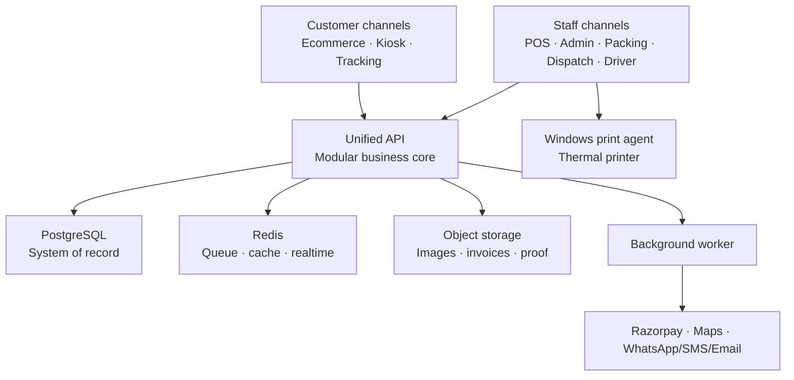

# Unified Commerce System — Architecture and Delivery Plan

**Status:** Proposed architecture  
**Locations:** Anna Nagar and Ayyanambakkam, Chennai  
**Scope:** POS, ecommerce, kiosk, inventory, purchasing, packing, delivery, tracking, and reporting  
**Constraint:** This document is a blueprint only. No application code is included.

## 1. Executive decision

Build a **custom, cloud-hosted modular monolith** with multiple user interfaces sharing one API and one PostgreSQL database.

This is the recommended approach because the business needs:

- Windows counter billing and thermal printing
- Loose products sold by weight
- Retail and wholesale price rules
- Self-service kiosks and token-based pickup
- Two-location stock, purchases, transfers, and reservations
- Offline counter billing during internet interruptions
- Packing, own-driver dispatch, live tracking, COD, and proof of delivery

All channels must use the same Product Master, pricing rules, inventory ledger, orders, payments, and customer records. Neither shop is permanently hardcoded as “retail” or “wholesale”; location capabilities and routing priorities are configurable.

### Architecture principles

1. **One source of truth:** PostgreSQL owns products, stock, orders, payments, and delivery status.
2. **Create once, use everywhere:** A product created in Product Master can be enabled for POS, kiosk, ecommerce, and wholesale independently.
3. **Ledger-based stock:** Every stock change is recorded; users never directly overwrite stock without an auditable adjustment.
4. **No split order by default:** Choose one location that can fulfill the complete order; use manual review if neither can.
5. **External services are processors:** Razorpay, maps, and messaging providers do not own business records.
6. **Offline is controlled:** POS can continue safely within configured limits; kiosk and ecommerce require connectivity.
7. **Start as a modular monolith:** Keep deployment and transactions simple while preserving clear module boundaries for future extraction.

### How every order flows

1. Identify the channel, customer type, and requested products.
2. Apply the correct price book, tax, discount, and serviceability rules.
3. Select one eligible shop and reserve its stock.
4. Confirm payment, COD, credit, or pay-at-counter terms.
5. Pick, weigh, and pack the order; record any approved quantity adjustment.
6. Commit stock, issue the invoice, and move to pickup or delivery.
7. Complete handover with token/OTP/proof and reconcile payment and cash.

## 2. Scope and assumptions

### In the first production release

- English-first interface with Tamil product names and kiosk language support
- Product, category, unit, price, tax, supplier, and channel visibility management
- Purchases, stock receipt, adjustment, transfer, reservation, and stock count
- Windows browser POS with 58/80 mm thermal printing
- Retail and wholesale sales, including loose-weight products
- Ecommerce catalogue, checkout, delivery-zone validation, online payment, and COD
- In-store kiosk, token, packing queue, and pickup status display
- Packing and actual-weight confirmation
- Driver assignment, route view, customer tracking, OTP, proof of delivery, and COD reconciliation
- Returns, refunds, customer credit, daily closing, reports, roles, and audit log

### Deferred until after the pilot

- Direct weighing-scale integration; manual weight entry is the MVP default
- Advanced multi-stop route optimization
- Loyalty points, subscriptions, marketplaces, and promotions engine
- Native Android/iOS applications; responsive PWAs are sufficient initially
- Tally/Zoho Books, GST e-invoice, and other accounting integrations
- Multiple warehouses beyond the two initial locations

### Capacity assumptions to validate

The initial design comfortably targets two locations, up to 10,000 SKUs, 500 orders per day, 10 drivers, and fewer than 50 concurrent users. Re-estimate infrastructure after real pilot measurements.

## 3. System architecture

### Runtime components

| Component | Responsibility |
|---|---|
| Ecommerce web | Marketing pages, catalogue, retail/wholesale accounts, checkout, order history |
| POS PWA | Counter search, weighted billing, payments, returns, register closing, offline queue |
| Kiosk PWA | Tamil/English browsing, cart, UPI/pay-at-counter, token creation |
| Operations web | Product, purchase, inventory, packing, dispatch, reports, settings |
| Driver PWA | Assigned stops, navigation, status, COD, OTP, photo/signature proof |
| Customer tracking | Private order status, ETA, driver location, delivery confirmation |
| Unified API | Validation, authorization, pricing, routing, transactions, state changes |
| Background worker | Notifications, document generation, webhook processing, reconciliation |
| Windows print agent | Trusted localhost bridge from POS to installed ESC/POS printer |

### Recommended technology stack

| Layer | Recommendation |
|---|---|
| Language | TypeScript end to end |
| Web applications | Next.js and React PWAs |
| UI | Tailwind CSS with a shared accessible component library |
| Backend | NestJS REST API with OpenAPI; WebSocket/SSE for live updates |
| Data access | Prisma for standard access; explicit SQL transactions for stock-critical operations |
| Primary database | PostgreSQL |
| Queue/cache/realtime | Redis with BullMQ |
| Offline POS storage | IndexedDB with an idempotent synchronization queue |
| Files | Google Cloud Storage in production; MinIO for local development |
| Authentication | Managed OIDC/Identity Platform; application roles and location scope in PostgreSQL |
| Payments | Razorpay payment gateway, dynamic UPI QR, refunds, and signed webhooks |
| Maps | Google Maps Platform for geocoding, ETA, routes, and route matrices |
| Notifications | WhatsApp Business provider, SMS fallback, and email |
| Local printing | Signed localhost print agent for Windows and ESC/POS printers |
| Packaging | Docker images; Docker Compose for local development |
| Production | Google Cloud Run, Cloud SQL for PostgreSQL, Memorystore Redis, and Cloud Storage in Mumbai |
| CI/CD | GitHub Actions with separate development, staging, and production environments |
| Monitoring | Structured logs, error tracking, metrics, uptime checks, and business alerts |

## 4. Module boundaries

The system is one deployment initially, but each module owns its rules and data access.

| Module | Owns |
|---|---|
| Identity and access | Users, roles, locations, registered devices, sessions |
| Catalogue | Categories, products, variants, units, images, channel visibility |
| Pricing and tax | Retail/wholesale price books, quantity tiers, discounts, HSN/GST configuration |
| Suppliers and purchasing | Suppliers, purchase orders, receipts, costs, supplier returns |
| Inventory | Ledger, balances, reservations, transfers, counts, lots, adjustments |
| Customers and wholesale | Profiles, addresses, approval, GST details, credit limit and balance |
| Orders | Carts, order lines, totals, lifecycle, source channel, location assignment |
| Payments and invoices | Payment attempts, webhooks, COD, credit, refunds, invoices, register sessions |
| Fulfillment | Picking, actual weight, packing, labels, pickup tokens, status display |
| Delivery | Drivers, shifts, assignments, route stops, tracking, OTP, proof, COD handover |
| Returns | Returns, reason, inspection, restocking, refund/replacement approval |
| Notifications | Templates, WhatsApp/SMS/email jobs, delivery logs and retry |
| Reporting and audit | Sales, margin, stock, tax, cash, delivery, immutable audit events |
| Integrations | Razorpay, maps, messaging, accounting exports, webhook inbox/outbox |

## 5. Core data design

### Quantity and money rules

- Store money as integer **paise**, not floating-point rupees.
- Store weighed inventory in the smallest base unit, normally **grams**. Example: `2.750 kg = 2,750 g`.
- Store counted products as whole units.
- Treat a loose 50 kg sack and a sealed 5 kg retail bag according to their real stock behavior. A loose sack converts to grams; a sealed bag is normally a separate counted SKU.
- Snapshot product name, quantity, price, discount, and tax on each order line. Historical invoices must not change when Product Master changes later.
- Store timestamps in UTC and display them in India Standard Time.

### Core entity groups

| Domain | Main records |
|---|---|
| Organization | `locations`, `location_capabilities`, `service_zones`, `devices`, `registers` |
| Catalogue | `categories`, `products`, `product_variants`, `units`, `unit_conversions`, `channel_visibility` |
| Pricing | `price_books`, `price_rules`, `customer_price_book`, `tax_profiles` |
| Parties | `customers`, `wholesale_profiles`, `suppliers`, `addresses`, `credit_accounts` |
| Inventory | `inventory_ledger`, `inventory_balances`, `reservations`, `transfers`, `stock_counts`, `lots` |
| Purchasing | `purchase_orders`, `purchase_receipts`, `purchase_receipt_lines`, `supplier_returns` |
| Sales | `carts`, `orders`, `order_lines`, `order_state_history`, `fulfillments`, `invoices` |
| Payments | `payment_attempts`, `payment_transactions`, `refunds`, `cash_register_sessions`, `cash_movements` |
| Kiosk | `kiosk_sessions`, `pickup_tokens`, `status_display_events` |
| Delivery | `drivers`, `vehicles`, `driver_shifts`, `delivery_jobs`, `route_stops`, `tracking_points`, `delivery_proofs` |
| Control | `audit_events`, `webhook_inbox`, `outbox_events`, `idempotency_keys`, `notification_jobs` |

### Critical relationships and constraints

- SKU is unique; a product variant can have only one balance row per location.
- Every order records source channel and assigned location; every physical channel records its registered device.
- Each order has many immutable order-line snapshots, payment attempts, and state-history events.
- Provider payment IDs, webhook event IDs, POS sync IDs, and refund IDs are unique to prevent duplicates.
- A transfer has matched transfer-out and transfer-in entries and cannot disappear between locations.
- Stock-critical updates use a database transaction and lock the affected balance rows.
- Business events are written to the outbox in the same transaction, then processed asynchronously.
- Audit and financial records are never hard-deleted; corrections use reversal or compensating entries.

### Inventory model

`inventory_ledger` is append-only. Each row records product, location, **on-hand delta**, **reserved delta**, reason, source document, user/device, and time. Keeping these as separate dimensions prevents a reservation from being mistaken for physical stock movement.

Typical reasons are:

- Purchase receipt
- Sale or fulfillment
- Reservation and release
- Customer return
- Supplier return
- Location transfer out/in
- Damage, expiry, shrinkage, or correction
- Physical stock-count variance

`inventory_balances` stores current on-hand and reserved quantities and is updated in the same database transaction as the ledger entry. Available stock is:

**On hand − active reservations − configured offline safety buffer**

## 6. State model

Do not use one status field for the entire order. Keep these lifecycles separate.

| Lifecycle | Main states |
|---|---|
| Order | Draft → Awaiting payment → Confirmed → On hold → Completed / Cancelled |
| Payment | Pending → Captured / Failed; COD due; Credit due; Partially refunded / Refunded |
| Fulfillment | Unassigned → Assigned → Picking → Weight confirmed → Packed → Ready / Handed to driver → Completed |
| Delivery | Unassigned → Assigned → Picked up → Out for delivery → Arriving → Delivered / Failed / Returned |

Every transition must record who or what performed it, when it occurred, and an optional reason. The API rejects invalid transitions.

## 7. Main business workflows

### 7.1 Product and purchase

1. Authorized manager creates a product once with English/Tamil names, SKU, unit behavior, prices, HSN/GST, locations, and channel switches.
2. Existing products are received through Purchase Receipt; they are not recreated.
3. Receipt converts purchase units to the stock base unit and posts a ledger entry at the receiving location.
4. Product becomes searchable on enabled POS/kiosk/ecommerce channels after publishing.

### 7.2 Counter POS

1. Registered device opens a register session for its assigned location.
2. Cashier searches by English/Tamil name, SKU, or barcode.
3. Cashier enters weight, item count, or customer amount; the system calculates the corresponding weight where allowed.
4. Pricing selects retail, wholesale, or approved customer price book.
5. Payment is recorded as cash, UPI, card, bank transfer, credit, or mixed payment if enabled.
6. One transaction creates the order, payment, invoice, stock ledger entry, and audit event.
7. Local print agent prints the thermal receipt.
8. Closing compares expected cash/UPI/COD movements against entered totals and records variances.

### 7.3 Self-service kiosk

1. Kiosk is locked to its registered location and offers English/Tamil.
2. Customer selects products and preset/custom weight.
3. System checks and reserves local stock.
4. Customer pays by dynamic UPI QR or selects pay at counter.
5. Razorpay webhook confirms paid orders; the screen alone is never treated as payment proof.
6. System issues a token and sends the order to that location’s packing queue.
7. Packer confirms actual weight, packs, and marks the order Ready.
8. Status display shows the token; staff completes handover and prints the final invoice.

### 7.4 Ecommerce and wholesale

1. Customer checks serviceability using pincode/address.
2. Catalogue applies the correct retail or approved wholesale price book and quantity rules.
3. Checkout calculates item total, tax, discount, delivery fee, and payable total.
4. Routing selects one eligible location using the rules below.
5. A short-lived stock reservation is created before online payment.
6. A signed payment webhook confirms payment; failed/expired payment releases the reservation.
7. COD or approved credit orders move directly to Confirmed under configured limits.
8. Assigned location accepts, picks, confirms weight, packs, and hands the order to pickup or delivery.

### 7.5 Location routing

Routing is data-driven, not hardcoded.

1. Physical POS/kiosk order stays at its registered location.
2. Filter locations by channel capability, service zone, operating status, and customer/order type.
3. Keep locations that can fulfill the whole order from available stock.
4. Rank by configured priority, driving time, capacity, and promised delivery time.
5. Assign the highest-ranked location and save the decision reasons.
6. If no location can fulfill the complete order, place it in Manual Review; do not split automatically.
7. A manager may override assignment with a recorded reason.

Wholesale fulfillment capability can be enabled for one or both locations without changing code.

### 7.6 Packing and weight confirmation

1. Shop accepts the assigned order.
2. Packer picks products and weighs loose lines.
3. Actual quantity is recorded separately from requested quantity.
4. Within an approved tolerance, totals are finalized automatically.
5. Outside tolerance, the system requests staff/customer approval and handles extra payment or partial refund.
6. Packing completion commits the final stock movement and creates the invoice.

### 7.7 Own-driver delivery

1. Dispatcher sees packed, delivery-ready orders.
2. System recommends drivers using shift, capacity, current workload, and route time.
3. Dispatcher assigns stops; driver accepts and picks up the order.
4. Customer receives a private, expiring tracking link.
5. Driver app sends location at a controlled interval while the delivery is active.
6. Driver completes delivery using OTP and optional photo/signature proof.
7. COD is recorded as collected, then settled through driver cash reconciliation.
8. Failed delivery requires a reason and moves to reschedule, return-to-shop, or cancellation review.

### 7.8 Return and refund

1. Find the original invoice and select lines/quantity.
2. Record reason and inspect whether goods are resellable.
3. Post usable quantity back to the original/current approved location; damaged stock uses a separate adjustment reason.
4. Refund to original method, issue store credit, or create replacement according to policy.
5. Keep payment, inventory, tax, and approval records linked to the original sale.

## 8. Offline POS and thermal printing

### Offline POS rules

- Cache the active location’s catalogue, prices, tax rules, and controlled stock snapshot in IndexedDB.
- Generate each local sale with a UUID and idempotency key.
- Preallocate accountant-approved invoice/receipt number blocks per registered device if final invoices must be issued offline.
- Queue orders, payments, stock changes, and audit events locally; synchronize in order after reconnection.
- Permit offline sales only within a configured safety quantity and credit limit.
- Disable risky offline actions such as product creation, stock transfer, supplier receipt, refunds without original data, and customer credit-limit changes.
- Flag stock conflicts for manager review; never silently discard or duplicate a sale.
- Alert management when a device has unsynchronized transactions beyond the configured period.

### Printing rules

- The browser sends a signed print job to a small Windows service on `localhost`.
- The service accepts requests only from approved origins/devices and prints to an allow-listed printer.
- Templates support 58 mm and 80 mm layouts, Tamil-capable fonts where supported, reprint labels, and a visible “COPY” mark.
- Every print/reprint is audited; printing never determines whether a sale succeeded.

## 9. Security and privacy

### Access control

| Role | Access boundary |
|---|---|
| Owner/Admin | All locations, configuration, security, and reports |
| Location manager | Assigned location operations, approvals, and reports |
| Cashier | POS, customer lookup, permitted discounts, register session |
| Inventory staff | Products, purchases, transfers, counts, and adjustments as granted |
| Packer | Assigned location queue and weight/packing actions |
| Dispatcher | Delivery-ready orders and driver assignment |
| Driver | Only assigned jobs, minimum customer details, and delivery actions |
| Customer | Own profile, orders, invoices, and tracking |
| Kiosk | Anonymous, location-scoped catalogue and order creation only |

### Required controls

- Managed authentication; MFA for owners/admins and sensitive approvals
- Short-lived sessions/tokens, secure HttpOnly cookies where applicable, and device registration
- Role plus location-scoped authorization on every API request
- TLS in transit; managed encryption for database, cache, backups, and files
- Secrets in a cloud secret manager, never in source control or images
- Razorpay-hosted payment handling; never store card or UPI credentials
- Webhook signature verification, timestamp checks, replay protection, and idempotency
- Rate limiting, bot protection for public endpoints, secure headers, and input validation
- Append-only audit trail for price, stock, refund, credit, role, and configuration changes
- Expiring tracking tokens and limited retention of driver location/proof files
- Encrypted backups, point-in-time recovery, and tested restoration
- Dependency scanning, static checks, container scanning, and regular access review

GST invoice fields, numbering, FSSAI display, retention, credit notes, and e-invoicing applicability must be approved by the business accountant/compliance adviser before launch.

## 10. Reliability and performance targets

| Area | Initial target |
|---|---|
| Central order/stock consistency | Atomic database transaction; no untracked stock mutation |
| Duplicate protection | Idempotent POS sync, checkout, webhooks, refunds, and delivery completion |
| POS product search | Under 300 ms p95 when online; immediate from cached catalogue offline |
| Standard API response | Under 750 ms p95, excluding third-party payment/map calls |
| Tracking refresh | Approximately every 10–15 seconds during active delivery |
| Availability | 99.9% monthly target for customer and operations services |
| Recovery point | 15 minutes or better |
| Recovery time | 4 hours or better |
| Audit retention | Defined with accountant/legal adviser before production |

Operational monitoring must alert on payment webhook failures, negative/low stock, stuck orders, unsynced POS devices, printer-agent health, failed notifications, delivery delays, and unusual refund/discount activity.

## 11. Environments and deployment

### Environments

| Environment | Purpose | Hosting |
|---|---|---|
| Local | Individual development and automated tests | Docker Compose on developer computer |
| Staging | Shared testing with both shops, kiosk, printers, and payment test mode | Separate Google Cloud project in Mumbai |
| Production | Real customers and business operations | Separate Google Cloud project in Mumbai |

A temporary Mumbai VM may host Docker Compose for an early demonstration, but staging should mirror production before the pilot.

### Production layout

- Cloud Run services for web/API/worker containers
- Cloud SQL PostgreSQL with private connectivity, automated backups, and point-in-time recovery
- Memorystore Redis for queues, cache, distributed locks, and realtime fan-out
- Cloud Storage for product images, invoice documents, and delivery proof
- Load balancer/CDN, managed TLS, firewall/WAF controls, and custom domain
- Separate service accounts with least privilege
- Database migrations run as a controlled deployment step
- Blue/green or gradual rollout with automatic health checks and rollback

## 12. Implementation phases

Each phase ends with a working demonstration and acceptance gate.

| Phase | Deliverables | Exit gate |
|---|---|---|
| 0. Discovery | Product sample, units, tax/invoice rules, receipt/printer audit, routing/service zones, user roles, wireframes | Owner and accountant approve rules and MVP |
| 1. Foundation | Environments, identity, locations, Product Master, price books, suppliers, audit, base database | Product can be created once and scoped to channels/locations |
| 2. Inventory | Purchases, receipts, ledger, balances, reservations, transfers, counts, adjustments | Concurrent stock and transfer tests pass |
| 3. POS pilot | Windows POS, weighted sales, payment methods, invoice, print agent, register closing, offline sync | One selected shop completes normal/offline/return scenarios |
| 4. Ecommerce | Marketing site, catalogue, retail/wholesale accounts, zones, checkout, Razorpay/COD, routing | Paid/COD orders reserve and route correctly |
| 5. Fulfillment and kiosk | Packing, actual weight, kiosk, dynamic UPI, tokens, status display | Kiosk order is paid, packed, displayed, and collected |
| 6. Delivery | Dispatch, driver PWA, tracking, ETA, OTP/proof, failed delivery, COD settlement | End-to-end home delivery completes and reconciles |
| 7. Business controls | Returns/refunds, credit, reports, profit, GST exports, low-stock alerts | Daily closing and owner reports reconcile with test data |
| 8. Hardening and rollout | Security test, load test, backup restore, monitoring, training, data migration, runbooks | Pilot sign-off, then controlled second-location rollout |

Do not begin a later channel until Product Master, pricing, inventory, and authorization rules from earlier phases are stable.

## 13. Test strategy

### Automated tests

- Unit conversion, amount-to-weight, price tier, discount, GST, rounding, and totals
- Stock ledger, reservation expiry, transfers, returns, and concurrent checkout
- Valid/invalid state transitions and role/location authorization
- Duplicate Razorpay webhook, duplicate POS sync, retry, timeout, and refund behavior
- Routing by service zone, capability, stock, priority, and manual override
- Offline queue ordering and reconnection conflict handling
- End-to-end POS, kiosk, ecommerce, wholesale, packing, delivery, COD, return, and daily closing

### Hardware and operational tests

- Both Windows computers and each printer model/receipt width
- Internet loss during search, payment, sale, and synchronization
- Power loss/restart with unsynchronized POS orders
- Dynamic UPI success, failure, timeout, duplicate callback, and refund
- Kiosk lockdown, inactivity reset, privacy clearing, and printer failure
- Driver weak-network behavior, location permission loss, OTP failure, and COD variance
- Backup restoration and production rollback rehearsal

## 14. Fully custom vs Shopify hybrid

| Decision factor | Fully custom | Shopify hybrid |
|---|---|---|
| Marketing/ecommerce launch | Slower initially | Faster storefront launch |
| Windows POS | Exact browser/print-agent fit | Shopify POS itself is iOS/Android, so Windows still needs custom POS |
| Loose-weight and amount-to-weight billing | Native business rule | Requires custom app/workaround and synchronization |
| Kiosk, packing, own-driver tracking | One shared workflow | Mostly custom beside Shopify |
| Offline POS | Can be designed for this operation | Custom Windows offline layer still required |
| Inventory/order ownership | One database and ledger | Requires strict source-of-truth choice, webhooks, retries, and reconciliation |
| Promotions/themes/ecosystem | Must be built selectively | Strong ecosystem and ready themes |
| Ongoing responsibility | Business owns development and operations | Platform fees plus custom integration maintenance |

### Recommendation

Choose **fully custom for the operational core and ecommerce**. The unusual requirements are not limited to the storefront; they affect pricing, stock, invoicing, kiosk fulfillment, delivery, and offline Windows POS. A Shopify hybrid would still require most custom modules while adding synchronization risk.

Choose Shopify hybrid only if launching a polished online catalogue quickly is more important than having one unified system in the first release. If chosen later, the custom platform must remain the operational source of truth, and Shopify must be treated as a sales channel with webhook reconciliation.

## 15. Key risks and mitigations

| Risk | Mitigation |
|---|---|
| Overselling during offline POS use | Offline safety buffer, idempotent sync, short offline window, conflict queue |
| Duplicate products | SKU uniqueness, duplicate suggestions, create-vs-receive training, manager-only creation |
| Incorrect loose-weight totals | Integer grams/paise, tested rounding, actual-weight confirmation, immutable invoice snapshot |
| Payment shown as paid incorrectly | Trust signed server webhook only; reconciliation job and idempotency |
| Printer/browser limitations | Registered Windows print agent, printer allow-list, tested receipt templates |
| Cross-location data exposure | Role plus location authorization on server, device registration, audit logs |
| Driver/customer privacy | Minimum data, expiring tracking link, active-delivery-only location collection, retention limits |
| Too much scope before launch | Phase gates and a one-shop pilot before second-location rollout |
| Cloud/vendor outage | POS offline mode, retries, circuit breakers, backups, documented manual procedure |

## 16. Decisions required before development

1. Thermal-printer models, receipt width, connection type, and Tamil print support
2. Manual weight entry versus weighing-scale model/integration
3. Product count, current catalogue format, units, prices, and opening stock
4. GSTIN/FSSAI details, approved invoice format, numbering, HSN/tax rules, and retention
5. Which capabilities each shop supports: retail, wholesale, kiosk, pickup, delivery fulfillment
6. Pincodes/service polygons, delivery fees, minimum order, SLA, and routing priority
7. Wholesale approval, minimum quantity/value, price tiers, credit limits, and due dates
8. Return, cancellation, discount, weight-tolerance, and failed-delivery policies
9. Driver count, vehicle type, shifts, capacity, COD process, and tracking consent
10. Payment methods, Razorpay merchant setup, WhatsApp/SMS provider, and notification templates
11. Kiosk hardware, token printer, status screen, accessibility, and Tamil translations
12. Required owner reports and future accounting software

## 17. Planning completion criteria

Architecture planning is approved when:

- The business accepts the custom modular-monolith decision.
- Both shops’ capabilities and routing rules are documented.
- Product units, pricing, stock, tax, invoice, and offline rules are signed off.
- Printer, kiosk, and optional scale hardware are tested or selected.
- MVP phase scope and acceptance scenarios are approved.
- Security roles, backup targets, and production environment are accepted.

After approval, development should start with **Phase 0 discovery**, followed by Product Master and inventory—not with the ecommerce homepage.

## 18. Verified platform references

- [Shopify POS hardware and device support](https://help.shopify.com/en/manual/sell-in-person/hardware/getting-started)
- [Shopify multi-location inventory](https://help.shopify.com/en/manual/fulfillment/setup/locations/assigning-inventory-to-locations)
- [Shopify order routing](https://help.shopify.com/en/manual/fulfillment/setup/order-routing/understanding-order-routing)
- [Razorpay QR-code webhook events](https://razorpay.com/docs/webhooks/qr-codes/)
- [Google Cloud Run locations](https://cloud.google.com/run/docs/locations)
- [Google Cloud SQL for PostgreSQL locations](https://cloud.google.com/sql/docs/postgres/locations)
- [Google Maps Routes API](https://developers.google.com/maps/documentation/routes)
